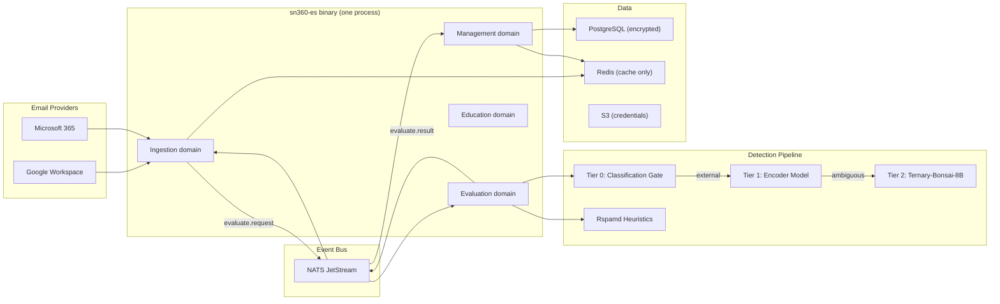

# SN360-ES — ShieldNet 360 Email Security

Cloud-native, privacy-first, AI-powered email security platform for SMEs.
Zero-admin. Zero-trust. Delivered as SaaS.

Protects Google Workspace and Microsoft 365 mailboxes using a 3-tier ML
detection pipeline with post-delivery remediation, behavioral anomaly
detection, in-client end-user warnings, and built-in email security
education — all operated by AI agents.

## Why SN360-ES

| Pain Point (SME) | SN360-ES Answer |
|---|---|
| No IT/security team | Fully autonomous — AI agents configure, tune, and operate |
| Cost-sensitive | 3-tier ML pipeline: 90-95% cheaper than LLM-for-every-email |
| Multilingual workforce | XLM-RoBERTa encoder handles 100+ languages natively |
| Privacy regulations | Zero-knowledge architecture — no PII stored, all data encrypted |
| Complex onboarding | One-click OAuth consent, auto-discovery of users and groups |
| Vendor lock-in | Works across Google Workspace and Microsoft 365 simultaneously |
| Confusing alerts | Tiered, color-coded banners + native labels (not just "FYI") |

## Architecture at a Glance

SN360-ES ships as a **single `sn360-es` Go binary** that exposes an HTTP
API and runs four cooperating domains in-process. They communicate via
NATS JetStream (or Redis Streams in the fallback configuration), so the
same binary can be scaled horizontally by running more replicas behind
the same event bus.



## Core Domains

The four domains below are **packages within the single `sn360-es`
binary**, not separate deployments. They share configuration, the event
bus client, and the process lifecycle; what differs is which subjects
they subscribe to and which HTTP routes they own.

| Domain | Purpose |
|---|---|
| **Ingestion** | Polls GWS/O365 mailboxes, normalizes emails, publishes events, applies post-evaluation actions (tiered banners, native labels, quarantine) |
| **Evaluation** | 3-tier ML detection: classification gate → encoder model → Ternary-Bonsai-8B. Parallel Rspamd heuristics. Weighted risk scoring |
| **Management** | Multi-tenant admin: tenants, users, groups, labels, score engine, vendors, relationships, education campaigns |
| **Education** | Manages phishing simulations, micro-lessons, in-context teachable moments, and employee resilience scoring |

## Detection Pipeline (3-Tier)

| Tier | Model | Latency | Cost/Email | When Used |
|---|---|---|---|---|
| **Tier 0** | Rule-based classification | <1ms | ~$0 | Every email — skips ML for internal, vendor, newsletter |
| **Tier 1** | XLM-RoBERTa encoder (self-hosted) | 50-200ms | ~$0.00005 | External unknown emails surviving Tier 0 |
| **Tier 2** | Ternary-Bonsai-8B (self-hosted SLM) | 2-10s | ~$0.001-0.005 | Ambiguous emails from Tier 1 (10-20% of Tier 1 input) |
| **Rspamd** | Heuristics (SPF/DKIM/DMARC/RBL) | 100-500ms | ~$0 | Always-on, parallel with ML tiers |

The Tier 2 deployment manifests live in [`deployments/llm/`](./deployments/llm/);
alternative model providers are not supported.

## End-User Experience — Tiered Banners & Native Labels

SN360-ES does not stop at a single "FYI" label. Every email is decorated
with **two** end-user signals:

1. **Inline banner** (HTML, injected into the message body, severity-themed)
2. **Native provider label** (Gmail Label / Outlook Category, color-coded)

### Severity Tiers

| Tier | Score | Banner Color | Native Label | Action |
|---|---|---|---|---|
| **Blocked** | 85-100 | Red (filled) | `SN360 / Blocked` | Auto-quarantine; release requires admin (AI agent) approval |
| **High Risk** | 70-84 | Red (filled) | `SN360 / HighRisk` | Banner with strong wording; URLs rewritten/disabled |
| **Warning** | 50-69 | Orange | `SN360 / Warning` | Banner with actionable buttons + micro-lesson |
| **Caution** | 30-49 | Yellow | `SN360 / Caution` | Compact footer banner |
| **Informational** | 15-29 | Blue | `SN360 / Informational` | Contextual chip ("First contact", "External") |
| **Trusted** | 0-14 | Green chip | `SN360 / Trusted` | Optional verified-sender chip |

### Category Labels (Specific, Not Generic)

`LIKELY_PHISHING`, `BEC_IMPERSONATION`, `LOOKALIKE_DOMAIN`, `SUSPICIOUS_URL`,
`SUSPICIOUS_ATTACHMENT`, `FIRST_CONTACT_EXTERNAL`, `ACCOUNT_TAKEOVER_SUSPECTED`,
`VENDOR_COMPROMISE`, `CREDENTIAL_HARVESTING`, `INVOICE_FRAUD`, `QR_PHISHING`,
`SCAM_FRAUD`, `AUTH_FAILED`, `INTERNAL_TRUSTED`, `VENDOR_TRUSTED`, `NEWSLETTER`.

### Banner Components

- Severity stripe + plain-language headline (localized per user locale)
- 2-3 sanitized detection reasons (no PII)
- Sender authentication chip — Verified / Unverified / Failed (SPF/DKIM/DMARC)
- One-click **Report Phishing** button → feedback loop to ML pipeline
- **Mark as Safe** / **Trust Sender** (only at Warning and below)
- **Learn more** → contextual micro-lesson from Education service
- **Why am I seeing this?** expander with category + signal explanation

### Pre-Send & Pre-Open Warnings (Optional Add-In)

- Outlook / Gmail add-in detects suspicious recipient before send (lookalike
  recipient domain, unusual external recipient) and prompts confirmation
- Pre-open warning on Warning+ tier asks "Are you sure?" before rendering
  message body with active content

## Privacy-First Design

- **Zero-knowledge processing**: Email content analyzed in-memory, never persisted in plaintext
- **PII stripping**: All stored metadata is pseudonymized (Blake2 hashing)
- **Encryption**: AES-256 at rest, TLS 1.3 in transit, per-tenant encryption keys
- **Data residency**: Configurable region pinning per tenant
- **Retention**: Configurable auto-purge (default 90 days), cryptographic erasure on tenant deletion
- **Audit trail**: Immutable append-only audit log, no PII in logs

## Event Bus — NATS JetStream

All inter-service communication uses NATS JetStream (replacing Redis Streams):
- Durable consumers with at-least-once delivery
- Built-in dead-letter queues and retry policies
- Message deduplication window
- Horizontal scaling via queue groups
- Persistent storage with configurable retention

## Zero-Admin Operation

SN360-ES is designed for SMEs without IT staff:
- **One-click onboarding**: OAuth consent flow auto-discovers users, groups, org structure
- **AI agent configuration**: Automatically tunes detection thresholds per tenant
- **Self-healing**: Auto-retry, circuit breakers, graceful degradation
- **AI-powered support**: Most inquiries resolved by AI agents
- **ShieldNet 360 SecOps**: Complex incidents escalated to human SOC analysts

## Email Education Platform

Built-in security awareness that teaches through the email experience:
- **In-context micro-lessons**: When a suspicious email is flagged, the banner includes a 30-second lesson
- **Phishing simulations**: Automated campaigns using real-world attack templates
- **Resilience scoring**: Per-employee and per-group security awareness scores
- **Adaptive difficulty**: Simulation complexity adjusts to employee performance
- **Zero-setup**: Campaigns auto-generated based on tenant's threat profile

## Project Status

This is an active development codebase. The matrix below reflects what
is wired into the `sn360-es` binary today versus what is implemented as
a package but is still optional / degraded when its backing
infrastructure is missing.

| Area | Implemented | Wired into `cmd/sn360-es` | Notes |
|---|---|---|---|
| HTTP server, health, metrics, OpenAPI/docs | Yes | Yes | Always on |
| Middleware (telemetry, request-id, request logger, CORS, rate limit, JWT auth) | Yes | Yes | Chain order: telemetry → request-id → request-logger → CORS → rate-limit → JWT-auth → mux. JWT-skipped paths are listed in `defaultAuthSkipPaths()` (`/healthz`, `/readyz`, `/metrics`, `/docs`, `/docs/`, `/openapi.yaml`, `/l/`, `/v1/banner/action`, `/v1/quarantine/release`, `/v1/education/lesson/`, `/v1/onboarding/callback`) |
| Event bus (NATS JetStream + Redis Streams fallback + factory) | Yes | Yes | Selected via `EVENT_BUS_TYPE=nats\|redis` |
| Tier 0 classification gate | Yes | Yes | Pure CPU, in-process |
| Tier 1 encoder client | Yes | Optional | Requires the encoder service from [`deployments/encoder/`](./deployments/encoder/) |
| Tier 2 SLM (Ternary-Bonsai-8B) client | Yes | Optional | Requires the deployment from [`deployments/llm/`](./deployments/llm/) |
| Rspamd client + cache | Yes | Optional | Requires Rspamd |
| Evaluator, scorer, categorizer | Yes | Yes | Drives the `es.evaluate.request` → `es.evaluate.result` flow |
| Banner / label / quarantine / URL-rewrite / feedback services | Yes | Partial | URL rewriter and quarantine release require Redis + JWT secret; degrade to 503 when unset |
| Provider-side action consumers (`es.action.{banner,label,url_rewrite,quarantine}`) | Yes | Yes | Best-effort; degrade to logging when no provider is registered for the tenant |
| Ingestion polling (Gmail + Outlook MailboxProviders, Redis checkpoint, distributed lock) | Yes | Optional | Requires GWS / O365 credentials; the poller is not constructed when both are unset |
| Push-webhook signature verification (Google Pub/Sub OIDC + Microsoft Graph clientState) | Yes | No | `PushSignatureVerifier` interface + `GoogleOIDCVerifier` (JWKS-backed, `singleflight`-collapsed refresh) + `MicrosoftClientStateVerifier` (constant-time compare) live in `internal/handler/push_signature.go` with handler `PushWebhookHandler` in `internal/handler/push_webhook.go`. The verifiers are unit-tested but the `POST /v1/push/{provider}/{tenant}` route is intentionally not mounted: receivers and per-tenant `clientState` storage are part of the push-ingestion pipeline that is not yet wired. Google audience is read from `INGESTION_PUSH_GOOGLE_AUDIENCE` |
| AI agents (Onboarding, Tuning, Support) | Yes | Optional | Each is wired only when its inputs (directory client, repos, event bus) are available |
| Directory sync (delta/incremental, GWS + O365) | Yes | Optional | Requires provider credentials; falls back to full enumeration when no delta token exists |
| Nested group resolution (O365 transitive memberOf) | Yes | Optional | Enabled via `O365_RESOLVE_NESTED_GROUPS`; falls back to direct memberOf on error |
| Vendor management API (CRUD) | Yes | Yes | `GET/POST/PUT/DELETE /v1/vendors`; works with both auto-discovered and manual vendors |
| Org graph persistence + API | Yes | Yes | `GET /v1/org-graph`; PII-redacted; updated by directory sync worker |
| Per-user behavioral baselines | Yes | Yes | Populated by relationship aggregation worker; used by timing anomaly detection |
| GWS setup wizard | Yes | Yes | `GET /v1/onboarding/gws-setup-status` validates domain-wide delegation step-by-step |
| Sensitivity classifier (encoder + Bonsai + multilingual keywords) | Yes | Optional | Bonsai optional via `SENSITIVITY_BONSAI_URL`; keyword fallback covers 6 languages |
| Periodic workers (relationship aggregation, vendor discovery, directory sync, data cleanup) | Yes | Yes | Coordinated via Redis distributed lock so only one replica runs each cycle |
| Predict (recipient / open) | Yes | Yes | Tier-based pre-open and recipient warning HTTP endpoints |
| Education (micro-lessons, simulation, resilience, adaptive) | Yes | Yes | The `/v1/education/lesson/` route + `es.education.lesson.trigger` consumer |
| Onboarding (OAuth, discovery, agent) | Yes | Optional | Requires `ONBOARDING_STATE_SECRET`, `ONBOARDING_CALLBACK_URL`, and at least one provider credential (GWS or O365) |
| Dashboard generator | Yes | Optional | 503 when generator is not configured |
| Escalation (resolve + get) | Yes | Yes | In-memory or PG-backed ticket store |
| PostgreSQL repositories (golang-migrate-managed) | Yes | Optional | Degraded mode (503 on PG-backed routes) when DSN is unset |
| Privacy primitives (Blake2 hashing, AES-GCM, JWT, KMS adapter) | Yes | Yes | KMS adapter is pluggable; falls back to a local key in dev |
| Tier 1 / Tier 2 deployments | Manifests only | Out of scope | See `deployments/encoder/` and `deployments/llm/` |
| Benchmark + accuracy harness | Yes | N/A | Build-tagged `//go:build benchmark`; see [`benchmarks/`](./benchmarks/) |

In short: the binary runs and serves every wired route on its own, but
routes that depend on optional infrastructure return `503` with a
machine-readable error when their dependency is unconfigured rather
than crashing the process.

## Quick Start (Development)

Prerequisites:

- Go 1.25+ (matches `go.mod`)
- Docker / Docker Compose for the local NATS + PostgreSQL + Redis + Rspamd + Unbound + ClamAV stack
- Optional: a running Tier 1 encoder ([`deployments/encoder/`](./deployments/encoder/))
  and Tier 2 SLM ([`deployments/llm/`](./deployments/llm/)) for end-to-end ML;
  the binary degrades gracefully when either is missing.

```bash
cp .env.example .env
docker-compose up -d        # NATS, Redis, PostgreSQL, Rspamd
make migrate-up             # Apply database migrations (golang-migrate via cmd/sn360-es-migrate)
make test                   # Unit tests
make run                    # Start sn360-es
```

## Running Tests

```bash
make test               # Unit tests (fast, no external deps)
make test-integration   # Integration tests (NATS / Redis / PG via testcontainers)
make lint               # gofmt + go vet
```

## Benchmarks

```bash
make bench-all          # Run the full suite (corpus + micro + accuracy + profile)

make bench              # Go microbenchmarks (ns/op, B/op, allocs/op)
make bench-accuracy     # Classification accuracy / precision / recall / F1 / confusion matrix
make bench-profile      # Resource utilisation (p50/p95/p99 latency, GC, peak memory, throughput)
make generate-corpus        # Regenerate the labelled 1,000-email evaluation corpus (seed 42)
make gen-corpus             # Generate a benchmark corpus (configurable size/seed)
```

All artefacts land under [`benchmarks/`](./benchmarks/) with a UTC
datestamp; the most recent baseline is summarised in
[`benchmarks/BASELINE.md`](./benchmarks/BASELINE.md). Accuracy and
profile tests are gated by `//go:build benchmark` so they stay out of
`make test` — see [`benchmarks/README.md`](./benchmarks/README.md) for
details on what each artefact contains and how to compare runs with
`benchstat`. The labelled corpus itself lives at
[`scripts/corpus/`](./scripts/corpus/) and is generated by the
generator documented in
[`scripts/corpus_generator/README.md`](./scripts/corpus_generator/README.md);
[`scripts/CORPUS.md`](./scripts/CORPUS.md) explains the dataset
contract.

## Documentation

| Doc | Purpose |
|---|---|
| [`internal/docs/PROPOSAL.md`](./internal/docs/PROPOSAL.md) | Design document: tiered pipeline, privacy, zero-admin, banner UX, education |
| [`internal/docs/ARCHITECTURE.md`](./internal/docs/ARCHITECTURE.md) | System architecture: single-binary deployment, streams, consumers, data flow |
| [`internal/docs/PHASES.md`](./internal/docs/PHASES.md) | Codebase guide: per-package code pointers organized by domain |
| [`scripts/CORPUS.md`](./scripts/CORPUS.md) | Labelled corpus dataset contract |
| [`scripts/corpus_generator/README.md`](./scripts/corpus_generator/README.md) | How the corpus is generated and which models are targeted |
| [`benchmarks/README.md`](./benchmarks/README.md) | Benchmark suite, baselines, and how to compare runs |
| [`deployments/helm/sn360-es/README.md`](./deployments/helm/sn360-es/README.md) | Helm chart values, subcharts, and upgrade notes |
| [`migrations/README.md`](./migrations/README.md) | golang-migrate SQL schema evolution |

## Repository Structure

```
sn360-es/
├── api/                                 # OpenAPI 3.1 spec (api/openapi.yaml)
├── benchmarks/                          # Bench artefacts (txt/md) + BASELINE.md + README.md
├── cmd/
│   ├── sn360-es/                        # Main service entrypoint (single binary)
│   ├── sn360-es-migrate/                # golang-migrate runner CLI
│   └── gen-corpus/                      # Corpus generator CLI driver
├── deployments/
│   ├── addins/
│   │   ├── outlook/                     # Outlook Office Add-in (Manifest v3)
│   │   └── gmail/                       # Gmail Add-on (Apps Script)
│   ├── encoder/                         # Tier 1 encoder inference service
│   ├── llm/                             # Tier 2 Ternary-Bonsai-8B SLM deployment
│   ├── helm/sn360-es/                   # Helm chart (Deployment, Service, HPA, NATS subchart)
│   └── argocd/                          # ArgoCD Application manifests (dev/qa/uat/prod)
├── internal/
│   ├── config/                          # Environment-based configuration
│   ├── constant/                        # Event types, Redis keys, categories
│   ├── dto/                             # Request/response DTOs
│   ├── handler/                         # HTTP handlers (banner, dashboard, education, …)
│   ├── middleware/                      # Auth, CORS, request logger, telemetry, log sanitiser
│   ├── numutil/                         # Small numeric helpers
│   ├── repository/                      # Database repositories (Postgres + in-memory)
│   ├── service/
│   │   ├── action/                      # 6-tier banner / labels / quarantine / feedback / URL rewriter
│   │   ├── agent/                       # AI agents (onboarding, tuning, support, escalation)
│   │   ├── cache/                       # AI + Rspamd Redis-backed result caches
│   │   ├── dashboard/                   # AI-generated admin dashboard
│   │   ├── education/                   # Micro-lessons, simulation, resilience, adaptive
│   │   ├── evaluate/                    # Tier 0/1/2 + score + URL + attachment pre-scan
│   │   ├── ingestion/                   # Mailbox polling, push subscriptions, action dispatch
│   │   ├── onboarding/                  # OAuth flow + org graph builder
│   │   ├── predict/                     # Pre-send / pre-open recipient analysis
│   │   ├── relationship/                # Categories, vulnerability, vendor, timing, baselines
│   │   ├── tenant/                      # Tenant CRUD + cryptographic erasure
│   │   ├── tier0/                       # Pure-CPU classification gates
│   │   ├── tier1/                       # Encoder client + batch orchestration
│   │   ├── worker/                      # Periodic workers (relationship, directory sync, vendor, cleanup)
│   │   └── dlq_processor.go, dlq_alerting.go  # Dead-letter consumer + alerting
│   ├── docs/                            # Design, architecture, and codebase guide
│   └── translation/                     # Cross-service i18n bundles (banners/)
├── pkg/
│   ├── email_provider/                  # GWS / O365 mailbox provider abstractions
│   ├── events/                          # bus factory, NATS JetStream, Redis Streams fallback
│   ├── httpclient/                      # HTTP/2 pooled client + circuit breaker
│   ├── privacy/                         # Pseudonymisation, KMS, encryption, JWT, erasure
│   ├── storage/                         # Postgres, Redis, S3 wrappers
│   └── telemetry/                       # OpenTelemetry tracer + Prometheus metrics
├── migrations/                          # golang-migrate SQL files + README.md
├── scripts/
│   ├── CORPUS.md                        # Dataset contract for the labelled corpus
│   ├── corpus/                          # Generated corpus artefacts (all.json, …)
│   ├── corpus_generator/                # Generator source + README.md
│   └── corpus_schema.json               # JSON schema for corpus entries
├── docker-compose.yml                   # Local NATS + Postgres + Redis + Rspamd + Unbound + ClamAV (all bound to 127.0.0.1)
├── Dockerfile
├── Makefile                             # test, lint, migrate-up/-down/-check, bench-* targets
└── README.md
```
