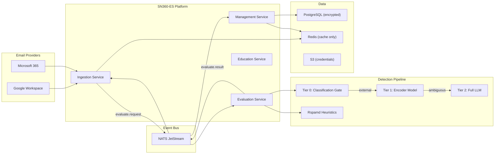

# SN360-ES — ShieldNet 360 Email Security

Cloud-native, privacy-first, AI-powered email security platform for SMEs.
Zero-admin. Zero-trust. Delivered as SaaS.

Protects Google Workspace and Microsoft 365 mailboxes using a 3-tier ML
detection pipeline with post-delivery remediation, behavioral anomaly
detection, in-client end-user warnings, and built-in email security
education — all operated by AI agents.

## Why SN360-ES

| Pain Point (SME) | SN360-ES Answer |
|---|---|
| No IT/security team | Fully autonomous — AI agents configure, tune, and operate |
| Cost-sensitive | 3-tier ML pipeline: 90-95% cheaper than LLM-for-every-email |
| Multilingual workforce | XLM-RoBERTa encoder handles 100+ languages natively |
| Privacy regulations | Zero-knowledge architecture — no PII stored, all data encrypted |
| Complex onboarding | One-click OAuth consent, auto-discovery of users and groups |
| Vendor lock-in | Works across Google Workspace and Microsoft 365 simultaneously |
| Confusing alerts | Tiered, color-coded banners + native labels (not just "FYI") |

## Architecture at a Glance



## Core Services

| Service | Purpose |
|---|---|
| **Ingestion** | Polls GWS/O365 mailboxes, normalizes emails, publishes events, applies post-evaluation actions (tiered banners, native labels, quarantine) |
| **Evaluation** | 3-tier ML detection: classification gate → encoder model → LLM. Parallel Rspamd heuristics. Weighted risk scoring |
| **Management** | Multi-tenant admin: tenants, users, groups, labels, score engine, vendors, relationships, education campaigns |
| **Education** | Manages phishing simulations, micro-lessons, in-context teachable moments, and employee resilience scoring |

## Detection Pipeline (3-Tier)

| Tier | Model | Latency | Cost/Email | When Used |
|---|---|---|---|---|
| **Tier 0** | Rule-based classification | <1ms | ~$0 | Every email — skips ML for internal, vendor, newsletter |
| **Tier 1** | XLM-RoBERTa encoder (self-hosted) | 50-200ms | ~$0.00005 | External unknown emails surviving Tier 0 |
| **Tier 2** | SLM | 2-5s | ~$0.001-0.005 | Ambiguous emails from Tier 1 (10-20% of Tier 1 input) |
| **Rspamd** | Heuristics (SPF/DKIM/DMARC/RBL) | 100-500ms | ~$0 | Always-on, parallel with ML tiers |

## End-User Experience — Tiered Banners & Native Labels

SN360-ES does not stop at a single "FYI" label. Drawing on patterns proven
by INKY, Material Security, Avanan, Proofpoint, IRONSCALES, and Microsoft
Defender, every email is decorated with **two** end-user signals:

1. **Inline banner** (HTML, injected into the message body, severity-themed)
2. **Native provider label** (Gmail Label / Outlook Category, color-coded)

### Severity Tiers

| Tier | Score | Banner Color | Native Label | Action |
|---|---|---|---|---|
| **Blocked** | 85-100 | Red (filled) | `SN360 / Blocked` | Auto-quarantine; release requires admin (AI agent) approval |
| **High Risk** | 70-84 | Red (filled) | `SN360 / Warning` | Banner with strong wording; URLs rewritten/disabled |
| **Warning** | 50-69 | Orange | `SN360 / Caution` | Banner with actionable buttons + micro-lesson |
| **Caution** | 30-49 | Yellow | `SN360 / Notice` | Compact footer banner |
| **Informational** | 15-29 | Blue | `SN360 / External` | Contextual chip ("First contact", "External") |
| **Trusted** | 0-14 | Green chip | `SN360 / Trusted` | Optional verified-sender chip |

### Category Labels (Specific, Not Generic)

`LIKELY_PHISHING`, `BEC_IMPERSONATION`, `LOOKALIKE_DOMAIN`, `SUSPICIOUS_URL`,
`SUSPICIOUS_ATTACHMENT`, `FIRST_CONTACT_EXTERNAL`, `ACCOUNT_TAKEOVER_SUSPECTED`,
`VENDOR_COMPROMISE`, `CREDENTIAL_HARVESTING`, `INVOICE_FRAUD`, `QR_PHISHING`,
`SCAM_FRAUD`, `AUTH_FAILED`, `INTERNAL_TRUSTED`, `VENDOR_TRUSTED`, `NEWSLETTER`.

### Banner Components

- Severity stripe + plain-language headline (localized per user locale)
- 2-3 sanitized detection reasons (no PII)
- Sender authentication chip — Verified / Unverified / Failed (SPF/DKIM/DMARC)
- One-click **Report Phishing** button → feedback loop to ML pipeline
- **Mark as Safe** / **Trust Sender** (only at Warning and below)
- **Learn more** → contextual micro-lesson from Education service
- **Why am I seeing this?** expander with category + signal explanation

### Pre-Send & Pre-Open Warnings (Tessian-Style, Optional Add-In)

- Outlook / Gmail add-in detects suspicious recipient before send (lookalike
  recipient domain, unusual external recipient) and prompts confirmation
- Pre-open warning on Warning+ tier asks "Are you sure?" before rendering
  message body with active content

## Privacy-First Design

- **Zero-knowledge processing**: Email content analyzed in-memory, never persisted in plaintext
- **PII stripping**: All stored metadata is pseudonymized (Blake2 hashing)
- **Encryption**: AES-256 at rest, TLS 1.3 in transit, per-tenant encryption keys
- **Data residency**: Configurable region pinning per tenant
- **Retention**: Configurable auto-purge (default 90 days), cryptographic erasure on tenant deletion
- **Audit trail**: Immutable append-only audit log, no PII in logs

## Event Bus — NATS JetStream

All inter-service communication uses NATS JetStream (replacing Redis Streams):
- Durable consumers with at-least-once delivery
- Built-in dead-letter queues and retry policies
- Message deduplication window
- Horizontal scaling via queue groups
- Persistent storage with configurable retention

## Zero-Admin Operation

SN360-ES is designed for SMEs without IT staff:
- **One-click onboarding**: OAuth consent flow auto-discovers users, groups, org structure
- **AI agent configuration**: Automatically tunes detection thresholds per tenant
- **Self-healing**: Auto-retry, circuit breakers, graceful degradation
- **AI-powered support**: Most inquiries resolved by AI agents
- **ShieldNet 360 SecOps**: Complex incidents escalated to human SOC analysts

## Email Education Platform

Built-in security awareness that teaches through the email experience:
- **In-context micro-lessons**: When a suspicious email is flagged, the banner includes a 30-second lesson
- **Phishing simulations**: Automated campaigns using real-world attack templates
- **Resilience scoring**: Per-employee and per-group security awareness scores
- **Adaptive difficulty**: Simulation complexity adjusts to employee performance
- **Zero-setup**: Campaigns auto-generated based on tenant's threat profile

## Quick Start (Development)

```bash
cp .env.example .env
docker-compose up -d        # NATS, Redis, PostgreSQL, Rspamd
make migrate-up             # Apply database migrations
make test                   # Unit tests
make run                    # Start service
```

## Running Tests

```bash
make test               # Unit tests (fast, no external deps)
make test-integration   # Integration tests (NATS / Redis / PG via testcontainers)
make lint               # gofmt + go vet
```

## Documentation

| Doc | Purpose |
|---|---|
| [`internal/docs/PROPOSAL.md`](./internal/docs/PROPOSAL.md) | Full v2 product + technical specification (8 phases, 51 tasks) |
| [`internal/docs/ARCHITECTURE.md`](./internal/docs/ARCHITECTURE.md) | System architecture: streams, consumer groups, services, data flow |
| [`internal/docs/PHASES.md`](./internal/docs/PHASES.md) | Phase-level rollup with code pointers and remaining scope |
| [`internal/docs/PROGRESS.md`](./internal/docs/PROGRESS.md) | Per-task checkbox tracker and changelog |

## Repository Structure

```
sn360-es/
├── cmd/                    # Service entrypoints
├── internal/               # Private application code
│   ├── config/             # Environment-based configuration
│   ├── constant/           # Event types, Redis keys, categories
│   ├── dto/                # Request/response DTOs
│   ├── handler/            # HTTP handlers
│   ├── middleware/          # Auth, CORS, logging
│   ├── repository/         # Database repositories
│   ├── service/            # Business logic
│   ├── docs/               # Internal documentation
│   │   ├── PROPOSAL.md     # v2 proposal with tiered ML + optimizations
│   │   ├── ARCHITECTURE.md # System architecture document
│   │   └── PROGRESS.md     # Changelog and progress tracker
│   └── translation/        # i18n (en, vi, th, ja, etc.)
├── pkg/                    # Shared libraries
│   ├── events/nats/        # NATS JetStream client
│   ├── httpclient/         # External API clients
│   ├── storage/            # Redis, PostgreSQL, S3 clients
│   └── privacy/            # PII stripping, pseudonymization, encryption
├── migrations/             # Atlas database migrations
├── docker-compose.yml
├── Dockerfile
├── Makefile
└── README.md
```
