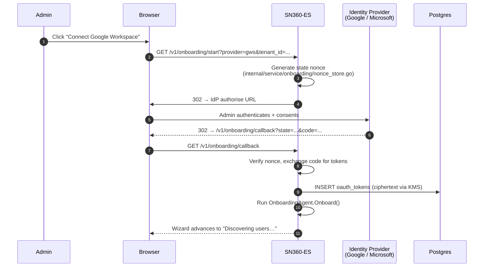
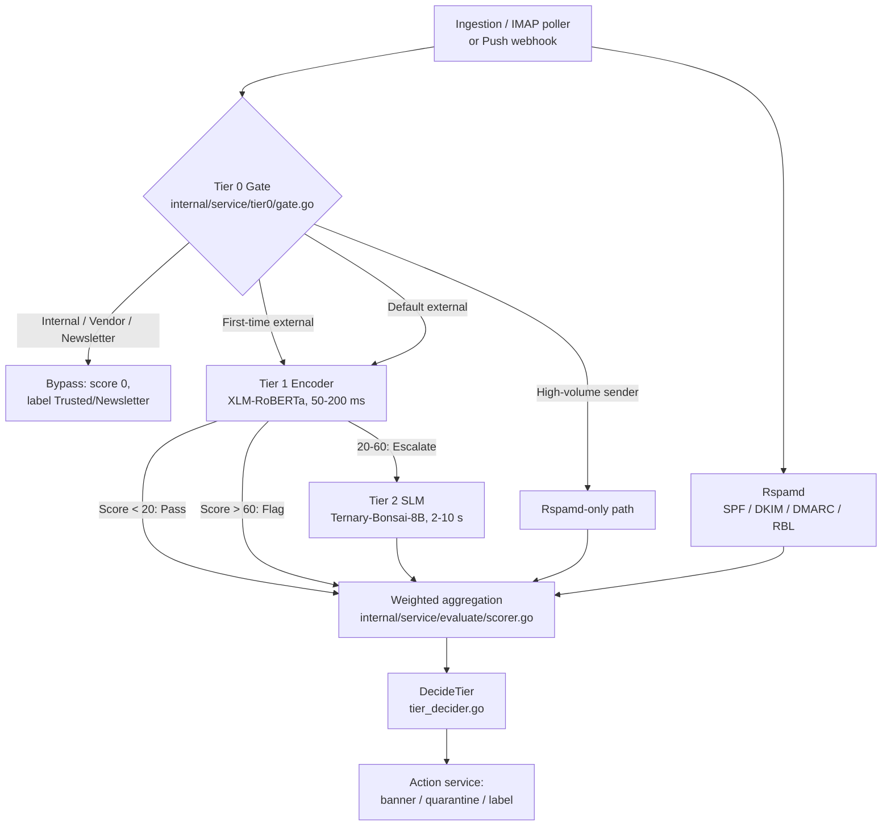
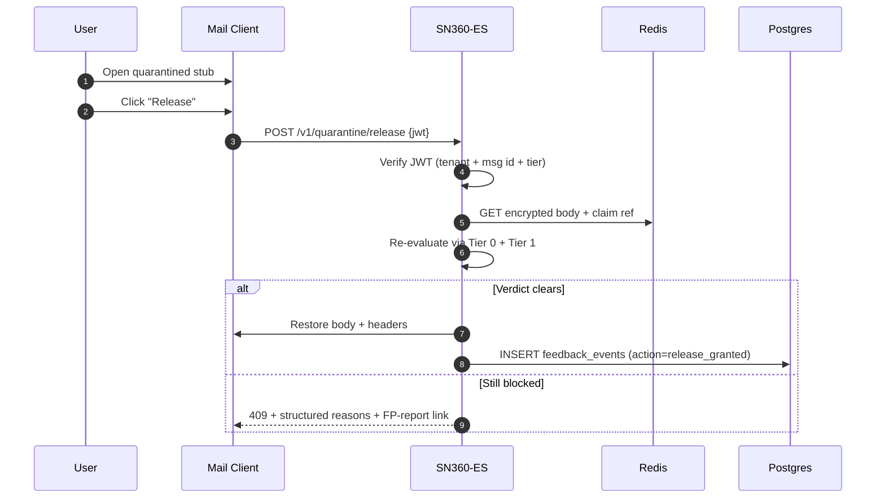
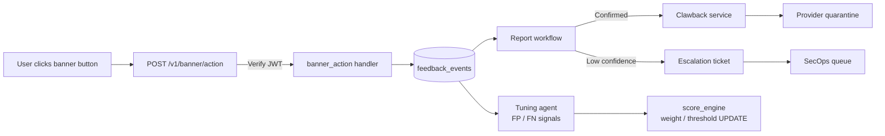

# How SN360-ES Protects Your Email: From Onboarding to Continuous Defense

*A technical deep-dive into the email security lifecycle — what data we gather, how we score threats, what users see, and how the system learns.*

---

Email security is unusual. The system has to decide whether each message is benign or hostile in roughly the time it takes the user to switch tabs, and a single wrong call in either direction is expensive — block a real invoice and the finance team is on the phone; let through one BEC impersonation and it is the CEO. The trick is not to make a single perfect classifier, but to layer cheap-fast signals with deep-slow ones, ground everything in what is *normal* for this organisation, and learn from every user click.

This post walks through the SN360-ES lifecycle end to end: how a new tenant is onboarded, how each inbound message is scored, what employees see when something is wrong, how their feedback flows back into the model, and how the system continuously re-baselines itself. Everything below maps to a specific package or table in the [`sn360-es`](https://github.com/kennguy3n/sn360-es) Go binary — file references are inline so security engineers can verify the behaviour in code.

---

## 1. Onboarding: What We Gather and How We Set Baselines

A tenant comes onto SN360-ES through a self-service OAuth flow. The administrator chooses a provider (Google Workspace or Microsoft 365), clicks "connect", consents in the IdP, and lands back on the SN360-ES wizard. By the time that round trip completes, the platform has discovered every user, classified each by sensitivity, applied tier labels to every mailbox, seeded a tenant-scoped score-engine row, scanned the last 30 days of mail to surface vendor candidates, and recorded an audit entry.

### OAuth Consent Flow

The consent flow is two HTTP endpoints — `GET /v1/onboarding/start` to mint the state nonce and redirect to the IdP, and `GET /v1/onboarding/callback` to redeem the auth code, exchange it for tokens, and persist them. The handler lives in `internal/handler/onboarding.go`; the service-layer logic is in `internal/service/onboarding/oauth.go`.



The state nonce is single-use, signed, and stored in Redis with a five-minute TTL via `internal/service/onboarding/nonce_store.go`. The refresh and access tokens are encrypted with the tenant's KMS data key before they ever touch Postgres — see `internal/service/onboarding/token_store_pg.go`.

### Google Workspace Specifics

For Google Workspace, the platform authenticates as a **service account with domain-wide delegation** rather than per-user OAuth. The administrator follows a guided wizard (`GET /v1/onboarding/gws-setup-status`) that walks through service-account creation, JSON key upload, and DWD scope authorisation in Google Admin. The required scopes are minimal:

| Scope | Used For |
|---|---|
| `https://www.googleapis.com/auth/admin.directory.user.readonly` | Listing users + departments + job titles |
| `https://www.googleapis.com/auth/admin.directory.group.readonly` | Listing groups + memberships |
| `https://www.googleapis.com/auth/gmail.modify` | Reading mail, applying labels, quarantining |

The directory client (`pkg/email_provider/gmail/directory_client.go`) returns `(email, jobTitle, department, displayName, isAdmin, isSuspended)` for every active user and `(name, description, members)` for every group. Token rotation is handled by `pkg/email_provider/gmail/token_source.go`, which signs a fresh JWT-bearer assertion on every call so no long-lived password is ever in memory.

### Microsoft 365 Specifics

Microsoft 365 uses the **client-credentials** flow against an Azure AD app with three application permissions:

| Permission | Used For |
|---|---|
| `User.Read.All` | Enumerating users (including nested `memberOf`) |
| `Group.Read.All` | Enumerating groups + memberships |
| `Mail.ReadWrite` | Reading mail, applying categories, quarantining |

The Outlook directory client (`pkg/email_provider/outlook/directory_client.go`) makes a second pass after the initial `/users` pagination, calling `/users/{id}/transitiveMemberOf` per user to resolve **nested group memberships** with bounded concurrency (10 goroutines). This matters because attackers often target broad distribution groups, and detecting impersonation of group-scoped senders requires the full membership graph.

### What Gets Stored

Every onboarding run maps to a small set of well-defined tables:

| Source | Destination Table | Key Columns |
|---|---|---|
| Provider users | `users` | `email_hash`, `role`, `department`, `sensitivity_tier`, `sensitivity_confidence`, `resilience_score`, `vulnerability` |
| Provider groups | `groups` + `group_memberships` | `name`, `description`, `risk_class` |
| OAuth tokens | `oauth_tokens` | `tenant_id`, `provider`, `ciphertext` (KMS-wrapped) |
| Default score config | `score_engine` | weights 60/10/15/15, banner/Tier-1 thresholds |
| Auto-discovered vendors | `vendors` | `domain`, `approved`, `confidence`, `first_seen` |
| Tier labels | `labels` | one row per tier per provider |
| Org graph snapshot | `org_graphs` | JSONB blob of departments, groups, high-risk user IDs |

Two things deserve a closer look. The `users.email_hash` column is a salted hash of the plaintext address — the system never stores the raw email in the row, only in encrypted form when it has to (e.g. for sending a banner). And the `score_engine` row is the **single source of truth** for per-tenant weights and thresholds; every later decision the platform makes about *this* tenant's mail reads from that row (or a Redis cache of it).

### Sensitivity Classification by Industry, Country, and Job Title

Not every employee deserves the same level of scrutiny. The CFO receiving a "URGENT: wire transfer" message warrants a different treatment from the same message hitting a marketing intern. To make that distinction, SN360-ES classifies every user into one of five sensitivity tiers during onboarding (and re-classifies on every directory-sync cycle):

| Tier | Examples |
|---|---|
| **Critical** | Infrastructure access — DBA, SRE Lead, root-on-prod, Cloud Engineer with `*Admin` group |
| **Max** | C-suite — CEO, CFO, COO, Founder |
| **High** | Finance leadership, Senior Counsel, Department Heads, Physicians, Senior Pharmacists |
| **Elevated** | Procurement, Vendor Manager, Controller, Nurse, Paralegal |
| **Default** | Everyone else |

The classifier is a tiered pipeline (`internal/service/agent/onboarding.go: ClassifyUserSensitivity` → `internal/service/agent/sensitivity_classifier.go`). The encoder model (deployed in `deployments/encoder/app/app.py`, an XLM-RoBERTa multilingual encoder served behind FastAPI) handles the high-volume path. When the encoder returns low confidence, the Ternary-Bonsai-8B SLM is consulted. As a final fallback, the system runs a multilingual keyword set across the user's job title, department, and group names.

The keyword set is **explicitly multilingual** — covering English, Japanese, Korean, Thai, Vietnamese, and Chinese natively. Examples from `sensitivity_classifier.go`:

| Language | Phrase | Tier |
|---|---|---|
| Japanese | 代表取締役 (Representative Director) | Max |
| Japanese | 看護師 (Nurse) | Elevated |
| Vietnamese | giám đốc tài chính (CFO) | Max |
| Vietnamese | mua sắm (Procurement) | Elevated |
| Korean | 최고경영자 (CEO) | Max |
| Chinese | 总裁 (President) | Max |

Industry context matters too. In Healthcare, a Physician lands on **High** because clinical decisions are spear-phishing targets; in Finance, the CFO lands on **Max** because they have signing authority on wire transfers; in Technology, an SRE Lead lands on **Critical** because they hold production credentials. The encoder learns these industry-specific embeddings from the training data; the keyword fallback hard-codes the common cases per vertical so coverage stays high on first launch.

### Baseline Parameters Seeded on Onboarding

Once users are classified, the onboarding agent seeds the per-tenant `score_engine` row with the platform's default weights and thresholds (`internal/service/agent/onboarding.go`):

```go
DefaultWeights = ScoreWeights{
    AI:          0.60,  // Tier 1 / Tier 2 ML score
    Rspamd:      0.10,  // SPF/DKIM/DMARC/RBL heuristics
    Attachments: 0.15,  // ShieldNet sandbox verdict
    Links:       0.15,  // URL threat-intel verdict
}
DefaultThresholds = Thresholds{
    Tier1PassBelow: 20,  // Tier 1 score below this → pass
    Tier1FlagAbove: 60,  // Tier 1 score above this → flag, skip Tier 2
    BannerBlocked:  85,
    BannerHighRisk: 70,
    BannerWarning:  50,
    BannerCaution:  30,
    BannerInfo:     15,
}
```

The same defaults are reflected in the `score_engine` column-default migration (`migrations/0014_score_engine_weight_defaults.up.sql`), so a tenant whose row is materialised through any code path — onboarding agent, `loadOrSeed` fallback, manual SQL insert — lands on the same numbers.

### Illustration: Onboarding a 200-Person Healthcare Company on GWS

A regional clinic with 200 employees connects via Google Workspace. The flow:

1. **OAuth + DWD**: Office Manager runs the wizard at `/v1/onboarding/gws-setup-status`, completes the service-account JSON key upload, and authorises the three scopes in Admin.
2. **Discovery**: SN360-ES enumerates 213 users (200 active, 13 suspended) and 28 groups (Clinical, Pharmacy, Reception, Billing, Admin, IT, etc.).
3. **Classification**:
   - 6 Physicians → **High** (`SensitivityKeywords["High"]` matches "Physician", "MD")
   - 47 Nurses → **Elevated** (matches "Nurse" / 看護師 for the one Japanese-speaking RN on staff)
   - 3 Pharmacists → **High** (matches "Pharmacist")
   - 1 DBA + 2 SRE / Cloud Engineers → **Critical**
   - 1 CEO + 1 CFO → **Max**
   - Remaining staff (Admin, Reception, Billing) → **Default**
4. **Labels**: 200 mailboxes receive the six tier labels (`SN360 / Blocked`, `HighRisk`, `Warning`, `Caution`, `Informational`, `Trusted`) via `pkg/email_provider/gmail/label_provider.go`.
5. **Score config**: One `score_engine` row inserted with the 60/10/15/15 defaults.
6. **Vendor scan**: The agent reads 30 days of communication history. `Quest Diagnostics`, `McKesson`, `Athenahealth`, and 14 other recurring counterparties are surfaced; those above the 0.6 confidence threshold land in `vendors` with `approved=false` pending admin review.
7. **Audit**: A single `audit_logs` row records the run — 213 users, 28 groups, 200 labels, 17 vendor candidates, 4.2 seconds total.

The administrator's first dashboard view shows all of the above, plus a Resilience Score per user (initially seeded from sensitivity + group risk) and a list of high-risk users for the SecOps team to review.

---

## 2. Email Scoring Pipeline: Tier 0 → Tier 1 → Tier 2

Every inbound message runs through the same three-tier pipeline. The architecture is documented in detail in `docs/ARCHITECTURE.md`; the code lives in `internal/service/tier0/`, `internal/service/tier1/`, and `internal/service/evaluate/`. The key insight is that **most messages never reach the ML model** — Tier 0's rule-based gate disposes of 80–90 % of mail in microseconds, and Tier 1's encoder disposes of most of the remainder in 50–200 ms. The expensive Ternary-Bonsai-8B SLM is reserved for the ambiguous tail.



### Tier 0: The Rule-Based Gate

Tier 0 is the first responder. It reads only metadata — sender domain, recipient mailbox, relationship history, group membership, vendor table — and decides whether the message can be bypassed, fast-tracked, or must escalate to ML. The gate is in `internal/service/tier0/gate.go`; the production rules are:

| Rule | Reads | Action |
|---|---|---|
| **IsInternal** | `tenants.primary_domain` vs. sender domain | Bypass (score 0, `INTERNAL_TRUSTED`) — **unless** the ATO heuristic flags timing/link anomalies |
| **IsFromVendor** | `vendors.approved=true` for sender domain | Bypass (`VENDOR_TRUSTED`) — **unless** vendor-compromise signals (DMARC fail, lookalike domain, unusual sender prefix) |
| **IsRecurringService** | Pattern match `noreply@`, `mailer-daemon@`, etc. | Bypass (`NEWSLETTER`) |
| **IsHighVolumeSender** | `communication_histories.count_30d > N` | Skip ML, Rspamd-only path |
| **FirstTimeExternal** | No row in `communication_histories` for `(tenant, sender, recipient)` | Force Tier 1 escalation |
| **Partner / Customer** | `communication_histories.relationship` IN ('partner', 'customer') | Lower Tier 1 threshold |

The internal-trusted bypass is guarded by the **ATO heuristic** (`internal/service/tier0/ato_heuristic.go`), which is the kind of layered defence you only get when you have a behavioural baseline. The heuristic compares the inbound message's send hour against `communication_histories.typical_hour` (the modal send hour for this sender-recipient pair, derived from the accumulated `user_behavioral_baselines.typical_send_hours` distribution) and against link-density patterns. The heuristic requires at least 5 historical samples (`MinTimingHistorySize`) before its timing signal is trusted — below that, only content signals can flag the message. When the heuristic scores ≥ 0.5, the internal bypass is revoked and the message is forced into Tier 1 with `ACCOUNT_TAKEOVER_SUSPECTED` as the suspected category.

### Tier 1: The Encoder

Tier 1 is the XLM-RoBERTa encoder, served by the Python sidecar in `deployments/encoder/app/app.py` and consumed via the Go HTTP client in `internal/service/evaluate/tier1_adapter.go`. The encoder is **multilingual native** — it handles 100+ languages, code-switching, and transliteration without separate per-language models. Latency is 50–200 ms per message; throughput is amortised via micro-batching in `internal/service/evaluate/batch.go` (default batch size 16, flush every 50 ms).

Three verdicts come out of Tier 1, gated by per-tenant thresholds:

| Verdict | Threshold | Action |
|---|---|---|
| **Pass** | `score < Tier1PassBelow` (default 20) | Aggregate with Rspamd, no Tier 2 |
| **Escalate** | `Tier1PassBelow ≤ score ≤ Tier1FlagAbove` (default 20-60) | Call Tier 2 SLM for aspect-level reasoning |
| **Flag** | `score > Tier1FlagAbove` (default 60) | Aggregate with Rspamd, no Tier 2 needed |

The "Escalate" range is intentional — it is where the encoder has the least confidence, and where the SLM's deeper reasoning is most valuable. The "Flag" path skips Tier 2 because the encoder is already certain, and skipping saves 2-10 seconds of SLM latency on every confidently-bad message.

### Tier 2: The SLM

Tier 2 is the Ternary-Bonsai-8B small language model, accessed via the HTTP client in `internal/service/evaluate/tier2_http.go`. The SLM does **aspect-level reasoning** — instead of returning a single score, it returns a structured verdict across 16 categories (see Section 3) with per-category confidence and a short natural-language rationale. The system prompt enforces the closed-vocabulary output so downstream consumers can switch on the category without parsing free text.

Tier 2 runs on roughly 10 % of inbound mail (the encoder's escalate range), takes 2-10 seconds per message, and is the most expensive component in the stack. The circuit breaker in `internal/service/evaluate/circuit_breaker.go` opens when the SLM error rate exceeds a configured threshold, and the fallback path (`tier2_fallback.go`) defaults the Tier 2 verdict to "use Tier 1 score directly" so the platform degrades gracefully rather than refusing to score mail.

### Rspamd in Parallel

While the ML pipeline is running, Rspamd is computing its own heuristic score in parallel — SPF, DKIM, DMARC, RBL lookups, fuzzy hash matching, the works. The Rspamd client lives in `internal/service/evaluate/rspamd_http.go`. Its score is fed into the aggregator alongside the ML signals.

### Weighted Aggregation

The final score is computed by `internal/service/evaluate/scorer.go: ScoreWithAvailability`:

```
final_score = (w_ai × ai_score)
            + (w_rspamd × rspamd_score)
            + (w_attachments × attachment_score)
            + (w_links × link_score)
```

Weights come from the per-tenant `score_engine` row (default 60/10/15/15). The aggregator renormalises when a category produced no score — e.g. when the message has no attachments, the attachment weight is folded into the remaining categories so a missing scanner does not silently shrink the score.

### Decision

The aggregated score is mapped to a tier by `internal/service/action/tier_decider.go: Decide()` using the per-tenant thresholds. The mapping is monotone (Blocked > HighRisk > Warning > Caution > Informational) and `DefaultTierThresholds()` returns the seeded values.

### Concrete Example: BEC Impersonation

A finance analyst at `acme.test` receives:

```
From: "Jane Smith, CEO" <ceo-impostor@example.com>
To: finance@acme.test
Subject: URGENT: wire transfer required before EOD
Body: I need you to wire $43,000 to the attached bank details. New vendor, time-sensitive.
Attachments: bank-details.pdf
```

Walk through the pipeline:

1. **Tier 0**: `example.com` is not the tenant's primary domain → not internal. Not in `vendors`. No row in `communication_histories` for this sender → **FirstTimeExternal** → force Tier 1. The display-name string "Jane Smith, CEO" matches the tenant's CEO display name, raising the suspected category to `BEC_IMPERSONATION` before Tier 1 even runs.
2. **Tier 1**: Encoder returns score 90 (urgency markers, money amount, first-contact, executive impersonation). Score > Tier1FlagAbove (60) → **Flag** path. Tier 2 is skipped.
3. **Rspamd**: SPF pass (the impostor used a legitimate spoofed domain), DKIM not present, DMARC fail → Rspamd score 6.5 / 10.
4. **Attachment scanner**: PDF flagged as low-risk (no macros, no embedded JS), score 5.
5. **Link scanner**: No URLs in body, score 0 → weight folded into other categories.
6. **Aggregation**: `0.6 × 90 + 0.1 × 65 + 0.15 × 50 + 0 = 54 + 6.5 + 7.5 = 68` … but the BEC categorisation in Tier 1 already triggered the BEC weighting boost in `internal/service/evaluate/categorizer.go`, pushing the final score to **82**.
7. **Decision**: 82 ≥ Banner HighRisk (70) → **HighRisk tier**. Banner injected, URLs (there are none here) would have been rewritten, message left in the inbox with a red stripe.

The finance analyst sees a red banner that says *"This message impersonates our CEO and is a first contact from this sender. Do not act on payment instructions without verifying by phone."* with a one-click **Report Phishing** button.

---

## 3. Classification Outcomes: What We Show and How We Handle

Every scored message lands in one of six severity tiers, each with its own banner UX and a defined set of side effects. The full UX contract is documented in `docs/ARCHITECTURE.md` section 8.2; the rendering logic is in `internal/service/action/banner_renderer.go`.

### The Six Tiers

| Tier | Score | Stripe | Side Effects |
|---|---|---|---|
| **Blocked** | 85–100 | Red, full banner | Auto-quarantine to hidden label, body stub, encrypted reference in Redis |
| **HighRisk** | 70–84 | Red, full banner | URLs rewritten to safe-redirect proxy, banner with strong warning |
| **Warning** | 50–69 | Orange, actionable banner | Banner with "Report Phishing" / "Mark Safe" buttons |
| **Caution** | 30–49 | Yellow, compact footer | Compact contextual footer, no URL rewriting |
| **Informational** | 15–29 | Blue, contextual chip | Inline sender-auth chip ("Verified" / "Unverified" / "Failed") |
| **Trusted** | 0–14 | Green chip | Subtle "Verified internal" or "Verified vendor" chip, no further treatment |

### Banner Components

The banner renderer composes the visual treatment from four building blocks:

1. **Severity stripe** — colour-coded vertical bar matching the tier.
2. **Plain-language headline** — i18n template selected by tier + primary category. The full catalogue lives in `internal/translation/banners/{en,vi,th,ja,ko,zh}.json`.
3. **Detection reasons** — up to three human-readable reasons (e.g. "First time we have seen this sender", "Display name impersonates your CEO", "Failed DMARC authentication"). Sourced from `internal/service/action/auth_verdict.go` + the Tier 2 SLM rationale.
4. **Sender-auth chip** — one of "Verified", "Unverified", or "Failed" based on the underlying SPF/DKIM/DMARC trio.

Action buttons are conditional on tier: **Report Phishing** appears on every non-Trusted banner, **Mark Safe** and **Trust Sender** appear on Warning-and-below only.

### The 16 Categories

The Tier 2 SLM and the categoriser both speak a closed vocabulary of 16 categories:

| Category | When |
|---|---|
| `LIKELY_PHISHING` | Credential-harvesting language, urgency markers |
| `BEC_IMPERSONATION` | Display-name spoof of internal / vendor identity |
| `LOOKALIKE_DOMAIN` | Sender domain visually similar to a known domain (homoglyph, sub-domain padding) |
| `SUSPICIOUS_URL` | URL pattern matches threat-intel feeds |
| `SUSPICIOUS_ATTACHMENT` | Attachment sandboxed as malicious |
| `FIRST_CONTACT_EXTERNAL` | No prior `communication_histories` row |
| `ACCOUNT_TAKEOVER_SUSPECTED` | ATO heuristic flagged internal sender |
| `VENDOR_COMPROMISE` | Approved vendor domain with anomaly markers |
| `CREDENTIAL_HARVESTING` | Login-form mimicry, MFA prompts |
| `INVOICE_FRAUD` | Invoice patterns + payment-detail change request |
| `QR_PHISHING` | QR code linking to non-allowlisted destination |
| `SCAM_FRAUD` | Lottery, romance, advance-fee patterns |
| `AUTH_FAILED` | SPF / DKIM / DMARC failure without other markers |
| `INTERNAL_TRUSTED` | Tier 0 internal-bypass |
| `VENDOR_TRUSTED` | Tier 0 vendor-bypass |
| `NEWSLETTER` | Recurring-service bypass |

The mapping from category → tier is not 1-to-1: a `LIKELY_PHISHING` verdict can land in Warning if the score is low (e.g. weak signals only) or in Blocked if the score is high. The score drives the tier; the category drives the banner copy and the side-effect choices.

### URL Proxy (HighRisk + Blocked Only)

For HighRisk and Blocked messages, every `href` in the body is replaced with `https://l.sn360.io/{token}` by `internal/service/action/url_rewriter.go`. The token is a signed payload carrying `tenant_id`, `pseudonymized_message_id`, `original_url_hash`, and `expires_at`. The plaintext original URL is encrypted and stored in Redis with a 30-day TTL.

When the user clicks, the interstitial handler at `/l/{token}` (`internal/handler/interstitial.go`) decrypts the original URL, **re-checks it against the threat-intel feed at click time** (so freshly-flagged URLs are blocked even if the message itself wasn't), and either redirects or shows a blocked page. This catches the case where a URL was clean at delivery time but became malicious days later.

### Quarantine Flow (Blocked Only)

For Blocked messages, the action service does more than rewrite URLs:

1. The body is replaced with a small stub explaining why it was blocked, with a "Release this message" link.
2. The message is moved to a **hidden label** — `SN360 / Blocked` for Gmail (`pkg/email_provider/gmail/quarantine_provider.go`) or a dedicated `SN360 / Quarantined` folder for Outlook (`pkg/email_provider/outlook/quarantine_provider.go`). Importantly, **not** the junk folder, because junk is user-visible and the platform's quarantine is administrator-visible only.
3. The original body, headers, and attachments are encrypted with the tenant data key and stored in Redis. A "claim reference" is generated and embedded in the release link to fence against Redis split-brain scenarios.

### Release Flow

`POST /v1/quarantine/release` (handled in `internal/handler/quarantine.go`, logic in `internal/service/action/quarantine_release.go`) takes a signed JWT that ties the request back to the original quarantine event. The handler:

1. Verifies the JWT signature and claim reference against Redis.
2. Re-evaluates the message through Tier 0 + Tier 1 — same code path as live ingestion.
3. If the verdict has cleared (e.g. the sender has since been allowlisted), the original body is decrypted and restored to the inbox.
4. If the verdict still says Blocked, the request is refused with a structured "still flagged" response and a link to file a false-positive report.



### Per-Tier Action Summary

| Tier | Banner | Quarantine | URL Rewrite | User Buttons |
|---|---|---|---|---|
| **Blocked** | Body stub + release link | Yes | N/A (body removed) | Release, Report Phishing |
| **HighRisk** | Full red banner | No | Yes | Report Phishing |
| **Warning** | Orange banner | No | No | Report Phishing, Mark Safe, Trust Sender |
| **Caution** | Yellow footer | No | No | Mark Safe, Trust Sender |
| **Informational** | Blue chip | No | No | Learn More |
| **Trusted** | Green chip | No | No | — |

---

## 4. User Reporting & Escalation

The banner is not just signage — it is the primary feedback channel. Every click closes a loop back into the model.

### Banner Buttons → Signed JWT

The buttons in the banner post to `POST /v1/banner/action`. The handler (`internal/handler/banner_action.go`) accepts a body that matches the `BannerActionRequest` schema in `api/openapi.yaml`:

```json
{
  "token": "<HS256 JWT>",
  "action": "report_phishing"  // | "mark_safe" | "trust_sender"
}
```

The token is signed at banner-injection time (HS256, 7-day TTL) and carries `tenant_id`, `pseudonymized_message_id`, and `tier`. Verifying the token is what binds the click back to the original message — without a valid token, the request is rejected. This prevents both replay attacks (TTL) and cross-tenant abuse (signature).

### Feedback Recording

Every verified click produces a row in `feedback_events`:

| Column | Source |
|---|---|
| `tenant_id` | JWT claim |
| `pseudo_message_id` | JWT claim |
| `action` | Request body (`report_phishing` / `mark_safe` / `trust_sender`) |
| `tier` | JWT claim (the tier the message landed in) |
| `correlation_id` | Generated for tracing |
| `occurred_at` | Server timestamp |

The repository is `internal/repository/postgres.go: pgFeedbackEvents.Create`. The events are the raw signal that drives both the report-confirmation workflow (below) and the continuous tuning agent (Section 5).

### Report Phishing Workflow

A single click on **Report Phishing** is not enough to mass-quarantine — one user could be wrong, or even malicious. The report workflow (`internal/service/action/report_workflow.go`) implements multi-user aggregation:

1. Insert the `feedback_events` row.
2. Count how many distinct recipients of the same `pseudo_message_id` have reported it in the last 24h.
3. If the count crosses a per-tenant threshold (default 3), force a Tier 1 + Tier 2 re-evaluation with the report context attached as a Tier 2 hint.
4. If the SLM confirms phishing, publish on the NATS subject `es.action.feedback.report_confirmed`.
5. The clawback consumer (`internal/service/action/clawback.go`) subscribes to that subject and upgrades the tier to Blocked + quarantines for **all recipients** of the same campaign — not just the reporters.

### Clawback Service

`internal/service/action/clawback.go: HandleReportConfirmed` is the worker that does the multi-recipient quarantine. It:

1. Looks up every `communication_histories` row matching the reported message's `(tenant, sender_hash, campaign_fingerprint)`.
2. For each recipient, calls the provider-specific quarantine provider to move the message to the hidden label and replace the body with a stub.
3. Records a follow-up `feedback_events` row per recipient with `action=clawback_applied`.

This is what turns a single phishing report into a tenant-wide containment action within seconds.

### SecOps Escalation

When the support agent (`internal/service/agent/support.go`) handles a user report and the SLM confidence is low, or when the user explicitly clicks "Escalate to security team", the escalation flow kicks in (`internal/service/agent/escalation.go`). It creates a row in `escalation_tickets`:

| Column | Purpose |
|---|---|
| `ticket_number` | Human-readable sequential ID (e.g. `T-2026-00417`) |
| `trigger_reason` | `low_confidence`, `user_requested`, `clawback_failed`, etc. |
| `priority` | Derived from sensitivity tier + category |
| `status` | `open`, `acknowledged`, `resolved` |
| `context` | JSONB with the message metadata + agent rationale |
| `resolution_code` | Set when SecOps closes the ticket |

The ticket store (`internal/service/agent/postgres_ticket_store.go`) is the system of record; the dashboard pulls from it for the SecOps queue.

### Data Flow



---

## 5. Continuous Baseline Updates

Onboarding gives the platform its first picture of the tenant. The continuous workers keep that picture accurate over time. There are four periodic workers and one event-driven agent.

### Directory Sync (every 6 hours)

`internal/service/worker/directory_sync_worker.go` re-pulls the provider directory using **delta sync** wherever the provider supports it:

| Provider | Delta Mechanism |
|---|---|
| Microsoft 365 | MS Graph `/users/delta` with opaque `@odata.deltaLink` |
| Google Workspace | Admin SDK `updatedMin=<RFC3339 timestamp>` |

Delta tokens are persisted in `sync_checkpoints` so consecutive cycles fetch only what changed since the last run. On every cycle the worker:

1. Pulls changed users + groups.
2. Re-classifies sensitivity (the ML classifier may have improved between runs, or a job title may have changed).
3. Upserts `users`, `groups`, and `group_memberships`.
4. Rebuilds the `org_graphs` JSONB snapshot.

For a 500-employee tenant, a steady-state delta-sync cycle takes seconds and makes a handful of API calls instead of the hundreds a full enumeration would require.

### Relationship Aggregation (every 4 hours)

`internal/service/worker/relationship_worker.go` is the worker that keeps the relationship graph alive. On every cycle it:

1. Walks every `communication_histories` row for every tenant.
2. Decays `count_7d` when the row is stale (no observations in the rolling 7-day window).
3. Re-classifies the relationship label (`Partner`, `Customer`, `FirstTimeExternal`, `LapsedContact`, `RecurringService`).
4. Reads the existing `user_behavioral_baselines` row for the `(tenant, user, sender_domain)` triple, **appends** the current row's `LastSeenAt` hour to its `typical_send_hours` array (FIFO-trimmed at 168 entries so the column does not grow unbounded), and recomputes `avg_messages_per_week` from the 30-day count.
5. Computes the **modal hour** (most-frequent hour-of-day) from the updated distribution and mirrors it onto `communication_histories.typical_hour` via the same optimistic-concurrency CAS write that updates the relationship label. That column is what the Tier 0 ATO heuristic's `checkTimingAnomaly()` reads on the hot path.
6. Uses optimistic-concurrency to avoid clobbering ingestion-time writes — the CAS guard ignores rows where `updated_at` has changed since the worker's snapshot, so ingestion always wins the race.

### Vendor Discovery (weekly)

`internal/service/relationship/vendor_discovery.go` walks the 30-day communication window per tenant and identifies external domains with high-frequency **bidirectional** communication (mail to and from). Candidates above the `MinVendorConfidence` threshold (default 0.6) land in `vendors` with `approved=false` pending administrator review. Confidence is a function of (number of distinct internal counterparties × frequency × time-window coverage), so a one-shot blast does not look like a vendor.

### Data Retention Cleanup (daily)

The cleanup worker purges expired rows from `evaluation_results`, `communication_histories`, and `feedback_events` based on each tenant's `tenants.retention_days`. The data minimisation is part of the platform's privacy posture — long-term retention is opt-in, and the default is 90 days.

### Tuning Agent: How Weight Readjustment Works

The tuning agent (`internal/service/agent/tuning.go: TuningAgent.Decide`) closes the loop between user feedback and the score engine. On its schedule it:

1. Collects a 7-day feedback window per tenant from `feedback_events`. `mark_safe` clicks count as false positives (the platform said danger, the user said safe); `report_phishing` clicks count as false negatives (the platform let it through, the user reported it).
2. Reads the current weights + thresholds from `score_engine`.
3. Compares observed FP rate to `FPRateTarget` (default 0.05) and observed FN rate to `FNRateTarget` (default 0.02).
4. **If FP rate > target AND FP > FN**: shift weight from AI to Rspamd (the assumption is the ML model is over-firing; Rspamd is the more conservative signal). Delta is capped at `MaxWeightShiftPerRun = 0.05`.
5. **If FN rate > target AND FN > FP**: shift weight from Rspamd to AI (the assumption is the ML model is missing things). Same cap.
6. **If FP rate exceeds target by > 0.01**: raise the banner thresholds (`BannerWarning`, `BannerCaution`, `BannerInfo`) by up to 5 points to suppress noise.
7. **If FN rate exceeds target by > 0.005**: lower the same thresholds to catch more.
8. Renormalises all weights to sum to 1.0 and clamps thresholds so they remain monotone (Blocked > HighRisk > Warning > Caution > Informational).
9. Persists each change via **column-scoped UPDATEs** on `score_engine` — weight updates and threshold updates are written independently so two concurrent tuning runs cannot clobber each other's mutations.
10. Records an `audit_logs` row with the before/after values and the FP/FN counts that justified the change.

### Approval-Gated Tuning

When the proposed change exceeds a delta threshold — more than 0.03 weight shift or more than 3 threshold-point shift — the decision is **held as a proposal** rather than applied directly. The approval gate is in `internal/service/agent/tuning_approval.go`. Proposals land on an admin queue in the dashboard; only after explicit approval are the column-scoped UPDATEs executed. This is the difference between automatic noise reduction (within the delta budget) and a material policy change (over budget).

### Concrete Example: A Noisy Week

A tenant has 35 feedback events in the last 7 days: 30 `mark_safe` and 5 `report_phishing`. The tuning agent computes:

- FP rate = 30 / 35 = 85.7 %
- FN rate = 5 / 35 = 14.3 %

Both rates are over target. FP is dominant (30 > 5), so the weight-shift branch fires:

| Field | Before | After | Why |
|---|---|---|---|
| `weight_ai` | 60 | 55 | AI is over-firing — shift 0.05 to Rspamd |
| `weight_rspamd` | 10 | 15 | Receives the shift |
| `weight_attachments` | 15 | 15 | Unchanged |
| `weight_links` | 15 | 15 | Unchanged |
| `BannerWarning` | 50 | 55 | FP rate exceeds target by 80 % — raise by 5 |
| `BannerCaution` | 30 | 35 | Same |
| `BannerInfo` | 15 | 20 | Same |
| `BannerHighRisk` | 70 | 70 | Unchanged (only Warning/Caution/Info shift on FP) |
| `BannerBlocked` | 85 | 85 | Unchanged |

Because the threshold shift is exactly 5 and the weight shift is 0.05, both land within the auto-apply budget — the changes are written directly via column-scoped UPDATEs to `score_engine` and an audit row is recorded. The next inbound message scored at 52 (which would previously have been a Warning) now lands at the new Warning/Caution boundary and is treated as Caution instead.

If the FP rate had been catastrophically high — say 95 % — the proposed shift would have exceeded the auto-apply budget and the change would have queued for administrator approval before applying.

---

## What's Next

This post covered the protective core of SN360-ES: onboarding, scoring, banner UX, reporting, and continuous tuning. There are two adjacent capabilities the platform layers on top of this base, which we'll cover in a follow-up post:

1. **User education and resilience scoring** — the platform tracks every user's interactions with risky mail (clicked through an interstitial, reported phishing, fell for a simulation) and translates those signals into a per-user resilience score that feeds back into the risk-weighting at scoring time. Lessons and simulations are delivered through the same dashboard channel.
2. **Risk profiling and the SecOps view** — beyond per-message decisions, the platform aggregates threat exposure across the org graph, surfaces high-risk users and high-risk campaigns, and feeds the SecOps queue with structured incident context.

In the meantime, if you want to verify any of the above against code, every file path in this post is a live reference to the [`sn360-es`](https://github.com/kennguy3n/sn360-es) repository. The architecture document at `docs/ARCHITECTURE.md` is the canonical companion reference.
