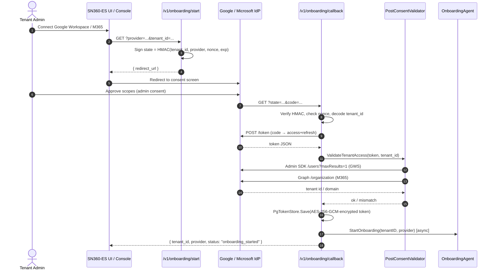
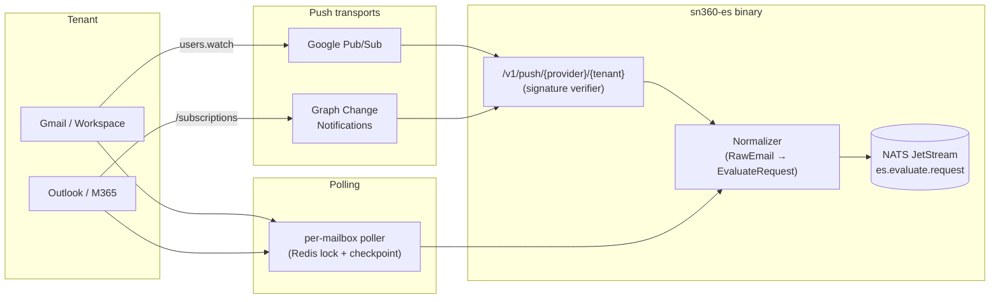
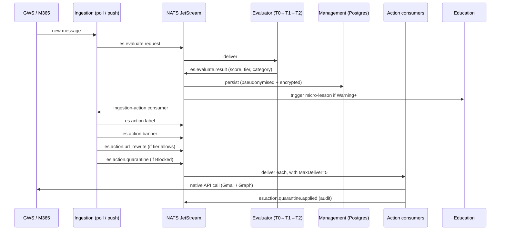

# Tenant Requirements & Implementation Deep-Dive: SN360-ES on Gmail and Outlook

*What it actually takes to connect SN360-ES to a Google Workspace or Microsoft 365 tenant — the auth setup, the OAuth onboarding, the per-capability HTTP shapes, the ingestion topology, and the privacy boundary that keeps customer content out of our stores.*

---

## Why a Tenant-Requirements Deep-Dive?

Most email security vendors hide their integration mechanics behind a marketing page. That works fine until a CISO asks the question that actually decides a deal: *"What permissions are you about to grant a third party against our entire mail estate, and what does the system do with them?"*

SN360-ES is built to answer that question line by line. This post is the long-form version: every scope, every Graph endpoint, every event subject, every encryption boundary — grounded in the file paths in the [`kennguy3n/sn360-es`](../README.md) repository.

If you are a buyer doing due diligence, jump to the [Summary Capability Matrix](#summary-capability-matrix). If you are an engineer onboarding the platform, start at the top — the rest of the post is what your tenant admin will end up doing.

---

## 1. Tenant Requirements — Google Workspace

SN360-ES connects to Google Workspace via a **service account with domain-wide delegation (DWD)**. This is the only mechanism Google supports for an external system to act on a mailbox without per-user OAuth consent, and it is the model documented in [`.env.example`](../.env.example) lines 150–169.

### 1.1 What You Provision in Google

Your Workspace super-admin performs a one-time setup in the GCP console and Google Admin console:

1. Create a GCP project.
2. Enable the **Admin SDK API** and **Gmail API**.
3. Create a **service account** and download the JSON key.
4. In **Admin Console → Security → API Controls → Domain-wide Delegation**, register the service account's numeric *client ID* with exactly three OAuth scopes:

   | Scope | Why SN360-ES needs it |
   |---|---|
   | `https://www.googleapis.com/auth/admin.directory.user.readonly` | Enumerate users for the org graph; needed by the [directory client](../pkg/email_provider/gmail/directory_client.go). |
   | `https://www.googleapis.com/auth/admin.directory.group.readonly` | Enumerate groups and group memberships for risk classification. |
   | `https://www.googleapis.com/auth/gmail.modify` | Apply labels, inject banners (via the import-and-trash shadow-copy flow), move messages to quarantine. **`gmail.modify` does NOT include `gmail.send`** — SN360-ES cannot send mail as a user. |

That scope list is the minimal viable surface; the rationale for each one is encoded directly into the wiring at [`cmd/sn360-es/wire_services.go`](../cmd/sn360-es/wire_services.go) and the JWT-Bearer source at [`pkg/email_provider/gmail/token_source.go`](../pkg/email_provider/gmail/token_source.go).

### 1.2 What You Hand to SN360-ES

After the admin grants DWD, the operator sets three environment variables:

```bash
GWS_SERVICE_ACCOUNT_JSON=/secrets/sn360-es-sa.json  # path OR inline JSON
GWS_DELEGATED_ADMIN=admin@example.com               # impersonated identity
GWS_DOMAIN=example.com                              # primary domain
```

The loader at `pkg/email_provider/gmail/token_source.go` (`LoadServiceAccount`) accepts either a filesystem path or inline JSON content, auto-detecting by leading `{` — so secrets can be injected via Kubernetes Secret, file mount, or env var without an indirection layer.

### 1.3 How the Token Flow Works at Runtime

`JWTBearerSource.Token` mints a fresh assertion only when fewer than 60s of TTL remain on the cached token, so a 500-mailbox tenant produces ~one token per process per hour, not one per API call:

```go
// pkg/email_provider/gmail/token_source.go
// JWTBearerSource issues access tokens for the Gmail API using the
// JWT-Bearer assertion flow with domain-wide delegation. Each call to
// Token() returns a cached token until 60s before expiry, at which
// point a fresh assertion is signed and exchanged.
```

Because impersonation is set per-call (`ImpersonatedUser`), SN360-ES rotates the `sub` claim per mailbox. The service account never holds a long-lived token for any single user; each request is bounded to the smallest possible blast radius.

### 1.4 The Self-Service Setup Wizard

To save the admin from a "did I miss a step?" support ticket, SN360-ES exposes a step-by-step validator at `GET /v1/onboarding/gws-setup-status?tenant_id=<id>` ([`internal/handler/onboarding_wizard.go`](../internal/handler/onboarding_wizard.go)):

```json
{
  "service_account_configured": true,
  "delegated_admin_configured": true,
  "domain_configured": true,
  "directory_access_ok": true,
  "gmail_access_ok": false,
  "steps_remaining": [
    "Grant the service account the Gmail API scope ... in Domain-wide Delegation"
  ]
}
```

The wizard runs **live connectivity checks** against the Admin SDK and Gmail endpoints, not just config presence — so a missing DWD scope grant surfaces in the response, not as a cryptic 403 three hours later.

---

## 2. Tenant Requirements — Microsoft 365

The M365 integration uses the **OAuth 2.0 client_credentials flow** against Microsoft Graph. The shape is the same as any modern enterprise-app integration; the details are encoded in [`pkg/email_provider/outlook/token_source.go`](../pkg/email_provider/outlook/token_source.go).

### 2.1 What You Provision in Azure AD

A Global Administrator (or Application Administrator) performs a one-time registration in Azure AD / Entra ID:

1. **App registrations → New registration** for SN360-ES. The redirect URI is only needed if you also opt into the self-service OAuth onboarding flow (see §3).
2. **Certificates & secrets** → create a client secret. Record the value at the moment of creation (Azure surfaces it exactly once).
3. **API permissions** → add **Application** (not Delegated) permissions on Microsoft Graph:

   | Permission | Why SN360-ES needs it |
   |---|---|
   | `User.Read.All` | Enumerate users and resolve manager / department fields for the org graph. |
   | `Group.Read.All` | Enumerate groups and (via `transitiveMemberOf`) nested group memberships. |
   | `Mail.ReadWrite` | Read message bodies for evaluation, mutate `categories` / `body.content` for labels and banners, move messages between folders for quarantine. **`Mail.ReadWrite` does NOT include `Mail.Send`** — SN360-ES cannot send mail as a user. |

4. **Grant admin consent** for the tenant.

The three permissions above are documented in [`.env.example`](../.env.example) lines 171–177 and consumed by [`pkg/email_provider/outlook/directory_client.go`](../pkg/email_provider/outlook/directory_client.go), [`pkg/email_provider/outlook/label_provider.go`](../pkg/email_provider/outlook/label_provider.go), [`pkg/email_provider/outlook/banner_injector.go`](../pkg/email_provider/outlook/banner_injector.go), [`pkg/email_provider/outlook/quarantine_provider.go`](../pkg/email_provider/outlook/quarantine_provider.go), and the ingestion mailbox provider.

### 2.2 What You Hand to SN360-ES

```bash
O365_CLIENT_ID=<application-id>
O365_CLIENT_SECRET=<client-secret>
O365_TENANT_ID=<directory-tenant-id>
O365_RESOLVE_NESTED_GROUPS=true   # default; uses /users/{id}/transitiveMemberOf
```

`O365_RESOLVE_NESTED_GROUPS` is on by default because the directory client at `pkg/email_provider/outlook/directory_client.go` switches between `memberOf` and `transitiveMemberOf` based on this flag — the latter is what gives you the full membership graph when "Engineering" is a member of "All Staff" is a member of "Newsletter Recipients".

### 2.3 How the Token Flow Works at Runtime

`ClientCredentialsSource.Token` POSTs to `https://login.microsoftonline.com/{tenant}/oauth2/v2.0/token` with the `https://graph.microsoft.com/.default` scope, caches the result until 60s before expiry, and re-uses it across every Graph call from the binary:

```go
// pkg/email_provider/outlook/token_source.go
// ClientCredentialsSource issues access tokens for Microsoft Graph
// using the OAuth2 client_credentials flow. It caches the most
// recently issued token until 60s before expiry.
```

A tenant of 1,000 mailboxes generates roughly 24 token requests per day to Microsoft, not 1,000 × ⟨polls/day⟩.

---

## 3. Self-Service Onboarding OAuth Flow

DWD and client_credentials are the *production-grade* tenant-onboarding paths. For SMEs that prefer a one-click consent screen rather than a manual admin runbook, SN360-ES exposes a self-service OAuth onboarding flow built around a signed-state HMAC and a nonce store — implemented in [`internal/service/onboarding/oauth.go`](../internal/service/onboarding/oauth.go) and [`internal/handler/onboarding.go`](../internal/handler/onboarding.go).

### 3.1 The Sequence



### 3.2 Why HMAC-Signed State (Not Just a Random Cookie)

OAuth state is famously easy to get wrong. SN360-ES uses an **HMAC-SHA256-signed payload** embedded directly in `state` so the callback handler is stateless: it can validate the parameter without a session lookup, while still rejecting tampered or stale values.

```go
// internal/service/onboarding/oauth.go
type StatePayload struct {
    TenantID  string       `json:"tid"`
    Provider  ProviderType `json:"p"`
    Nonce     string       `json:"n"`
    IssuedAt  int64        `json:"iat"`
    ExpiresAt int64        `json:"exp"`
}
```

`Sign` returns `base64(payload).hex(hmac)`; `Verify` checks HMAC equality with `hmac.Equal` (constant-time), then enforces a 10-minute expiry window. A leaked state from yesterday cannot be replayed today, and a state forged for tenant A cannot be re-aimed at tenant B.

### 3.3 Why a Nonce Store on Top of HMAC

The HMAC guarantees authenticity; it does *not* guarantee single-use. A network sniffer that captures a valid callback URL could in principle replay it. The flow therefore also consults a `NonceStore` ([`internal/service/onboarding/nonce_store.go`](../internal/service/onboarding/nonce_store.go)) on every callback, marking the nonce used for 10 minutes. The second call to the same callback is rejected with `nonce already used (replay detected)`.

### 3.4 Why a Post-Consent Validator

A subtle BEC-adjacent attack against OAuth is consent-mismatch: the user clicks "Approve" from the *wrong* org, and the integration silently binds tokens for `evilcorp.com` against the tenant ID `safecorp`. SN360-ES defends against this with a server-side check before the token is saved ([`internal/service/onboarding/post_consent_validator.go`](../internal/service/onboarding/post_consent_validator.go)):

- **Google**: calls Admin SDK `/admin/directory/v1/users?maxResults=1` and verifies the returned user's domain matches the expected primary domain.
- **Microsoft**: calls Graph `/organization` and compares the `tenantId` field against the expected tenant.

A mismatch aborts the flow before tokens hit the database.

### 3.5 Where the Tokens Live

`PgTokenStore` ([`internal/service/onboarding/token_store_pg.go`](../internal/service/onboarding/token_store_pg.go)) writes only the ciphertext to the `oauth_tokens` Postgres table. The encryption is AES-256-GCM via a `TokenEncryptor` interface intentionally separate from the per-tenant `privacy.Encryptor` — OAuth tokens are infrastructure secrets, not tenant data, so their key lives in `ONBOARDING_TOKEN_KEY_HEX` and is rotatable without touching tenant DEKs.

### 3.6 Where the Onboarding Agent Takes Over

Once tokens are persisted, the callback fires `PostConsentTrigger.StartOnboarding`. The default implementation is `AgentBridge` ([`internal/service/onboarding/discovery.go`](../internal/service/onboarding/discovery.go)), which kicks the AI Onboarding agent in a background goroutine bounded by a 10-minute context. The agent runs the directory discovery, vendor scan, sensitivity classification, and config seeding described in the [Directory Intelligence](./directory-intelligence-email-security.md) post.

`AgentBridge` is shutdown-aware: a `Draining` atomic flag is consulted before scheduling new work, and a `sync.WaitGroup` lets the binary wait for in-flight onboardings during graceful shutdown — so an SRE running `kubectl rollout restart` does not strand a tenant mid-onboarding.

---

## 4. Capability Implementation Deep-Dive

Once the tenant is connected, four post-evaluation capabilities act on each message. Each is implemented as a provider-agnostic Go interface with two backends (`pkg/email_provider/gmail/*` and `pkg/email_provider/outlook/*`), so the orchestrator at [`cmd/sn360-es/consumers.go`](../cmd/sn360-es/consumers.go) writes the same code path for both Gmail and Outlook tenants.

### 4.1 Labeling — Native Gmail Labels & Outlook Categories

The label model is the cleanest example of the abstraction. [`internal/service/action/label_applier.go`](../internal/service/action/label_applier.go) defines:

```go
type LabelProvider interface {
    Kind() LabelProviderKind
    EnsureLabel(ctx context.Context, email, name string, color LabelColor) (id string, err error)
    ApplyLabel(ctx context.Context, email, messageID, labelID string) error
    RemoveLabel(ctx context.Context, email, messageID, labelID string) error
}
```

Each provider implements this against its native model:

| Provider | EnsureLabel | ApplyLabel | RemoveLabel |
|---|---|---|---|
| **Gmail** ([`label_provider.go`](../pkg/email_provider/gmail/label_provider.go)) | `POST /gmail/v1/users/{email}/labels` with `labelListVisibility: labelShow`. Idempotent: 409 on duplicate is treated as success and the existing ID is fetched. | `POST /users/{email}/messages/{id}/modify` with `addLabelIds`. | Same `modify` endpoint with `removeLabelIds`. |
| **Outlook** ([`label_provider.go`](../pkg/email_provider/outlook/label_provider.go)) | `POST /me/outlook/masterCategories` — Outlook has no first-class label object, only a per-mailbox Master Category List and a `categories` string array on each message. The ID *is* the category name. | `PATCH /me/messages/{id}` with `categories` set to `union(existing, new)`. | `PATCH` with `categories` reduced. |

The applier serialises concurrent ensure-label calls per cache key (`ensureMu`) so a burst of 50 evaluations for the same tenant produces exactly one provider create call, not 50. The IDs are cached in Redis via the `LabelCache` interface so subsequent runs skip the create step entirely.

### 4.2 Banner Injection — Two Provider Models, One Contract

Banners are the high-visibility user touchpoint, and the two providers differ fundamentally in how a message body can be mutated.

#### Gmail: Immutable Body → Shadow-Copy Pattern

Gmail's `users.messages.modify` endpoint only mutates labels and flags. The body itself is immutable. [`pkg/email_provider/gmail/banner_injector.go`](../pkg/email_provider/gmail/banner_injector.go) therefore implements the "import + trash" shadow-copy flow used by Google's own add-on SDK:

```text
1. GET  /users/{email}/messages/{id}?format=raw
2. Decode RFC-2822, locate text/html (or text/plain) part, splice
   the banner HTML before <body>.
3. POST /users/{email}/messages/import with threadId set so the
   shadow stays in the same conversation; internalDateSource=dateHeader
   preserves the receive timestamp.
4. POST /users/{email}/messages/{id}/trash to remove the original.
```

The trash step is deliberately last. If step 3 succeeds and step 4 fails transiently, the user sees the banner immediately and the label applier's monotonicity logic catches the stale original on the next pass — failure mode is "duplicated message" (recoverable), not "no message at all" (data loss).

#### Outlook: Body Is Mutable → Single PATCH

Microsoft Graph supports direct body mutation, so the Outlook injector ([`pkg/email_provider/outlook/banner_injector.go`](../pkg/email_provider/outlook/banner_injector.go)) is a straightforward GET → splice → PATCH:

```text
1. GET   /v1.0/users/{email}/messages/{id}?$select=id,body
2. Splice banner HTML after <body> tag (promote text/plain → html
   when needed so the banner renders).
3. PATCH /v1.0/users/{email}/messages/{id} with the updated body.
```

#### Banner Rendering Is Provider-Free

Both injectors consume the *same* rendered HTML produced by [`internal/service/action/banner_renderer.go`](../internal/service/action/banner_renderer.go), which:

- Handles BCP-47 locale fallback (with right-to-left support for `ar`, `he`, `fa`, `ur`).
- Embeds a short-lived signed JWT (`ActionToken`) so banner buttons can post one-click feedback back to the pipeline without a session.
- Surfaces a "Degraded" notice when one or more detection services were down during evaluation.

Provider-agnostic rendering means a single change to the banner copy or layout ships to both Gmail and Outlook tenants in one PR.

### 4.3 URL Rewriting — Tier-Gated Interstitial With Encrypted Pre-Image

[`internal/service/action/url_rewriter.go`](../internal/service/action/url_rewriter.go) replaces `href="..."` attributes in the message body with an interstitial token. Three properties make this design notable:

1. **Tier-gated**: `req.Tier.AllowsURLRewrite()` short-circuits the rewrite for low-risk messages. Trusted / Informational / Caution tiers are pass-through — we don't add latency for clean mail.
2. **Encrypted pre-image**: the original URL is encrypted with the tenant's DEK (via `URLEncryptor`, satisfied by `pkg/privacy.Encryptor`) and stored in Redis under the token hash with a 30-day TTL. A Redis snapshot leak does not reveal which URLs were sent.
3. **Server-side re-check**: when the user clicks, the interstitial handler at [`internal/handler/interstitial.go`](../internal/handler/interstitial.go) calls a `ThreatIntel.CheckURL` hook — so a domain that became malicious between delivery and click is blocked at click-time, not waved through because we approved it 30 days ago.

The token itself is the only thing in the message body; the URL never appears in cleartext on the wire after rewrite, and is never stored in cleartext at rest.

### 4.4 Quarantine — Different Storage Models, Same Outcome

#### Gmail

[`pkg/email_provider/gmail/quarantine_provider.go`](../pkg/email_provider/gmail/quarantine_provider.go) creates the hidden `SN360 / Blocked` label (`messageListVisibility: hide` keeps it out of the sidebar), attaches it to the offending message, and removes `INBOX` in a single `modify` call. The user sees the message disappear from their primary view; admins can list quarantined messages via the label.

#### Outlook

The Outlook implementation ([`pkg/email_provider/outlook/quarantine_provider.go`](../pkg/email_provider/outlook/quarantine_provider.go)) deliberately does **not** use the well-known `junkemail` folder:

```go
// We deliberately do NOT use the "junkemail" well-known folder because
// Exchange Online tenants frequently configure aggressive Junk Email
// policies (e.g. auto-purge after N days) which would silently
// destroy messages SN360 is holding for admin review. A dedicated
// folder isolates SN360 from tenant-side retention policy.
```

Instead it creates a per-mailbox `SN360 / Quarantined` child folder and moves the message there. The folder-id cache is bounded at 16,384 entries (~4 MB upper bound) with random eviction on overflow — a defense against a runaway tenant exhausting memory in a long-running deployment.

#### Release Flow

`POST /v1/quarantine/release` ([`internal/handler/quarantine.go`](../internal/handler/quarantine.go)) accepts a signed JWT minted by the support agent. The token is the only authoritative source of `(tenant_id, pseudonymized_message_id)`. The handler verifies the JWT, looks up the original via the pseudonym, and calls `RestoreFromQuarantine` on the appropriate provider.

### 4.5 Add-Ins — Optional Pre-Send and Pre-Open Warnings

For tenants who want defenses in the *compose* and *read* surfaces (not just post-delivery), SN360-ES ships two thin client add-ins under [`deployments/addins/`](../deployments/addins/). These are optional — the core platform works without them — but they close the loop on user-driven mistakes that no inbox-side tool can catch.

| Add-In | Manifest | Triggers | Source |
|---|---|---|---|
| **Outlook** | [`manifest.json`](../deployments/addins/outlook/manifest.json) (Teams JSON v1.16, Mailbox capability ≥ 1.10) | `OnMessageSend`, `OnMessageRecipientsChanged` | [`presend.js`](../deployments/addins/outlook/src/presend.js), [`preopen.js`](../deployments/addins/outlook/src/preopen.js) |
| **Gmail** | [`appsscript.json`](../deployments/addins/gmail/appsscript.json) (Apps Script V8, gmail.addons.* scopes) | `composeTrigger.selectActions`, `contextualTriggers.unconditional` | [`presend.gs`](../deployments/addins/gmail/src/presend.gs), [`preopen.gs`](../deployments/addins/gmail/src/preopen.gs) |

Both manifests are scoped to the **smallest plausible permission set**: the Outlook add-in declares `mail` only (no `compose` write access beyond what the lifecycle event hands it); the Gmail add-on uses `gmail.addons.execute` + `gmail.addons.current.message.metadata` — metadata only, never the full message body. The add-ins are clients of the SN360-ES API; no message content leaves the mailbox.

---

## 5. Ingestion Architecture — Polling and Push, Side by Side

The ingestion domain ([`internal/service/ingestion/`](../internal/service/ingestion/)) is the canonical entry point for new mail. Two transports run side by side, with the choice determined per-tenant by infrastructure availability and provider preferences.

### 5.1 Polling — Always Available, Always Reliable

[`internal/service/ingestion/poller.go`](../internal/service/ingestion/poller.go) implements a per-mailbox worker pool:

- **Per-mailbox concurrency** — a buffered channel of `MailboxJob` is drained by `Concurrency` workers; a slow user does not block the rest of the tenant.
- **Distributed locking** — each `(tenant, mailbox)` poll acquires a Redis lock via the `DistributedLock` interface. Running multiple replicas of the binary against the same event bus does not double-poll a mailbox.
- **Checkpointing** — [`checkpoint.go`](../internal/service/ingestion/checkpoint.go) persists per-`(tenant, mailbox)` "last polled" timestamps in Redis. Keys are SHA-256 of the mailbox identifier so raw email addresses never appear in Redis keys. TTL is 90 days to bound long-paused tenants.
- **Graceful degradation** — when Redis is unavailable, `LockFactory` returns a `NoopLock`; the poller still runs (best-effort, no cross-replica coordination) instead of refusing to start.

The poller emits `es.evaluate.request` events onto the bus. Default interval is 30s; default batch size is 50 messages per mailbox per cycle (`INGESTION_INTERVAL`, `INGESTION_BATCH_SIZE`).

### 5.2 Push — Lower Latency, Per-Provider Mechanics

For tenants with public ingress, both providers offer push notifications that cut tail latency from ~30s to ~2s.

#### Gmail Push — Google Cloud Pub/Sub

[`push_gmail.go`](../internal/service/ingestion/push_gmail.go) implements Gmail's `users.watch` model:

1. Register a Pub/Sub topic (the SN360-ES operator owns the GCP project that hosts it).
2. Call `POST /gmail/v1/users/me/watch` with `topicName` + `labelIds: ["INBOX"]`. Watch defaults to ~7-day expiry; `Renew` re-registers (Gmail does not support in-place renewal).
3. Pub/Sub delivers notifications to `POST /v1/push/gmail/{tenant}` on the SN360-ES side. The payload is the standard Pub/Sub wrapper with a base64'd inner `gmailNotificationData` containing the mailbox address and the new `historyID`.

#### Outlook Push — Microsoft Graph Change Notifications

[`push_outlook.go`](../internal/service/ingestion/push_outlook.go) creates a Graph subscription:

1. `POST /v1.0/subscriptions` with `resource: users/{id}/mailFolders('Inbox')/messages`, `changeType: created`, and a ~48-hour `expirationDateTime` (Graph's max for mail is ~4230 minutes).
2. Graph performs a one-shot **validation handshake**: it `POST`s to the callback URL with a `validationToken` query parameter, and the callback MUST echo that token **byte-for-byte as `text/plain`** within 10 seconds.

The validation echo is implemented at [`internal/handler/push_webhook.go`](../internal/handler/push_webhook.go) with explicit hardening against accidental mutation:

```go
// Microsoft compares the echoed value byte-for-byte ... any mutation
// (HTML escaping, trimming, re-encoding) fails subscription validation.
w.Header().Set("Content-Type", "text/plain; charset=utf-8")
w.Header().Set("X-Content-Type-Options", "nosniff")
w.WriteHeader(http.StatusOK)
_, _ = w.Write([]byte(vt))
```

`X-Content-Type-Options: nosniff` is the defense-in-depth against a browser re-rendering the response as HTML.

#### Authenticating Pushes

Both push transports route through a single endpoint — `POST /v1/push/{provider}/{tenant}` — and authentication branches per provider via `PushSignatureVerifier` ([`internal/handler/push_signature.go`](../internal/handler/push_signature.go)):

- **Google Pub/Sub**: validates the OIDC bearer token attached to push deliveries, comparing `aud` against `INGESTION_PUSH_GOOGLE_AUDIENCE`. When the env var is unset, every callback is rejected — no accidentally-open endpoint.
- **Microsoft Graph**: compares the `clientState` field against the value set at subscription creation.

A missing or invalid credential returns `ErrPushAuthMissing` / `ErrPushAuthInvalid` and the handler responds **before** dispatching to the push manager — unauthenticated callers cannot trigger expensive provider fetches or pollute tenant state.

### 5.3 The Combined Topology



Push is an optimisation; polling is the safety net. A tenant whose subscription expires unexpectedly does not lose visibility — the next polling cycle picks up from the last checkpoint with at most `INGESTION_INTERVAL` of latency.

---

## 6. Privacy Architecture

The strongest signal in a security RFP isn't a marketing line — it's the code that enforces the privacy boundary. SN360-ES's [`pkg/privacy`](../pkg/privacy/) package is the single chokepoint through which every piece of tenant data flows.

### 6.1 Three Components, One Facade

```go
// pkg/privacy/privacy.go
type Privacy struct {
    pseudo Pseudonymizer  // Blake2b-256, keyed per tenant
    enc    Encryptor      // AES-256-GCM with per-tenant DEK
    jwt    *JWTIssuer     // signed action tokens
    san    *Sanitizer     // strip PII from logs / banner reasons
    keyForTenant func(ctx context.Context, tenantID string) ([]byte, error)
}
```

Every persistence call routes through this facade. Direct use of raw email addresses, message IDs, or body content outside this package is a code-review violation.

### 6.2 Pseudonymization — Blake2b-256, Keyed Per Tenant

[`pseudonymizer.go`](../pkg/privacy/pseudonymizer.go) hashes PII (email addresses, message IDs, URLs) with **Blake2b-256 keyed by a per-tenant 32-byte key**. Two properties matter:

- **Deterministic within a tenant**: the same email always pseudonymises to the same token, so the system can still aggregate `(employee, vendor)` relationships and behavioral baselines without holding plaintext.
- **Cross-tenant uncorrelatable**: two tenants cannot correlate each other's tokens because the keys differ — even if both pseudonymise the same address `alice@stripe.com`, the resulting tokens are unrelated.

The reflective `Pseudonymize(tenantKey, v)` walks struct fields tagged `privacy:"pii"` and replaces them in-place — so adding a new model with a PII field is a single annotation, not a sweeping refactor.

### 6.3 Envelope Encryption — Per-Tenant DEKs Wrapped by a CMK

[`encryptor.go`](../pkg/privacy/encryptor.go) implements **envelope encryption**: every tenant has its own Data Encryption Key (DEK), wrapped at rest by a Customer Master Key (CMK) managed by the KMS layer.

```text
Blob layout:
  [2 bytes wrappedLen][wrappedLen bytes wrapped DEK]
  [12 bytes nonce][AES-256-GCM ciphertext]
```

The blob is self-contained — `Decrypt` does not need any side state — which means a stolen ciphertext is useless without the CMK, and rotating the CMK does not require re-encrypting tenant data (it re-wraps the DEK only).

### 6.4 Cryptographic Erasure — "Forget" Means *Forget*

[`erasure.go`](../pkg/privacy/erasure.go) implements cryptographic erasure: deleting a tenant's DEK renders every ciphertext blob for that tenant permanently unreadable. There is no "delete pass" over Postgres rows, no S3 walker — the data still exists physically, but with the key destroyed it is mathematically unrecoverable.

This satisfies the "right to be forgotten" requirement under GDPR and the parallel data-residency clauses in APPI (Japan), PIPL (China), and PIPA (South Korea) — and it does so in milliseconds rather than the hours a full delete sweep would take.

### 6.5 Zero-Knowledge Evaluation

The detection pipeline reads message body content but never persists it. The lifecycle is:

```text
1. Ingestion reads RawEmail from provider.
2. Normalizer builds an EvaluateRequest (body still cleartext, in-memory).
3. Evaluator (Tier 0 / 1 / 2) reads body, emits a verdict.
4. EvaluateResult records only:
     - pseudonymized_message_id
     - pseudonymized_sender_hash
     - tier verdict (0-100 score, tier label, category)
     - sanitised reason codes (no quoted body text)
     - encrypted ciphertext blob (when the verdict needs admin review)
5. RawEmail is dropped at goroutine exit. Garbage-collected.
```

Nothing in the persistence layer can reconstruct the original message without the per-tenant DEK. And nothing in our logs (`privacy.Sanitizer` strips PII before emission) ties a verdict back to a human-readable address.

---

## 7. Event-Driven Action Pipeline

The four capabilities in §4 do not run inline with the evaluator — they run as **event consumers** on the NATS JetStream backbone. This decouples evaluation latency from provider-side I/O latency, and it makes every action independently retryable.

### 7.1 The Subject Tree

The naming convention is `es.<domain>.<action>[.<detail>]`. The full set (extracted from a `grep` over the codebase) is:

```text
es.evaluate.request
es.evaluate.result
es.action.label
es.action.banner
es.action.url_rewrite
es.action.quarantine
es.action.quarantine.applied
es.action.quarantine.release
es.action.feedback.report_phishing
es.action.feedback.report_confirmed
es.action.feedback.report_dismissed
es.action.escalation.created
es.action.escalation.resolved
es.onboarding.tenant.created
es.onboarding.user.created
es.onboarding.vendor.seeded
es.onboarding.backfill.complete
es.onboarding.label.retry
es.education.lesson.trigger
es.education.simulation.send
es.education.simulation.result
es.relationship.vendor.approved
es.relationship.vendor.pending_approval
es.relationship.vendor.auth_degraded
es.agent.tuning.proposed
es.dlq.evaluate
es.dlq.action
es.dlq.onboarding
es.dlq.education
es.dlq.other
es.dashboard.report.generated
```

Subjects are stable across the codebase — every publisher and consumer in [`cmd/sn360-es/consumers.go`](../cmd/sn360-es/consumers.go) uses string literals that grep-match cleanly.

### 7.2 Durable Consumers with Bounded Retries

Every consumer is registered as a **durable** subscription with an explicit `MaxDeliver` budget:

```go
// cmd/sn360-es/consumers.go
a.eventBus.Subscribe(ctx, "es.action.label", a.handleActionLabel,
    events.WithDurable("action-label"),
    events.WithMaxDeliver(5))
```

| Subject | Durable name | Max deliver |
|---|---|---|
| `es.evaluate.request` | `evaluate-svc` | 5 |
| `es.evaluate.result` | `ingestion-action`, `management-persist`, `education-trigger` | 3 |
| `es.action.label` | `action-label` | 5 |
| `es.action.banner` | `action-banner` | 5 |
| `es.action.url_rewrite` | `action-url-rewrite` | 5 |
| `es.action.quarantine` | `action-quarantine` | 5 |
| `es.action.quarantine.release` | `quarantine-release` | 5 |
| `es.action.feedback.>` | `feedback-persist` | 3 |
| `es.action.escalation.>` | `escalation` | 3 |
| `es.onboarding.>` | `onboarding` | 5 |

Durable consumers mean a binary restart does not re-process the entire stream from the beginning; it picks up where it left off. `MaxDeliver` means a persistently-failing message lands in the DLQ (`es.dlq.action`, `es.dlq.evaluate`, etc.) rather than ping-ponging forever on the work queue.

### 7.3 The End-to-End Flow for One Email



Three properties fall out of this design:

- **Independent retry**: a transient Gmail 5xx on label apply does not block the banner injection.
- **Provider-side isolation**: if a tenant's Gmail API quota is exhausted, only the action consumer slows down — evaluation and education continue.
- **Auditability**: every action publishes an outcome event (`es.action.quarantine.applied`) that the management domain persists as an immutable audit row.

### 7.4 Dead-Letter Handling

[`internal/service/dlq_processor.go`](../internal/service/dlq_processor.go) consumes `es.dlq.*` and routes each entry to an alerting backend. A message that exhausts its `MaxDeliver` budget is not silently dropped — it surfaces in operator dashboards within seconds, with full headers (`HeaderError`, `HeaderDeliveryCount`, `HeaderOriginSubject`) attached for diagnosis.

---

## 8. Summary Capability Matrix

For the buyer at the back of the room scanning for a single table to put in the procurement deck:

| Capability | Google Workspace | Microsoft 365 | Source |
|---|---|---|---|
| **Auth — production** | Service account + Domain-Wide Delegation (JWT-Bearer assertion) | Azure AD app + client_credentials | [`token_source.go`](../pkg/email_provider/gmail/token_source.go), [`token_source.go`](../pkg/email_provider/outlook/token_source.go) |
| **Auth — self-service** | OAuth 2.0 Authorization Code (signed-state + nonce + post-consent validator) | OAuth 2.0 Authorization Code (same flow, different IdP) | [`oauth.go`](../internal/service/onboarding/oauth.go) |
| **Required scopes — directory** | `admin.directory.user.readonly`, `admin.directory.group.readonly` | `User.Read.All`, `Group.Read.All` | [`.env.example`](../.env.example), [`wire_services.go`](../cmd/sn360-es/wire_services.go) |
| **Required scopes — mail** | `gmail.modify` (no send) | `Mail.ReadWrite` (no send) | Same |
| **Nested group resolution** | Admin SDK groups list (recurses on demand) | `transitiveMemberOf` (`O365_RESOLVE_NESTED_GROUPS=true`) | [`directory_client.go`](../pkg/email_provider/outlook/directory_client.go) |
| **Token at rest** | Service-account JSON (file mount or env), wraps to in-memory cache | OAuth refresh token via `PgTokenStore` (AES-256-GCM) | [`token_store_pg.go`](../internal/service/onboarding/token_store_pg.go) |
| **Labeling** | Gmail Labels (`users.labels`, `users.messages.modify`) | Outlook Categories (`/me/outlook/masterCategories` + `categories[]` PATCH) | [`label_provider.go`](../pkg/email_provider/gmail/label_provider.go), [`label_provider.go`](../pkg/email_provider/outlook/label_provider.go) |
| **Banner injection** | Import + Trash shadow-copy (body is immutable) | Direct PATCH on `/messages/{id}.body` | [`banner_injector.go`](../pkg/email_provider/gmail/banner_injector.go), [`banner_injector.go`](../pkg/email_provider/outlook/banner_injector.go) |
| **URL rewriting** | Provider-agnostic; tier-gated; encrypted pre-image in Redis | Same | [`url_rewriter.go`](../internal/service/action/url_rewriter.go) |
| **Interstitial click-time recheck** | `ThreatIntel.CheckURL` server-side hook | Same | [`interstitial.go`](../internal/handler/interstitial.go) |
| **Quarantine storage** | Hidden `SN360 / Blocked` label + INBOX removal | Dedicated `SN360 / Quarantined` folder (NOT `junkemail`, to escape tenant retention policy) | [`quarantine_provider.go`](../pkg/email_provider/gmail/quarantine_provider.go), [`quarantine_provider.go`](../pkg/email_provider/outlook/quarantine_provider.go) |
| **Quarantine release** | `POST /v1/quarantine/release` with signed JWT | Same | [`quarantine.go`](../internal/handler/quarantine.go) |
| **Polling ingestion** | Per-mailbox worker pool, Redis lock, SHA-256-keyed checkpoint | Same | [`poller.go`](../internal/service/ingestion/poller.go), [`checkpoint.go`](../internal/service/ingestion/checkpoint.go) |
| **Push ingestion** | `users.watch` → Cloud Pub/Sub (7-day watch, OIDC-authenticated callback) | Graph Change Notifications (`/subscriptions`, 48h max, `clientState`-authenticated) | [`push_gmail.go`](../internal/service/ingestion/push_gmail.go), [`push_outlook.go`](../internal/service/ingestion/push_outlook.go) |
| **Push validation handshake** | OIDC `aud` claim matches `INGESTION_PUSH_GOOGLE_AUDIENCE` | One-shot `validationToken` echoed verbatim with `nosniff` | [`push_webhook.go`](../internal/handler/push_webhook.go) |
| **Pre-send / pre-open add-in** | Apps Script add-on (`appsscript.json` + `.gs`) | Outlook add-in (Teams manifest v1.16 + `.js`) | [`deployments/addins/`](../deployments/addins/) |
| **Pseudonymization** | Blake2b-256 keyed per tenant | Same | [`pseudonymizer.go`](../pkg/privacy/pseudonymizer.go) |
| **At-rest encryption** | Envelope encryption (per-tenant DEK wrapped by CMK) | Same | [`encryptor.go`](../pkg/privacy/encryptor.go) |
| **Right-to-be-forgotten** | Cryptographic erasure (destroy tenant DEK) | Same | [`erasure.go`](../pkg/privacy/erasure.go) |
| **Event bus** | NATS JetStream, durable consumers, `MaxDeliver` + DLQ | Same | [`consumers.go`](../cmd/sn360-es/consumers.go) |
| **Cross-replica safety** | Redis distributed lock per `(tenant, mailbox)` | Same | [`poller.go`](../internal/service/ingestion/poller.go) |

---

## What This Means in Practice

For a **buyer**: the SN360-ES tenant footprint is three OAuth scopes per side, and the encryption boundary is documented in code paths you can audit.

For an **operator**: connect either provider in under ten minutes — `GET /v1/onboarding/gws-setup-status` and the OAuth callback validator hand you a structured "what's missing" response, not a stack trace.

For a **builder**: the `LabelProvider`, `BannerInjector`, `QuarantineProvider`, `BodyRewriter`, `MailboxProvider`, and `DirectoryClient` interfaces are the seams. SN360-ES ships native packages for Gmail, Outlook, **Zoho Mail**, **Fastmail (JMAP)**, and **Amazon WorkMail** today — see [`blog/tenant-requirements-zoho-fastmail-workmail.md`](./tenant-requirements-zoho-fastmail-workmail.md) for the equivalent deep-dive on the three newer providers. Adding Yahoo Mail, IMAP, or an on-prem Exchange is still a new package under `pkg/email_provider/`, not a fork of the binary.

The platform's commitment is straightforward: every byte of customer mail that enters SN360-ES is either dropped at goroutine exit, hashed before it touches disk, or encrypted under a key the customer can destroy at will. The architecture is the proof — and the file paths in this post are the receipts.
