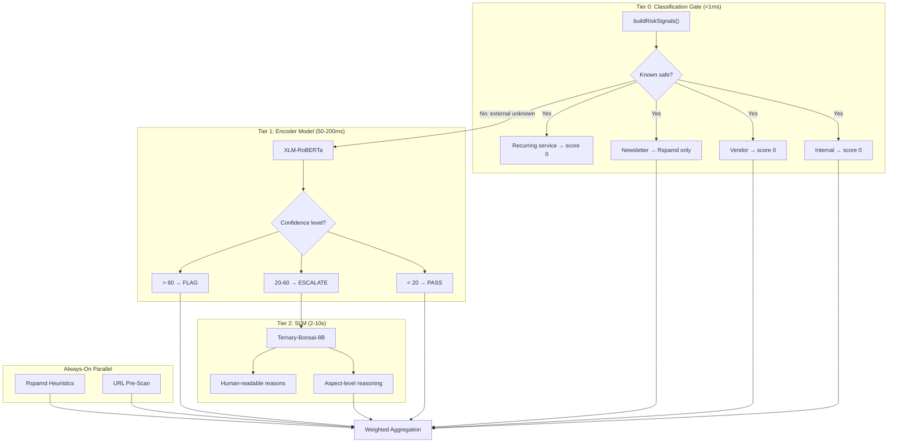
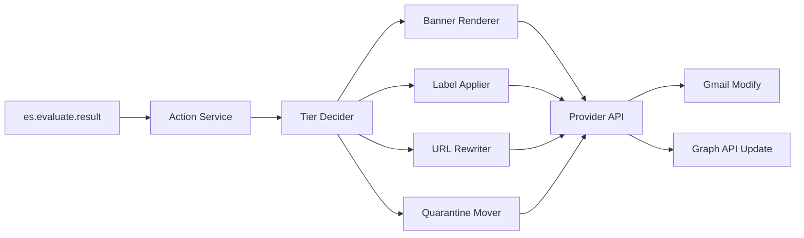

# SN360-ES Architecture Document

## 1. System Overview

SN360-ES is a multi-tenant, privacy-first email security platform. It
ships as a **single `sn360-es` Go binary** (`cmd/sn360-es/`) that owns
the HTTP API, the NATS JetStream / Redis Streams consumers, and the
periodic workers. The codebase is organised into four logical
**domains** — Ingestion, Evaluation, Management, and Education — but
those domains are packages compiled into the same process, not
separate microservices. Replicas of the same binary are scaled
horizontally behind the same event bus and database; what differs
between replicas is consumer-group routing rather than the build.

Redis is used for caching and distributed locking, and PostgreSQL is
used for encrypted persistent storage.

### High-Level Topology

```mermaid
graph TD
    subgraph "External APIs"
        GWS["Google Workspace API"]
        O365["Microsoft Graph API"]
        SLM["Tier 2 SLM (Ternary-Bonsai-8B)"]
    end

    subgraph "sn360-es binary (single process)"
        subgraph "Ingestion domain"
            IngAPI["Ingestion HTTP routes"]
            PollDispatcher["Poll Dispatcher"]
            ActionSvc["Action Service"]
            OnboardSvc["Onboarding Service"]
        end

        subgraph "Evaluation domain"
            EvalConsumer["Evaluate consumer"]
            Tier0["Tier 0: Classification Gate"]
            Tier1["Tier 1: Encoder Model"]
            Tier2["Tier 2: SLM client"]
            RspamdSvc["Rspamd client"]
            ShieldNet["ShieldNet Worker"]
        end

        subgraph "Management domain"
            MgmtAPI["Management HTTP routes"]
            MgmtConsumer["Management consumer"]
            RelWorker["Relationship Aggregation"]
            CleanupWorker["Cleanup Worker"]
            AIAgents["AI Agent Controller"]
        end

        subgraph "Education domain"
            EduEngine["Education Engine"]
            SimGenerator["Simulation Generator"]
            ResilienceTracker["Resilience Tracker"]
        end

        subgraph "Heuristic Engine"
            Rspamd["Rspamd v3.14.2"]
            Unbound["Unbound DNS"]
        end

        subgraph "Privacy Layer"
            Pseudonymizer["PII Pseudonymizer"]
            Encryptor["Envelope Encryptor"]
            LogSanitizer["Log Sanitizer"]
        end
    end

    subgraph "Event Bus"
        NATS["NATS JetStream Cluster"]
    end

    subgraph "Data Stores"
        PG["PostgreSQL (encrypted)"]
        Redis["Redis (cache + locks)"]
        S3["AWS S3 (credentials)"]
        KMS["AWS KMS (encryption keys)"]
    end

    GWS <--> PollDispatcher
    O365 <--> PollDispatcher
    PollDispatcher --> Pseudonymizer
    Pseudonymizer --> NATS
    NATS --> Tier0
    Tier0 --> Tier1
    Tier1 --> Tier2
    Tier2 --> SLM
    EvalConsumer --> RspamdSvc
    RspamdSvc --> Rspamd
    Rspamd --> Unbound
    EvalConsumer -->|"result"| NATS
    NATS --> ActionSvc
    NATS --> MgmtConsumer
    NATS --> EduEngine
    ActionSvc --> GWS
    ActionSvc --> O365
    MgmtAPI --> PG
    MgmtAPI --> Redis
    Encryptor --> KMS
    RelWorker --> PG
    RelWorker --> Redis
```



## 2. Event Bus — NATS JetStream

### Why NATS JetStream

NATS JetStream is the primary inter-domain event bus. A Redis Streams
implementation behind the same `events.EventService` interface
(`pkg/events/`) remains available as a fallback selected via
`EVENT_BUS=nats|redis`. Redis is otherwise used exclusively for
caching and distributed locking.

### Stream Architecture

| Stream | Subjects | Retention | Storage | Purpose |
|---|---|---|---|---|
| `ES_EVALUATE` | `es.evaluate.>` | WorkQueue | File | Evaluation pipeline events |
| `ES_ONBOARDING` | `es.onboarding.>` | WorkQueue | File | User/tenant lifecycle events |
| `ES_EDUCATION` | `es.education.>` | Limits | File | Education campaign events (retained for analytics) |
| `ES_ACTION` | `es.action.>` | WorkQueue | File | Post-evaluation remediation actions |
| `ES_DLQ` | `es.*.dlq` | Limits | File | Dead-letter queue for failed processing |

### Message Flow


### Consumer Groups

Although the consumers live in the same binary, JetStream still groups
them by name so multiple replicas of `sn360-es` can share work.

| Consumer Group | Stream | Filter | Max Deliver | Ack Wait | Wired in binary | Purpose |
|---|---|---|---|---|---|---|
| `evaluate-svc` | ES_EVALUATE | `es.evaluate.request` | 5 | 60s | Yes (critical when `evaluator` is constructed) | Multi-tier evaluation processing |
| `ingestion-action` | ES_EVALUATE | `es.evaluate.result` | 3 | 30s | Yes (critical when banner/URL/release wired) | Banner + label + URL-rewrite + quarantine fan-out |
| `management-persist` | ES_EVALUATE | `es.evaluate.result` | 3 | 30s | Yes (critical when Postgres repos wired) | Result persistence |
| `education-trigger` | ES_EVALUATE | `es.evaluate.result` | 3 | 10s | Yes (critical when micro-lesson service wired) | Education micro-lesson triggers |
| `feedback-persist` | ES_EVALUATE | `es.action.feedback.>` | 3 | 30s | Yes (critical when feedback repo wired) | Persist banner click feedback for dashboard counts |
| `ingestion-onboard` | ES_ONBOARDING | `es.onboarding.>` | 3 | 30s | Yes (best-effort; observe-only until directory client wired) | Onboarding handlers |
| `education-sim` | ES_EDUCATION | `es.education.simulation.send` | 3 | 30s | Yes (critical when simulation engine wired) | Simulation campaign execution |
| `education-sim-track` | ES_EDUCATION | `es.education.simulation.result` | 3 | 30s | Yes (best-effort when tracker wired) | Record per-user interaction outcomes |
| `quarantine-release` | ES_ACTION | `es.action.quarantine.release` | 3 | 30s | Yes (critical when release service wired) | Quarantine release flow |
| `escalation` | ES_ACTION | `es.action.escalation.>` | 3 | 30s | Yes (critical when escalation service wired) | SecOps escalation ticket fan-out |
| `action-banner` | ES_ACTION | `es.action.banner` | 3 | 30s | Yes (best-effort; degrades to logging without a provider) | Banner injection via provider API (Gmail import-and-trash, Outlook `PATCH /me/messages/{id}`) |
| `action-label` | ES_ACTION | `es.action.label` | 3 | 30s | Yes (best-effort; degrades to logging without a provider) | Tier-aware label application via Gmail Labels / Outlook categories |
| `action-url-rewrite` | ES_ACTION | `es.action.url_rewrite` | 3 | 30s | Yes (best-effort; degrades to logging without a provider) | Body URL rewriting to interstitial tokens |
| `action-quarantine` | ES_ACTION | `es.action.quarantine` | 3 | 30s | Yes (best-effort; degrades to logging without a provider) | Provider-side quarantine (move to hidden label/folder, store encrypted reference) |

#### `TIER1_BATCH_ENABLED` wire-format dependency

The optional Tier 1 `BatchOrchestrator` (`internal/service/evaluate/batch.go`)
shares the `es.evaluate.request` subject with the per-message
`evaluate-svc` consumer, but the two consumers expect **different
payloads on the wire**:

| `TIER1_BATCH_ENABLED` | Active consumer | Expected payload on `es.evaluate.request` |
|---|---|---|
| `false` (default) | per-message `evaluate-svc` (`handleEvaluateRequest`) | `dto.EvaluateRequest` JSON |
| `true` | `BatchOrchestrator` only (per-message consumer is suppressed) | `evaluate.BatchMessage` JSON: `{ "request": dto.EvaluateRequest, "signals": dto.RiskSignals }` |

`sn360-es` enforces mutual exclusion via the `a.evaluator != nil &&
a.batchOrch == nil` guard in `StartConsumers`, so both consumers will
never be active at once in the same process. However, **upstream
publishers (ingestion-svc, replay tooling, anything that calls
`bus.Publish("es.evaluate.request", ...)`) must agree on which payload
shape to emit for the configured mode**. A misconfigured deployment
(batch enabled in `sn360-es` but ingestion still publishing flat
`dto.EvaluateRequest` payloads, or vice versa) results in every message
failing to unmarshal and being NAK'd up to `MaxDeliver=5` before
landing in the DLQ.

When flipping `TIER1_BATCH_ENABLED`, roll the publisher and the
consumer together: both must speak the same wire format in the same
release.

## 3. Detection Pipeline

### 3-Tier Architecture



### Risk Scoring Engine

Weights per category (configurable per tenant):

| Category | Default Weight | Source |
|---|---|---|
| `ai` (Tier 1 or Tier 2) | 80% | Encoder or SLM score |
| `rspamd` | 20% | Heuristic score |
| `attachments` | 0% (reserved) | ShieldNet sandbox |
| `links` | 0% (reserved) | URL threat intel |

Formula: `final_score = Σ(category_weight × normalized_category_score)`, clamped to `[0, 100]`

### Multilingual Support

| Tier | Multilingual Approach |
|---|---|
| **Tier 0** | Language-agnostic (metadata-based rules) |
| **Tier 1** | XLM-RoBERTa: 100+ languages native, code-switching aware |
| **Tier 2** | Ternary-Bonsai-8B SLM, multilingual; receives language hint from Tier 1 |
| **Rspamd** | Language-agnostic heuristics (SPF/DKIM/RBL) |
| **Banners** | i18n templates (en, vi, th, ja, ko, zh, etc.) |
| **Education** | Simulations and lessons in employee's language |

### Tier 2 SLM Deployment

The Tier 2 model is a **self-hosted Ternary-Bonsai-8B SLM**. The
deployment manifests live in [`deployments/llm/`](../../deployments/llm/);
the in-process Go client is `internal/service/evaluate/tier2.go` and
uses the shared `pkg/httpclient` pool. Corpus generation and accuracy
baselines are pinned to this deployment for reproducibility — see
[`scripts/CORPUS.md`](../../scripts/CORPUS.md) and
[`scripts/corpus_generator/README.md`](../../scripts/corpus_generator/README.md).
Alternative model providers are not supported.

## 4. Privacy Architecture

### Data Flow with Privacy Controls

```
Email arrives → Fetch via API
  → In-memory normalization
  → PII fields tagged
  → Detection (all in-memory, no persistence of content)
  → Action (banner + native label injected back to provider)
  → Metadata pseudonymized (blake2 hash)
  → Encrypted score + reasons stored
  → Raw email NEVER stored
```

### Encryption Layers

| Layer | Method | Key Management |
|---|---|---|
| **Transit** | TLS 1.3 (all connections) | Auto-managed via cert-manager |
| **At rest (PostgreSQL)** | AES-256-GCM column-level | Per-tenant data key via AWS KMS envelope encryption |
| **At rest (Redis)** | AES-256-GCM value-level | Shared platform key (cache is ephemeral) |
| **At rest (S3)** | SSE-KMS | AWS-managed KMS key |
| **At rest (NATS)** | AES-256 file encryption | Platform key (messages are transient) |
| **Audit logs** | Append-only, no PII | Signed with platform key |

### Tenant Isolation

- All database queries scoped by `tenant_id` (enforced at repository layer)
- Redis keys namespaced: `tenant:{name}:*`
- NATS subjects optionally partitioned: `es.{tenant}.evaluate.request`
- Per-tenant encryption keys (derived from AWS KMS CMK)
- Tenant deletion = key deletion = cryptographic erasure

## 5. Service Architecture

The four "services" below are **packages within the single
`cmd/sn360-es/` binary**. They share the same configuration, event-bus
client, HTTP server, and lifecycle. What distinguishes them is which
NATS subjects they subscribe to, which periodic workers they own, and
which HTTP routes they register. Horizontal scaling is done by running
multiple replicas of the same binary behind the same event bus.

### 5.1 Ingestion Domain

- **Poll Dispatcher**: Distributed lock per `(tenant, provider, email)`, concurrent worker pool
- **Provider abstraction**: GWS (domain-wide delegation) + O365 (client credentials)
- **Normalizer**: Provider-specific → unified `EmailEvent` with PII tagging
- **Action Pipeline**: Tiered banner injection + native label application + quarantine (see Section 8)
- **Event bridge**: Publishes to `es.evaluate.request`, consumes from `es.evaluate.result`

#### 5.1.1 Ingestion Polling

The polling layer lives in `internal/service/ingestion/` and is wired
by `cmd/sn360-es/main.go` (`buildPoller`, `buildMailboxProviders`).

- **`Poller`** (`internal/service/ingestion/poller.go`): owns one
  `MailboxProvider` per provider kind (Gmail, Outlook) plus a worker
  pool sized by `PollerConfig.Concurrency`. Each tick:
  1. Calls `MailboxProvider.ListMailboxes(ctx, tenant)` to discover
     the mailboxes the provider has access to for the tenant.
  2. Submits one job per mailbox onto a buffered channel; the worker
     pool drains the channel so a slow mailbox cannot block the
     others.
  3. For each mailbox the worker acquires a Redis distributed lock
     keyed `ingestion:lock:{tenant}:{mailbox_hash}` (TTL slightly
     larger than the poll interval to absorb GC pauses without
     allowing double-polling).
  4. Reads the previous high-water mark from the `CheckpointStore`
     (`internal/service/ingestion/checkpoint.go`, Redis-backed,
     keyed `ingestion:checkpoint:{tenant}:{mailbox_hash}`), calls
     `MailboxProvider.FetchNew(ctx, mailbox, since, limit)`, runs
     each `RawEmail` through the `Normalizer`, publishes the
     resulting `dto.EvaluateRequest` on `es.evaluate.request`, and
     finally advances the checkpoint.
- **`Normalizer`** (`internal/service/ingestion/normalizer.go`):
  strips HTML, pseudonymises addresses via
  `pkg/privacy/pseudonymizer.go`, computes the `RawBodyHash` /
  `NormalisedHash` pair, extracts SPF / DKIM / DMARC results from
  the `Authentication-Results` header, derives `RiskSignals`
  (`IsExternal`, `IsFreeDomain`, `HasAttachment`, sender / recipient
  domains), and assigns a locale from `Content-Language` or the
  tenant default.
- **Distributed lock** (`pkg/storage/redis/lock.go`): the same
  `SET NX EX` + Lua-scripted `Release` / `Extend` primitive that
  the periodic workers use (see Section 5.3). The poller wraps it in
  a `LockFactory` so each cycle gets a fresh lock instance.
- **Graceful degradation**: failures on a single mailbox are logged
  but not fatal — the next cycle retries from the previous
  checkpoint. When no provider credentials are configured the
  poller is not constructed at all and `StartBackground` becomes a
  no-op.

### 5.2 Evaluation Domain

- **Tier 0 Gate**: Rule-based classification using `buildRiskSignals()`
- **Tier 1 Encoder**: HTTP call to self-hosted XLM-RoBERTa inference service (`deployments/encoder/`)
- **Tier 2 SLM**: HTTP call to the self-hosted Ternary-Bonsai-8B deployment (`deployments/llm/`)
- **Rspamd**: Always-on parallel heuristic check
- **ShieldNet**: Async attachment sandbox submission
- **Scorer**: Weighted aggregation with per-tenant overrides from Redis
- **Consumer**: `es.evaluate.request` from NATS / Redis Streams

### 5.3 Management Domain

- **Domain entities**: Tenants, Users, Groups, Labels, Score Engine, Email Classifications, Vendors, Evaluation Results, Communication History
- **Persistence**: `internal/repository/` exposes one interface per entity backed by both a Postgres (pgx) implementation and an in-memory fixture for tests. The Postgres schema is defined under `migrations/` and applied via `make migrate-up`.
- **Relationship Aggregation Worker**: Runs every 4h, computes 7d/30d sender→receiver stats, caches in Redis
- **AI Agent Controller**: Orchestrates auto-tuning, onboarding, support agents
- **Cleanup Worker**: Stream + data retention enforcement
- **HTTP routes**: Tenant/user/group/label CRUD, dashboard summary, escalation get/resolve

### 5.4 Education Domain

- **Simulation Generator**: AI-powered phishing simulation creation
- **Campaign Scheduler**: Auto-schedules based on tenant threat profile
- **Interaction Tracker**: Records user responses to simulations and micro-lessons
- **Resilience Scorer**: Computes per-employee and per-group security awareness scores
- **Micro-Lesson Engine**: Generates contextual lessons matched to detected threat types
- **HTTP route**: `GET /v1/education/lesson/{category}` returns the contextual lesson; `es.education.lesson.trigger` consumer fans out lessons after escalated evaluations

### 5.5 Shared Packages

- **`pkg/httpclient/`**: HTTP/2 pooled client with retry, circuit breaker, and per-call timeout. Shared by the VirusTotal URL scanner, the encoder client (Tier 1), the SLM client (Tier 2), and tenant provider clients.
- **`pkg/storage/postgres/`**: pgx-based PostgreSQL connection helper with structured `Config` and `Open` / `Close` / `Ping` / `Driver` accessors.
- **`pkg/storage/redis/`**: Redis pipeline wrapper, scan / prefix helpers, and JSON serialization helpers used by the `internal/service/cache/` AI + Rspamd caches and the action-token cache.
- **`pkg/storage/s3/`**: AWS S3 client wrapper for raw-body offload (optional).
- **`pkg/events/`**: Bus factory that selects between `pkg/events/nats/` (default) and `pkg/events/redis/` based on the `EVENT_BUS` config flag.
- **`internal/translation/banners/`**: Banner i18n bundles re-exported from `internal/service/action/catalogs/` so other domains can reuse the same wording.

## 6. Infrastructure

### 6.1 Kubernetes Deployment

SN360-ES deploys as a **single Deployment** running the `sn360-es`
binary; there is no per-domain Deployment object. Scaling is done by
increasing the replica count on this Deployment — NATS consumer groups
take care of work distribution across replicas. Periodic workers
(relationship aggregation, cleanup, education scheduler) elect a
leader via a Redis lock so only one replica runs them at a time.

- **Platform**: AWS EKS
- **GitOps**: ArgoCD with auto-sync
- **Environments**: dev → qa → uat → prod (namespace isolation)
- **Secrets**: AWS Secrets Manager via CSI Driver
- **Encryption**: AWS KMS for tenant data keys
- **NATS**: Deployed as StatefulSet with persistent volumes (3-node cluster), pulled in as a Helm subchart of `deployments/helm/sn360-es/`
- **Encoder Model**: Deployed as GPU-enabled Deployment (or CPU with HPA) from `deployments/encoder/`
- **Tier 2 SLM**: Deployed from `deployments/llm/` (Ternary-Bonsai-8B)

### 6.2 Observability

- **Logging**: Structured JSON via `slog`, PII-sanitized through `internal/middleware/log_sanitizer.go`.
- **Tracing**: OpenTelemetry W3C Trace Context (HTTP + NATS propagation) from `pkg/telemetry/tracer.go`.
- **Metrics**: Prometheus counters / histograms registered in `pkg/telemetry/metrics.go` (namespace `sn360`, subsystem `es`). The metrics handler is exposed at `GET /metrics` from `cmd/sn360-es/main.go`. A `ServiceMonitor` ships in the Helm chart for scrape config.
- **Health probes**: `GET /healthz` (liveness — always 200) and `GET /readyz` (readiness — runs NATS / Redis / PG probes with a 2 s timeout) via `internal/handler/health.go`. Wired into the Helm chart's `livenessProbe` / `readinessProbe`.
- **Alerting**: AI agent monitors metrics, auto-escalates to SN360 SecOps.

### 6.3 API Documentation

- **Spec**: `api/openapi.yaml` (OpenAPI 3.1) documents every public handler, including `/v1/banner/action`, `/v1/education/lesson/{category}`, `/v1/escalation/resolve`, `/v1/dashboard/summary`, `/v1/predict/{recipient,open}`, `/v1/quarantine/release`, and the health / metrics endpoints.
- **Serving**: `internal/handler/docs.go` exposes Swagger UI at `/docs` (pinned to 5.17.14 for reproducibility) and the raw spec at `/openapi.yaml`.

### 6.4 Database Migrations

- **Tool**: `golang-migrate/migrate` v4 (PostgreSQL driver).
- **CLI**: `cmd/sn360-es-migrate/` wraps the library so deployments can run migrations as a Kubernetes Job (template included in the Helm chart).
- **Make targets**: `make migrate-up`, `make migrate-down`, `make migrate-check` (validates SQL syntax in CI).
- **Schema**: `migrations/0001_init.{up,down}.sql` provisions all 13 tables (tenants, users, groups, labels, score_engine, email_classifications, vendors, evaluation_results, communication_histories, campaigns, simulation_results, escalation_tickets, audit_logs).

### 6.5 Deployment Artifacts

- **Helm chart**: `deployments/helm/sn360-es/` with templates for Deployment, Service, ConfigMap, Secret, HPA, ServiceAccount, ServiceMonitor, Ingress, and a migration Job. NATS is wired in as a Helm dependency chart configured to match the JetStream stream layout in §2.
- **ArgoCD applications**: `deployments/argocd/application.yaml` defines one Application per environment (`dev`, `qa`, `uat`, `prod`) and points each at the in-repo Helm chart with per-env overrides (`values.dev.yaml`, `values.prod.yaml`).

### 6.6 Scaling

| Component | Strategy |
|---|---|
| **`sn360-es` Deployment** | HPA based on NATS consumer lag + CPU |
| **Encoder Model** | HPA based on inference queue depth |
| **Tier 2 SLM** | HPA based on inference queue depth |
| **NATS** | 3-node Raft cluster, horizontal scaling via additional routes |
| **Redis** | Cluster mode for cache, Sentinel for HA |
| **PostgreSQL** | Read replicas for management queries, primary for writes |

## 7. Redis (Cache-Only Role)

With NATS JetStream handling all event streaming, Redis serves exclusively as:

| Use Case | Key Pattern | TTL |
|---|---|---|
| Poller distributed locks | `{provider}:poller:lock:{tenant}:{email}` | Poll interval TTL |
| Score engine weights | `tenant:{name}:score_engine:weights:{provider}` | 8h |
| Email classifications | `tenant:{name}:email_classification:*` | 8h |
| Vendor lists | `tenant:{name}:vendors` | 8h |
| Label configs | `tenant:{name}:labels` | 8h |
| Relationship stats | `tenant:{name}:relationship:{hash_sender}:{hash_receiver}` | 8h |
| High-volume sender tracking | `tenant:{name}:high_volume_sender:{hash}` | Configurable |
| AI result cache | `ai_cache:{content_fingerprint}` | 1h |
| Rspamd result cache | `rspamd_cache:{raw_fingerprint}` | 30m |
| Provider label ID cache | `{provider}:{tenant}:{email}:label:{tier}` | 24h |
| Banner action token cache | `banner:token:{token_id}` | 7d |

This reduces Redis memory requirements significantly (no stream storage)
and allows using a smaller, cheaper Redis instance.

## 8. End-User Label & Banner Architecture

This section is the architectural complement to `PROPOSAL.md` Section 6
("End-User Label & Banner UX"). It defines how the tiered banner + native
label system is implemented across packages.

### 8.1 Action Pipeline



The Action Service consumes `es.evaluate.result` and runs four sub-actions
in parallel per result:

1. **Banner Renderer** — produces tier-specific HTML and injects via provider API
2. **Label Applier** — applies the tier label and optional category sub-label
3. **URL Rewriter** — only at `High Risk` and `Blocked` tiers
4. **Quarantine Mover** — only at `Blocked` tier

### 8.2 Tier Decider

Tier identifiers are typed `string` (not `int iota`) so they remain
stable across services, persisted records, and the NATS payload. The
canonical definitions live in
[`internal/constant/tiers.go`](../constant/tiers.go):

```go
type Tier string

const (
    TierBlocked       Tier = "Blocked"
    TierHighRisk      Tier = "HighRisk"
    TierWarning       Tier = "Warning"
    TierCaution       Tier = "Caution"
    TierInformational Tier = "Informational"
    TierTrusted       Tier = "Trusted"
)

// DecideTier maps a normalized score (0-100) and risk signals to a tier.
// Thresholds are loaded per-tenant from the score engine cache.
func (d *Decider) DecideTier(score int, signals RiskSignals, cfg TierConfig) constant.Tier {
    switch {
    case score >= cfg.BlockedThreshold:    // default 85
        return constant.TierBlocked
    case score >= cfg.HighRiskThreshold:   // default 70
        return constant.TierHighRisk
    case score >= cfg.WarningThreshold:    // default 50
        return constant.TierWarning
    case score >= cfg.CautionThreshold:    // default 30
        return constant.TierCaution
    case score >= cfg.InfoThreshold || (signals.IsExternal && signals.IsFirstContact):
        return constant.TierInformational
    default:
        return constant.TierTrusted
    }
}
```

`constant.Tier` carries the helper methods used across the action
pipeline: `Severity()` (ordinal 0–5), `IsBlocking()`,
`AllowsURLRewrite()`, `AllowsMarkSafe()`, and `LabelName()` (e.g.
`"SN360 / HighRisk"`).

Per-tenant threshold overrides live in Redis at
`tenant:{name}:score_engine:tier_thresholds`.

### 8.3 Banner Rendering

- **Template engine**: Go `html/template` with i18n catalog lookup
- **Inputs**: tier, category (primary + up to 2 secondary), reason codes,
  sender auth verdict, user locale, action token
- **Output**: Self-contained HTML fragment (inline CSS, no remote assets)
- **Determinism**: Same inputs → byte-identical output (enables caching)

```go
type BannerInput struct {
    Tier              constant.Tier
    PrimaryCategory   constant.Category
    SecondaryCategories []constant.Category
    ReasonCodes       []ReasonCode  // fixed enum, not free text
    SenderAuth        AuthVerdict   // Verified / Unverified / Failed
    Locale            string        // e.g., "en-US", "vi-VN"
    ActionToken       string        // signed JWT, 7d TTL
    MicroLessonRef    string        // optional Education service ref
}
```

Banner templates live in `internal/translation/banners/{locale}.json` and
are loaded per-request. Adding a new locale is a translation-only change.

### 8.4 Native Label Management

| Provider | Label Object | Color Mechanism |
|---|---|---|
| **Google Workspace** | Gmail label (per user) | `labelListVisibility`, `messageListVisibility`, `color.backgroundColor`, `color.textColor` |
| **Microsoft 365** | Outlook Master Category (per mailbox) | `color` enum (Preset0..Preset24) — closest match to tier color |

**Label lifecycle:**

1. On tenant onboarding, the AI Onboarding Agent creates all 6 tier labels
   per mailbox (idempotent — checks existing labels first).
2. Label IDs are cached in Redis: `{provider}:{tenant}:{email}:label:{tier}`
3. On evaluation result, the Label Applier reads the cached ID and applies
   it via provider API (`messages.modify` for Gmail, `PATCH /messages/{id}`
   for Graph).
4. Old labels are removed when tier changes (e.g., on re-evaluation after
   a user click on "Mark as Safe").

**Category sub-labels** (`SN360 / Warning / Lookalike`) are created lazily
on first use and cached.

### 8.5 URL Rewriting

- **Trigger**: Only `constant.TierHighRisk` and `constant.TierBlocked`
- **Mechanism**: Replace `href` attributes in HTML body with
  `https://l.sn360.io/{token}` where `token` is a signed payload containing
  `tenant_id`, `pseudonymized_message_id`, `original_url_hash`, `expires_at`.
- **Interstitial**: A lightweight stateless handler (`/l/{token}` on the
  same `sn360-es` binary) redeems the token, re-checks the URL against
  threat intel, and either redirects or shows a blocked page.
- **Storage**: URL pre-image is stored encrypted in Redis with a short TTL
  (default 30 days) keyed by `original_url_hash`. The token itself never
  contains the URL.

### 8.6 Quarantine Flow

- **Mechanism**: Move the message to a hidden Gmail label (`SN360 / Blocked`,
  `messageListVisibility: hide`) or to a hidden Outlook folder.
- **Body replacement**: Original body is replaced with a stub
  (`"This message was blocked by SN360. Tap Why? for details."`). The
  original body is retained only in the provider's hidden label/folder —
  SN360-ES never persists the body.
- **Release**: AI Support Agent has a per-message release action; release
  triggers re-evaluation (Tier 0 + Tier 1) before restoring.

### 8.7 Action Token Service

```
POST /v1/banner/action
  { token, action }   # action ∈ {report_phishing, mark_safe, trust_sender}
  → 200 OK            # silently records feedback and triggers re-evaluation
```

- Token is a short-lived signed JWT (HS256 with per-tenant secret).
- Token contains only opaque IDs — no email content, no PII.
- Click is recorded in the management domain via NATS:
  `es.action.feedback.{action_type}`.

### 8.8 Pre-Send / Pre-Open Add-In

Optional Outlook (Office Add-in) and Gmail (Add-on) modules:

- **Manifest**: Office.js add-in / Google Add-on manifest deployed via the
  tenant's admin console during onboarding (AI Onboarding Agent automates
  the install).
- **Communication**: Add-in calls `POST /v1/predict/recipient` and
  `POST /v1/predict/open` against the same `sn360-es` binary.
- **Latency budget**: < 300ms p95 (otherwise the prompt is skipped).
- **Privacy**: Add-in sends only pseudonymized recipient hashes for the
  pre-send check; full content is sent only if the user confirms a "deep
  scan".

### 8.9 Accessibility & Internationalization

- Banner HTML is tested against WCAG 2.1 AA contrast at every tier.
- All copy lives in `internal/translation/banners/{locale}.json` — no
  hard-coded strings.
- New locale = JSON file + translation review; no code change required.
- Right-to-left locales (e.g., Arabic, Hebrew) are supported via
  `dir="rtl"` on the banner root element.

### 8.10 Observability for Banner UX

All metrics are registered in `pkg/telemetry/metrics.go` under namespace `sn360`, subsystem `es`, and exposed via `GET /metrics`.

| Metric | Type | Purpose |
|---|---|---|
| `sn360_es_banner_rendered_total{tier,category}` | Counter | Tier distribution per tenant |
| `sn360_es_banner_action_total{action,tier}` | Counter | User feedback rates (FP/FN tuning) |
| `sn360_es_quarantine_release_total{outcome}` | Counter | Release approval / refusal rates |
| `sn360_es_url_rewrite_click_total{verdict}` | Counter | Interstitial click-through rates |
| `sn360_es_presend_prompt_total{outcome}` | Counter | Add-in pre-send confirmations |
| `sn360_es_banner_render_latency_seconds` | Histogram | Action-pipeline p95 latency |
| `sn360_es_tier0_bypass_total{reason}` | Counter | Tier 0 short-circuit reasons |
| `sn360_es_tier1_verdict_total{verdict}` | Counter | Tier 1 pass / flag / escalate distribution |
| `sn360_es_tier1_latency_seconds` | Histogram | Tier 1 encoder latency |
| `sn360_es_tier2_outcome_total{outcome}` | Counter | Tier 2 SLM categorical outcome |
| `sn360_es_rspamd_latency_seconds` | Histogram | Rspamd round-trip latency |
| `sn360_es_evaluate_latency_seconds{tier}` | Histogram | End-to-end evaluator latency |
| `sn360_es_education_simulation_sent_total` | Counter | Education simulation send rate |
| `sn360_es_education_resilience_score` | Gauge | Per-tenant aggregate resilience score |
