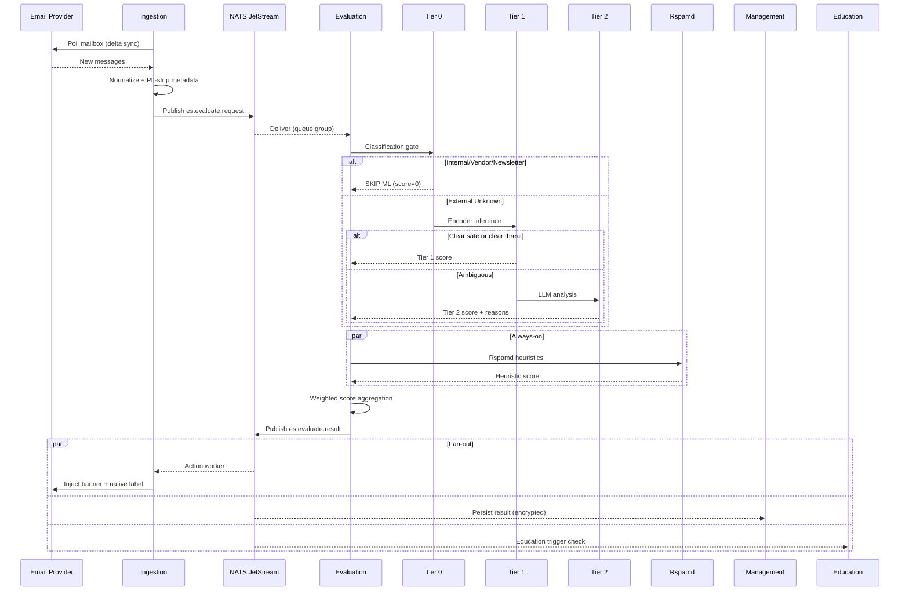
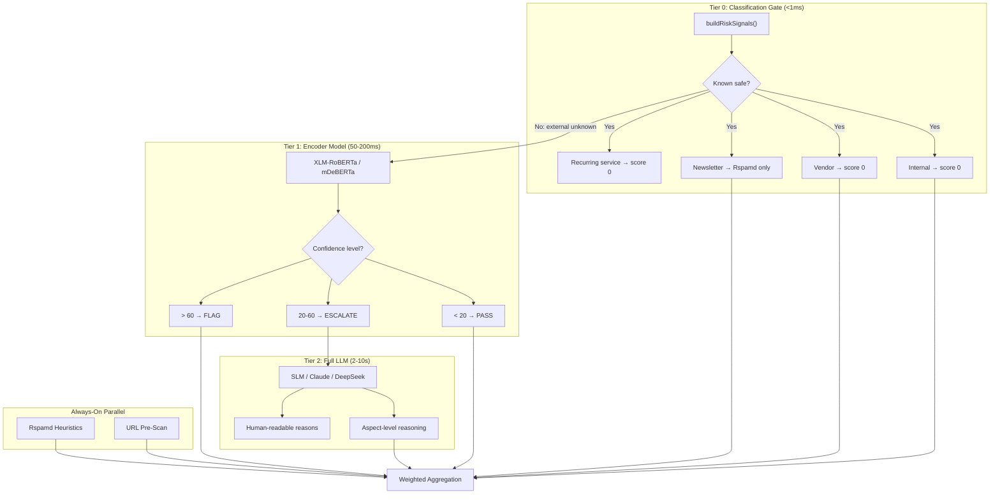
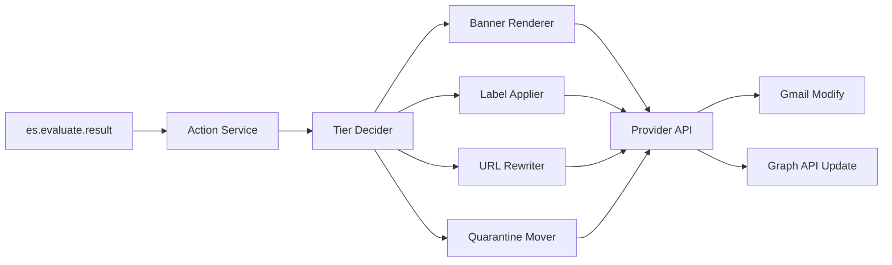

# SN360-ES Architecture Document

## 1. System Overview

SN360-ES is a multi-tenant, privacy-first email security platform composed of
four core services connected by NATS JetStream, with Redis for caching and
PostgreSQL for encrypted persistent storage.

### High-Level Topology

```mermaid
graph TD
    subgraph "External APIs"
        GWS["Google Workspace API"]
        O365["Microsoft Graph API"]
        LLM["LLM API (Tier 2)"]
    end

    subgraph "SN360-ES Platform"
        subgraph "Ingestion Layer"
            IngAPI["Ingestion API"]
            IngListener["Ingestion Listener"]
            PollDispatcher["Poll Dispatcher"]
            ActionSvc["Action Service"]
            OnboardSvc["Onboarding Service"]
        end

        subgraph "Evaluation Layer"
            EvalListener["Evaluation Listener"]
            Tier0["Tier 0: Classification Gate"]
            Tier1["Tier 1: Encoder Model"]
            Tier2["Tier 2: LLM Service"]
            RspamdSvc["Rspamd Service"]
            ShieldNet["ShieldNet Worker"]
        end

        subgraph "Management Layer"
            MgmtAPI["Management API"]
            MgmtListener["Management Listener"]
            RelWorker["Relationship Aggregation"]
            CleanupWorker["Cleanup Worker"]
            AIAgents["AI Agent Controller"]
        end

        subgraph "Education Layer"
            EduEngine["Education Engine"]
            SimGenerator["Simulation Generator"]
            ResilienceTracker["Resilience Tracker"]
        end

        subgraph "Heuristic Engine"
            Rspamd["Rspamd v3.14.2"]
            Unbound["Unbound DNS"]
        end

        subgraph "Privacy Layer"
            Pseudonymizer["PII Pseudonymizer"]
            Encryptor["Envelope Encryptor"]
            LogSanitizer["Log Sanitizer"]
        end
    end

    subgraph "Event Bus"
        NATS["NATS JetStream Cluster"]
    end

    subgraph "Data Stores"
        PG["PostgreSQL (encrypted)"]
        Redis["Redis (cache + locks)"]
        S3["AWS S3 (credentials)"]
        KMS["AWS KMS (encryption keys)"]
    end

    GWS <--> PollDispatcher
    O365 <--> PollDispatcher
    PollDispatcher --> Pseudonymizer
    Pseudonymizer --> NATS
    NATS --> Tier0
    Tier0 --> Tier1
    Tier1 --> Tier2
    Tier2 --> LLM
    EvalListener --> RspamdSvc
    RspamdSvc --> Rspamd
    Rspamd --> Unbound
    EvalListener -->|"result"| NATS
    NATS --> ActionSvc
    NATS --> MgmtListener
    NATS --> EduEngine
    ActionSvc --> GWS
    ActionSvc --> O365
    MgmtAPI --> PG
    MgmtAPI --> Redis
    Encryptor --> KMS
    RelWorker --> PG
    RelWorker --> Redis
```



## 2. Event Bus — NATS JetStream

### Why NATS JetStream

NATS JetStream replaces Redis Streams as the inter-service event bus. Redis
remains exclusively for caching and distributed locking.

### Stream Architecture

| Stream | Subjects | Retention | Storage | Purpose |
|---|---|---|---|---|
| `ES_EVALUATE` | `es.evaluate.>` | WorkQueue | File | Evaluation pipeline events |
| `ES_ONBOARDING` | `es.onboarding.>` | WorkQueue | File | User/tenant lifecycle events |
| `ES_EDUCATION` | `es.education.>` | Limits | File | Education campaign events (retained for analytics) |
| `ES_ACTION` | `es.action.>` | WorkQueue | File | Post-evaluation remediation actions |
| `ES_DLQ` | `es.*.dlq` | Limits | File | Dead-letter queue for failed processing |

### Message Flow



### Consumer Groups

| Consumer Group | Stream | Filter | Max Deliver | Ack Wait | Purpose |
|---|---|---|---|---|---|
| `evaluate-svc` | ES_EVALUATE | `es.evaluate.request` | 5 | 60s | Evaluation processing |
| `ingestion-action` | ES_EVALUATE | `es.evaluate.result` | 3 | 30s | Banner/label actions |
| `management-persist` | ES_EVALUATE | `es.evaluate.result` | 3 | 30s | Result persistence |
| `education-trigger` | ES_EVALUATE | `es.evaluate.result` | 3 | 10s | Education micro-lesson triggers |
| `ingestion-onboard` | ES_ONBOARDING | `es.onboarding.>` | 3 | 30s | Onboarding handlers |
| `education-sim` | ES_EDUCATION | `es.education.simulation.>` | 3 | 30s | Simulation execution |

## 3. Detection Pipeline

### 3-Tier Architecture



### Risk Scoring Engine

Weights per category (configurable per tenant):

| Category | Default Weight | Source |
|---|---|---|
| `ai` (Tier 1 or Tier 2) | 80% | Encoder or LLM score |
| `rspamd` | 20% | Heuristic score |
| `attachments` | 0% (reserved) | ShieldNet sandbox |
| `links` | 0% (reserved) | URL threat intel |

Formula: `final_score = Σ(category_weight × normalized_category_score)`, clamped to `[0, 100]`

### Multilingual Support

| Tier | Multilingual Approach |
|---|---|
| **Tier 0** | Language-agnostic (metadata-based rules) |
| **Tier 1** | XLM-RoBERTa: 100+ languages native, code-switching aware |
| **Tier 2** | SLM (Claude / DeepSeek class) multilingual; receives language hint from Tier 1 |
| **Rspamd** | Language-agnostic heuristics (SPF/DKIM/RBL) |
| **Banners** | i18n templates (en, vi, th, ja, ko, zh, etc.) |
| **Education** | Simulations and lessons in employee's language |

## 4. Privacy Architecture

### Data Flow with Privacy Controls

```
Email arrives → Fetch via API
  → In-memory normalization
  → PII fields tagged
  → Detection (all in-memory, no persistence of content)
  → Action (banner + native label injected back to provider)
  → Metadata pseudonymized (blake2 hash)
  → Encrypted score + reasons stored
  → Raw email NEVER stored
```

### Encryption Layers

| Layer | Method | Key Management |
|---|---|---|
| **Transit** | TLS 1.3 (all connections) | Auto-managed via cert-manager |
| **At rest (PostgreSQL)** | AES-256-GCM column-level | Per-tenant data key via AWS KMS envelope encryption |
| **At rest (Redis)** | AES-256-GCM value-level | Shared platform key (cache is ephemeral) |
| **At rest (S3)** | SSE-KMS | AWS-managed KMS key |
| **At rest (NATS)** | AES-256 file encryption | Platform key (messages are transient) |
| **Audit logs** | Append-only, no PII | Signed with platform key |

### Tenant Isolation

- All database queries scoped by `tenant_id` (enforced at repository layer)
- Redis keys namespaced: `tenant:{name}:*`
- NATS subjects optionally partitioned: `es.{tenant}.evaluate.request`
- Per-tenant encryption keys (derived from AWS KMS CMK)
- Tenant deletion = key deletion = cryptographic erasure

## 5. Service Architecture

### 5.1 Ingestion Service

**Dual-mode**: API (health/docs) + Listener (polling + event processing)

- **Poll Dispatcher**: Distributed lock per `(tenant, provider, email)`, concurrent worker pool
- **Provider abstraction**: GWS (domain-wide delegation) + O365 (client credentials)
- **Normalizer**: Provider-specific → unified `EmailEvent` with PII tagging
- **Action Pipeline**: Tiered banner injection + native label application + quarantine (see Section 8)
- **NATS Publisher**: Publishes to `es.evaluate.request`, consumes from `es.evaluate.result`

### 5.2 Evaluation Service

**Listener-only**: Consumes evaluate requests from NATS JetStream

- **Tier 0 Gate**: Rule-based classification using `buildRiskSignals()`
- **Tier 1 Encoder**: HTTP call to self-hosted XLM-RoBERTa inference service
- **Tier 2 LLM**: HTTP call to external AI API (only for ambiguous)
- **Rspamd**: Always-on parallel heuristic check
- **ShieldNet**: Async attachment sandbox submission
- **Scorer**: Weighted aggregation with per-tenant overrides from Redis

### 5.3 Management Service

**Dual-mode**: API (REST management) + Listener (event processing + workers)

- **Domain entities**: Tenants, Users, Groups, Labels, Score Engine, Email Classifications, Vendors, Evaluation Results, Communication History
- **Relationship Aggregation Worker**: Runs every 4h, computes 7d/30d sender→receiver stats, caches in Redis
- **AI Agent Controller**: Orchestrates auto-tuning, onboarding, support agents
- **Cleanup Worker**: Stream + data retention enforcement

### 5.4 Education Service

**New service**: Manages security awareness program

- **Simulation Generator**: AI-powered phishing simulation creation
- **Campaign Scheduler**: Auto-schedules based on tenant threat profile
- **Interaction Tracker**: Records user responses to simulations and micro-lessons
- **Resilience Scorer**: Computes per-employee and per-group security awareness scores
- **Micro-Lesson Engine**: Generates contextual lessons matched to detected threat types

## 6. Infrastructure

### 6.1 Kubernetes Deployment

- **Platform**: AWS EKS
- **GitOps**: ArgoCD with auto-sync
- **Environments**: dev → qa → uat → prod (namespace isolation)
- **Secrets**: AWS Secrets Manager via CSI Driver
- **Encryption**: AWS KMS for tenant data keys
- **NATS**: Deployed as StatefulSet with persistent volumes (3-node cluster)
- **Encoder Model**: Deployed as GPU-enabled Deployment (or CPU with HPA)

### 6.2 Observability

- **Logging**: Structured JSON via `slog`, PII-sanitized
- **Tracing**: OpenTelemetry W3C Trace Context (end-to-end)
- **Metrics**: Prometheus + Grafana (latency histograms, throughput, error rates per tier)
- **Alerting**: AI agent monitors metrics, auto-escalates to SN360 SecOps

### 6.3 Scaling

| Component | Strategy |
|---|---|
| **Ingestion** | HPA based on NATS consumer lag |
| **Evaluation** | HPA based on NATS pending messages + GPU utilization |
| **Encoder Model** | HPA based on inference queue depth |
| **NATS** | 3-node Raft cluster, horizontal scaling via additional routes |
| **Redis** | Cluster mode for cache, Sentinel for HA |
| **PostgreSQL** | Read replicas for management queries, primary for writes |

## 7. Redis (Cache-Only Role)

With NATS JetStream handling all event streaming, Redis serves exclusively as:

| Use Case | Key Pattern | TTL |
|---|---|---|
| Poller distributed locks | `{provider}:poller:lock:{tenant}:{email}` | Poll interval TTL |
| Score engine weights | `tenant:{name}:score_engine:weights:{provider}` | 8h |
| Email classifications | `tenant:{name}:email_classification:*` | 8h |
| Vendor lists | `tenant:{name}:vendors` | 8h |
| Label configs | `tenant:{name}:labels` | 8h |
| Relationship stats | `tenant:{name}:relationship:{hash_sender}:{hash_receiver}` | 8h |
| High-volume sender tracking | `tenant:{name}:high_volume_sender:{hash}` | Configurable |
| AI result cache (new) | `ai_cache:{content_fingerprint}` | 1h |
| Rspamd result cache (new) | `rspamd_cache:{raw_fingerprint}` | 30m |
| Provider label ID cache | `{provider}:{tenant}:{email}:label:{tier}` | 24h |
| Banner action token cache | `banner:token:{token_id}` | 7d |

This reduces Redis memory requirements significantly (no stream storage)
and allows using a smaller, cheaper Redis instance.

## 8. End-User Label & Banner Architecture

This section is the architectural complement to `PROPOSAL.md` Section 6
("End-User Label & Banner UX"). It defines how the tiered banner + native
label system is implemented across services.

### 8.1 Action Pipeline



The Action Service consumes `es.evaluate.result` and runs four sub-actions
in parallel per result:

1. **Banner Renderer** — produces tier-specific HTML and injects via provider API
2. **Label Applier** — applies the tier label and optional category sub-label
3. **URL Rewriter** — only at `High Risk` and `Blocked` tiers
4. **Quarantine Mover** — only at `Blocked` tier

### 8.2 Tier Decider

```go
type Tier int

const (
    TierTrusted Tier = iota
    TierInformational
    TierCaution
    TierWarning
    TierHighRisk
    TierBlocked
)

// DecideTier maps a normalized score (0-100) and risk signals to a tier.
// Thresholds are loaded per-tenant from the score engine cache.
func (d *Decider) DecideTier(score int, signals RiskSignals, cfg TierConfig) Tier {
    switch {
    case score >= cfg.BlockedThreshold:    // default 85
        return TierBlocked
    case score >= cfg.HighRiskThreshold:   // default 70
        return TierHighRisk
    case score >= cfg.WarningThreshold:    // default 50
        return TierWarning
    case score >= cfg.CautionThreshold:    // default 30
        return TierCaution
    case score >= cfg.InfoThreshold || signals.IsExternal && signals.IsFirstContact:
        return TierInformational
    default:
        return TierTrusted
    }
}
```

Per-tenant threshold overrides live in Redis at
`tenant:{name}:score_engine:tier_thresholds`.

### 8.3 Banner Rendering

- **Template engine**: Go `html/template` with i18n catalog lookup
- **Inputs**: tier, category (primary + up to 2 secondary), reason codes,
  sender auth verdict, user locale, action token
- **Output**: Self-contained HTML fragment (inline CSS, no remote assets)
- **Determinism**: Same inputs → byte-identical output (enables caching)

```go
type BannerInput struct {
    Tier              Tier
    PrimaryCategory   Category
    SecondaryCategories []Category
    ReasonCodes       []ReasonCode  // fixed enum, not free text
    SenderAuth        AuthVerdict   // Verified / Unverified / Failed
    Locale            string        // e.g., "en-US", "vi-VN"
    ActionToken       string        // signed JWT, 7d TTL
    MicroLessonRef    string        // optional Education service ref
}
```

Banner templates live in `internal/translation/banners/{locale}.json` and
are loaded per-request. Adding a new locale is a translation-only change.

### 8.4 Native Label Management

| Provider | Label Object | Color Mechanism |
|---|---|---|
| **Google Workspace** | Gmail label (per user) | `labelListVisibility`, `messageListVisibility`, `color.backgroundColor`, `color.textColor` |
| **Microsoft 365** | Outlook Master Category (per mailbox) | `color` enum (Preset0..Preset24) — closest match to tier color |

**Label lifecycle:**

1. On tenant onboarding, the AI Onboarding Agent creates all 6 tier labels
   per mailbox (idempotent — checks existing labels first).
2. Label IDs are cached in Redis: `{provider}:{tenant}:{email}:label:{tier}`
3. On evaluation result, the Label Applier reads the cached ID and applies
   it via provider API (`messages.modify` for Gmail, `PATCH /messages/{id}`
   for Graph).
4. Old labels are removed when tier changes (e.g., on re-evaluation after
   a user click on "Mark as Safe").

**Category sub-labels** (`SN360 / Warning / Lookalike`) are created lazily
on first use and cached.

### 8.5 URL Rewriting

- **Trigger**: Only `TierHighRisk` and `TierBlocked`
- **Mechanism**: Replace `href` attributes in HTML body with
  `https://l.sn360.io/{token}` where `token` is a signed payload containing
  `tenant_id`, `pseudonymized_message_id`, `original_url_hash`, `expires_at`.
- **Interstitial**: A lightweight stateless service redeems the token,
  re-checks the URL against threat intel, and either redirects or shows a
  blocked page.
- **Storage**: URL pre-image is stored encrypted in Redis with a short TTL
  (default 30 days) keyed by `original_url_hash`. The token itself never
  contains the URL.

### 8.6 Quarantine Flow

- **Mechanism**: Move the message to a hidden Gmail label (`SN360 / Blocked`,
  `messageListVisibility: hide`) or to a hidden Outlook folder.
- **Body replacement**: Original body is replaced with a stub
  (`"This message was blocked by SN360. Tap Why? for details."`). The
  original body is retained only in the provider's hidden label/folder —
  SN360-ES never persists the body.
- **Release**: AI Support Agent has a per-message release action; release
  triggers re-evaluation (Tier 0 + Tier 1) before restoring.

### 8.7 Action Token Service

```
POST /v1/banner/action
  { token, action }   # action ∈ {report_phishing, mark_safe, trust_sender}
  → 200 OK            # silently records feedback and triggers re-evaluation
```

- Token is a short-lived signed JWT (HS256 with per-tenant secret).
- Token contains only opaque IDs — no email content, no PII.
- Click is recorded in the management service via NATS:
  `es.action.feedback.{action_type}`.

### 8.8 Pre-Send / Pre-Open Add-In

Optional Outlook (Office Add-in) and Gmail (Add-on) modules:

- **Manifest**: Office.js add-in / Google Add-on manifest deployed via the
  tenant's admin console during onboarding (AI Onboarding Agent automates
  the install).
- **Communication**: Add-in calls `POST /v1/predict/recipient` and
  `POST /v1/predict/open` against the Evaluation service.
- **Latency budget**: < 300ms p95 (otherwise the prompt is skipped).
- **Privacy**: Add-in sends only pseudonymized recipient hashes for the
  pre-send check; full content is sent only if the user confirms a "deep
  scan".

### 8.9 Accessibility & Internationalization

- Banner HTML is tested against WCAG 2.1 AA contrast at every tier.
- All copy lives in `internal/translation/banners/{locale}.json` — no
  hard-coded strings.
- New locale = JSON file + translation review; no code change required.
- Right-to-left locales (e.g., Arabic, Hebrew) are supported via
  `dir="rtl"` on the banner root element.

### 8.10 Observability for Banner UX

| Metric | Type | Purpose |
|---|---|---|
| `banner_rendered_total{tier,category}` | Counter | Tier distribution per tenant |
| `banner_action_total{action,tier}` | Counter | User feedback rates (FP/FN tuning) |
| `quarantine_release_total{outcome}` | Counter | Release approval / refusal rates |
| `url_rewrite_click_total{verdict}` | Counter | Interstitial click-through rates |
| `presend_prompt_total{outcome}` | Counter | Add-in pre-send confirmations |
| `banner_render_latency_seconds` | Histogram | Action-pipeline p95 latency |
