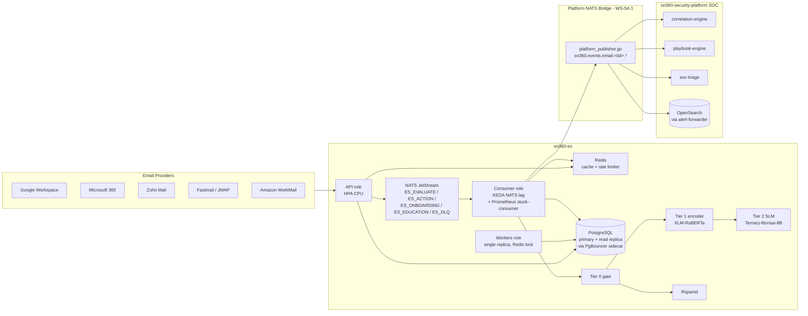

# SN360-ES Product Plan: Top-Level Roadmap to 5,000 Tenants

This is the top-level product plan for taking `sn360-es` from its
current state to a 5,000-tenant production-ready email security
product. Work is organised into **workstreams** (WS-1 through WS-7)
rather than calendar phases so that workstreams can run in parallel
across multiple Devin sessions without conflicting on the same files.

The companion documents are:

- [`PROPOSAL.md`](./PROPOSAL.md) — design document for the service.
- [`ARCHITECTURE.md`](./ARCHITECTURE.md) — current deployed topology
  and the canonical reference for what is wired in `cmd/sn360-es/`.
- [`PHASES.md`](./PHASES.md) — narrative history of work already
  landed (per-package code pointers).
- [`PROGRESS.md`](./PROGRESS.md) — release-style changelog.

Status legend used throughout this document:

- **DONE** — merged to `main`; the listed code pointer is the
  shipped artefact, not a target.
- **TODO** — work remains; the listed code pointer is the target
  file / package the work will land in.

The priority table at the end of this document is the source of
truth for execution order — workstream subsections are grouped by
topic, not by priority.

---

## WS-1 — Security Hardening

End-state: a single missed `WHERE tenant_id = $1` predicate cannot
leak cross-tenant data, every write endpoint requires the right
role, JWT signing keys are rotatable without redeploying the
binary, and signed banner tokens cannot be replayed for a month.

### 1a — Postgres Row-Level Security  *(DONE — PR #50)*

`migrations/0018_row_level_security.up.sql` enables `ROW LEVEL
SECURITY` and `FORCE ROW LEVEL SECURITY` on the 16 tenant-scoped
tables listed in `cmd/sn360-es-tenant-lint/main.go` and installs
the `tenant_isolation` policy that uses the `sn360.tenant_id`
session GUC. `pkg/storage/postgres/tenant_context.go` pins a pool
connection per request / consumer message, sets the GUC via
`set_config(...)`, and releases the connection with a clean slate
on response. HTTP handlers are wrapped by
`internal/middleware/tenant_conn.go`; NATS consumers by
`tenantBoundMessageHandler` in `cmd/sn360-es/consumers.go`; worker
fan-out paths declare cross-tenant scope explicitly via
`WithCrossTenant`. The build-time `cmd/sn360-es-tenant-lint`
static analyser remains as the first line of defence.

### 1b — RBAC roles in JWT claims  *(DONE — PR #51)*

`pkg/privacy/jwt.go` now mints tokens whose claims include a
`role` field, and `internal/middleware/rbac.go` exposes
`RequireRole(roles ...string)` which is applied per-route in
`cmd/sn360-es/routes.go`. The supported role set is
`admin`, `operator`, `viewer`, `end_user`. Write endpoints
(vendor approve / revoke, score-engine tuning, tenant CRUD) gate
on `admin` or `operator`; read endpoints gate on
`viewer` / `operator` / `admin`; banner-action and quarantine
self-release remain reachable by `end_user`.

### 1c — JWT ES256 + JWKS  *(DONE — PR #52)*

`pkg/privacy/jwt.go` supports ES256 alongside HS256, gated by
`JWT_SIGNING_ALG`. A `.well-known/jwks.json` handler serves the
public key for downstream verifiers (RFC 7638 thumbprint computed
via `json.Encoder` for canonical-form stability). During migration
the verifier accepts both HS256 and ES256 tokens; the dual-verify
path is wired so the rollover does not require a flag-day swap.

### 1d — Banner Token TTL  *(DONE — PR #49)*

`cmd/sn360-es/app.go::newApplication` previously fell back to
`30 * 24 * time.Hour` when `BANNER_TOKEN_TTL` was unset, which
contradicted the explicit 7d default in
`internal/config/scoring.go::loadBanner` and the same 7d fallback
inside `pkg/privacy/jwt.NewJWTIssuer`. All three call-sites now
agree on `7 * 24 * time.Hour`, capping the replay window for a
leaked banner / quarantine / interstitial action token at one
week.

---

## WS-2 — Scale Infrastructure for 5,000 Tenants

End-state: the deployed topology absorbs 5,000 tenants worth of
ingest without runaway connection counts, dashboard reads do not
contend with consumer writes, the largest table (`communication_histories`)
distributes evenly across partitions instead of bloating one row
group, and the cost model is calibrated for the new tenant density.

Already done (no work item — recorded here to keep WS-2 readable
against the priority table):

- **PgBouncer sidecar** is wired in
  [`deployments/helm/sn360-es/templates/deployment-role.yaml`](../../deployments/helm/sn360-es/templates/deployment-role.yaml)
  (template-level docstring lines 22–28 describe the sidecar
  injection, the `localhost:6432` env-override, and the network
  namespace sharing). The Helm values surface
  `pgbouncer.{enabled,poolSize,poolMode}` and tie the Go pool size
  to bouncer backend capacity per the round-6 review on PR #53.
- **KEDA on NATS JetStream consumer lag** ships at
  [`deployments/helm/sn360-es/templates/scaledobject.yaml`](../../deployments/helm/sn360-es/templates/scaledobject.yaml)
  with two triggers: `nats-jetstream` against the `evaluate-svc`
  consumer of stream `ES_EVALUATE`, and a Prometheus
  `event_lag_seconds` stuck-consumer safety net. Mutual
  exclusivity with the per-role HPA is wired in
  [`hpa-role.yaml`](../../deployments/helm/sn360-es/templates/hpa-role.yaml)
  via the `$skipForKeda := and $kedaOn (eq $role "consumers")`
  gate.
- **Provider `CHECK` constraint** for `('gws', 'o365', 'zoho',
  'fastmail', 'workmail')` is the shipped constraint in
  [`migrations/0015_expand_provider_check.up.sql`](../../migrations/0015_expand_provider_check.up.sql).
  The migration looks up the constraint by target column rather
  than by name to stay safe across dump-and-restore round-trips.

### 2a — Read-Replica Routing  *(TODO)*

- `cmd/sn360-es/app.go`: add `readPgDB *postgres.DB` to the
  `application` struct.
- `internal/config/postgres.go`: add `PG_READ_HOST`,
  `PG_READ_PORT` (optional; fall back to primary when unset).
- `cmd/sn360-es/wire_infra.go`: open a second `*postgres.DB`
  against the read host when configured; wire the same RLS
  binding middleware (the read path must `SET sn360.tenant_id`
  on the replica connection — RLS is enforced replica-side).
- `internal/repository/registry.go`: pass `writeDB` and `readDB`
  to repositories; route `List*` / `Get*` / dashboard queries to
  `readDB`; route every mutation to `writeDB`.
- Document the replica's expected lag tolerance in
  [`ARCHITECTURE.md`](./ARCHITECTURE.md) §6 — anything more than
  a few seconds of lag will produce visible inconsistency on the
  dashboard summary.

### 2b — Communication Histories HASH Partitioning  *(TODO)*

`migrations/0017_partition_append_only_tables.up.sql` lines 27–34
explicitly defer this work; this item closes the deferral.

- `migrations/0019_hash_partition_comm_histories.up.sql` (new):
  convert `communication_histories` to `PARTITION BY HASH
  (tenant_id)` into 32 partitions. The `up` migration must walk
  existing rows into the partitioned table without a
  `DROP TABLE` window (use `CREATE TABLE LIKE ... INCLUDING ALL`
  + `INSERT INTO ... SELECT` + atomic rename, then drop the
  legacy table).
- Down migration must consolidate the partitions back into the
  pre-partitioned shape; document the consolidation strategy in
  the down-migration header.
- `internal/repository/communication_history.go`: no code change
  expected — partitioned tables are transparent to the query
  layer — but add a partition-pruning test that asserts the
  query planner actually prunes by `tenant_id`.

### 2c — Cost Model Recalibration for 5,000 Tenants  *(TODO)*

PR #49 already added `--tenants` flag support, an
`enterprise` traffic profile (15 000 msg/tenant/day), and the
`test_5000_tenant_density` structural-invariant regression
(`scripts/cost_model/test_project.py`). This item recalibrates
the unit-economics constants once read-replica + HASH
partitioning are in place:

- Refresh `scripts/cost_model/project.py::PRICE_*` constants
  against current cloud-provider price sheets.
- Re-run `make bench-cost-model` and regenerate
  [`benchmarks/cost_model.json`](../../benchmarks/cost_model.json).
- Update the per-tenant figures in
  [`benchmarks/COST_MODEL.md`](../../benchmarks/COST_MODEL.md) §
  "Per-tenant cost at 5,000-tenant density" with the post-HASH
  numbers.

---

## WS-3 — Frontend, UX & Quarantine

End-state: end users can release their own quarantined messages
without an admin in the loop for the low-risk tiers, the
investigation surface answers "what happened with this message?"
and "what does this sender's pattern look like?" in a single API
call, and the customer-facing dashboard summary endpoint is
populated.

### 3a — Quarantine Self-Service  *(TODO)*

- New handler: `internal/handler/quarantine_digest.go`.
  - `GET /v1/quarantine/digest?tenant_id={id}&user_hash={hash}` —
    returns the user's pseudonymised quarantine list (score, tier,
    reason codes, sender hash).
  - `POST /v1/quarantine/self-release` — release a message at
    `Warning` tier or below; `HighRisk` / `Blocked` returns
    `403 admin_required` and emits an escalation ticket.
- Register routes in `cmd/sn360-es/routes.go`; gate via
  `RequireRole("end_user", "operator", "admin")`.
- The `end_user` role binds the token's `user_hash` claim to the
  query parameter — a user cannot read another user's queue even
  with a valid token.

### 3b — Investigation API  *(TODO)*

- New handler: `internal/handler/investigation.go`.
  - `GET /v1/investigation/message/{pseudo_id}?tenant_id={id}` —
    returns the full evaluation trail (Tier 0 gate outcome, Tier 1
    score + features, Tier 2 verdict + rationale, enriched risk
    signals, relationship label snapshot at evaluation time).
  - `GET /v1/investigation/sender/{sender_hash}?tenant_id={id}` —
    returns every evaluation result for the sender within the
    retention window, plus the aggregated
    `CommunicationHistory` row.
- These are the API contracts the SOC-lite dashboard and the AI
  Support Agent (`internal/service/agent/`) call into; document
  the contracts in `api/openapi.yaml`.
- Gate via `RequireRole("viewer", "operator", "admin")`.

---

## WS-4 — Detection

End-state: a phishing campaign that pivots in real time gets a
fresh `CommunicationHistory` baseline within seconds of the first
message landing, the accuracy harness exercises real-world and
adversarial corpora rather than only the synthetic mix, and the
Tier 2 SLM is one of several pluggable providers so the platform
is not locked to one model vendor.

### 4a — Incremental Behavioral Baselines  *(TODO)*

- `cmd/sn360-es/signal_enricher.go`: after `commHistorySignalEnricher`
  enriches the per-message signals, publish an async event
  `es.management.comm_history.update` containing
  `{sender_hash, recipient_hash, sent_at, tenant_id}`.
- New consumer: `comm-history-update` on `ES_MANAGEMENT` (or
  on `ES_EVALUATE` if we want to keep the topology flat) — upserts
  the `communication_histories` row inline using the existing
  `UpdateCountsIfFresh` CAS path.
- Net effect: the next message from the same sender sees an
  up-to-date baseline without waiting for the 4-hour
  `relationship_worker` cycle. The 4-hour worker stays in place
  for aggregated stats (typical send-hour distribution, volume
  smoothing) where stale-by-a-few-hours is fine.

### 4b — Real-World Corpus & Adversarial Testing  *(TODO)*

- `scripts/corpus_generator/`: add a `realworld` source that
  fetches and labels public phishing corpora (Nazario phishing
  email corpus, PhishTank URL set). Cite the licence on each
  corpus in the README.
- Add adversarial template transforms: homoglyph substitution,
  zero-width-character injection, Unicode RTL override, HTML
  entity encoding. Each transform is a deterministic function
  taking a clean message and emitting an adversarial variant for
  the same label.
- `Makefile`: new `make bench-adversarial` target running the
  accuracy harness against the adversarial corpus.
- Pin regression targets in `scripts/corpus_generator/README.md`:
  F1 ≥ 0.95 on real-world corpus, F1 ≥ 0.90 on adversarial
  corpus. Refresh [`benchmarks/BASELINE.md`](../../benchmarks/BASELINE.md)
  with the new baselines.

### 4c — Tier 2 Model Abstraction  *(TODO)*

- `internal/service/evaluate/tier2.go`: extract a `Tier2Provider`
  interface `Analyze(ctx, Tier2Input) (Tier2Result, error)`.
- Implement three concrete providers: `BonsaiProvider` (the
  current Ternary-Bonsai-8B path), `OllamaProvider` (any Ollama
  model for local dev), `BedrockProvider` (AWS Bedrock Claude /
  Haiku).
- `internal/config/`: add `TIER2_PROVIDER=bonsai|ollama|bedrock`
  plus the provider-specific config blocks.
- Each provider gets its own row in
  [`benchmarks/accuracy_*.md`](../../benchmarks/) so the model
  swap doesn't drift detection accuracy invisibly.

---

## WS-5A — Primary SOC Integration via `sn360-security-platform`

End-state: every HighRisk / Blocked evaluation result and every
quarantine + escalation event flows into the platform's NATS,
correlation engine, playbook engine, and SOC triage views. The
platform — not sn360-es itself — is the SOC.

The platform repo (`kennguy3n/sn360-security-platform`) already
ships the correlation engine, playbook engine,
alert-forwarder (which indexes events to OpenSearch), and SOC
triage services. The work here is to feed those engines email
events from sn360-es and to author the email-specific correlation
rules + playbooks + dashboard panels that turn the raw events
into SOC-actionable signal.

### 5A.1 — NATS Event Bridge  *(TODO — P0)*

- New file: `internal/service/bridge/platform_publisher.go`
  in sn360-es. Publishes HighRisk+ and Blocked evaluation results,
  quarantine events, and escalation events to the platform's NATS
  on subject `sn360.events.email.<tenant_id>.<kind>`.
- Subject mapping:

  | sn360-es event                | Subject                                       |
  | ---                            | ---                                            |
  | phishing verdict (Tier 1/2)   | `sn360.events.email.<tid>.phishing`           |
  | BEC verdict                   | `sn360.events.email.<tid>.bec`                |
  | malware-bearing attachment    | `sn360.events.email.<tid>.malware`            |
  | quarantine action             | `sn360.events.email.<tid>.quarantine`         |
  | escalation ticket             | `sn360.events.email.<tid>.escalation`         |

- Config (new env vars on the sn360-es side):
  - `PLATFORM_NATS_URLS` — comma-separated platform NATS URLs.
  - `PLATFORM_NATS_ENABLED` — gate the bridge; defaults `false`
    for standalone deployments.
  - `PLATFORM_NATS_CREDS_FILE` — path to NATS credentials.
- Wiring in `cmd/sn360-es/consumers.go`:
  - `handleIngestionAction` (`consumers_action.go:21`) — publish
    on terminal verdicts.
  - `handleEscalation` (`consumers.go:297`) — publish escalation
    open / update / resolve.
  - `handleActionQuarantine` (`consumers_action.go:32`) — publish
    quarantine apply / release / hold.
- Wire envelope shape: re-use the platform's existing event
  envelope (the same shape that `services/alert-forwarder`
  already indexes into OpenSearch) — that keeps the bridge purely
  a routing concern, not a schema-translation concern.

### 5A.2 — Email-specific correlation rules  *(TODO — P0)*

In `kennguy3n/sn360-security-platform/data/correlation/`, add:

- `11_phish_click_then_endpoint_activity.yaml` — phish-click
  followed by suspicious endpoint behaviour (lateral-movement
  precursor on the device the click came from).
- `12_bec_then_wire_transfer.yaml` — BEC verdict followed by a
  finance approval workflow event (joins to the kapp-fab finance
  event stream).
- `13_post_phish_account_compromise.yaml` — phish verdict
  followed by impossible-travel sign-in or token-abuse from the
  same identity.
- `14_mass_phishing_campaign.yaml` — N phishing verdicts targeting
  the same tenant within a sliding window, regardless of recipient.

The existing correlation files (`01_…` through `10_…`) live in
the same directory and form the schema reference for these new
rules.

### 5A.3 — Playbooks  *(TODO — P0)*

In `kennguy3n/sn360-security-platform/data/playbooks/`:

- Verify `data/playbooks/11_phishing_response.yaml`'s
  `condition_cel` matches the bridge wire shape — the playbook's
  `trigger_subjects` already lists `sn360.events.email.*.phishing`
  / `sn360.events.email.*.identity.phishing`, which lines up with
  the 5A.1 subject map.
- New `23_email_quarantine_escalation.yaml` — runs when a
  HighRisk quarantine is held for admin review on the sn360-es
  side, opens a case in the platform's case-manager, and notifies
  the SOC channel.

### 5A.4 — Dashboard panels  *(TODO — P1)*

In `kennguy3n/sn360-security-platform/sn360-dashboard-plugin/`,
add an email-security tab with three panel groups:

- **Threat volume** — phishing / BEC / malware per tenant over
  time, broken out by tier (Warning vs HighRisk vs Blocked) and
  by Tier 0 bypass rate.
- **Quarantine management** — held messages by tier, time-to-release,
  release-by (user vs admin), FP-tracked re-injections.
- **Investigation views** — drilldown from a correlation hit back
  to the underlying sn360-es evaluation result via the
  Investigation API (WS-3b).

These panels read the same OpenSearch indices `alert-forwarder`
already populates — WS-5A.1 fills the indices; WS-5A.4 visualises
them.

### 5A.5 — SOC triage email enrichment  *(TODO — P1)*

- `kennguy3n/sn360-security-platform/services/soc-triage/`:
  enrich case context with the matching email evaluation trail
  (calls back into sn360-es Investigation API from WS-3b).
- `kennguy3n/sn360-security-platform/services/ai-triage-agent/`:
  add an email-specific prompt template that summarises the
  evaluation trail + relationship context for the analyst.

### 5A.6 — Escalation ticket resolution sync  *(TODO — P1)*

Bidirectional sync over platform NATS:

- sn360-es opens an escalation via 5A.1; the platform's
  case-manager creates a case. Case state changes (assigned,
  in-progress, resolved, root-cause-tagged) flow back to sn360-es
  on `sn360.events.email.<tid>.escalation.update`.
- sn360-es applies the resolution to the local
  `escalation_tickets` row so the customer-facing API surfaces
  the final disposition without polling the platform.

---

## WS-5B — Secondary SIEM Export

End-state: deployments that do not run sn360-security-platform
can still export events to an external SIEM (Splunk, generic
syslog, CEF) and can still consume threat-intel feeds. Items
here are P2 because WS-5A makes them redundant for the common
case (platform deployment).

### 5B.1 — alert-forwarder note  *(no work)*

The platform's `services/alert-forwarder` already indexes
every event it sees into OpenSearch. Once WS-5A.1 is live no
additional indexing work is required for OpenSearch-based SIEM
queries.

### 5B.2 — Optional webhook / SIEM export for standalone deployments  *(TODO — P2)*

For deployments that run sn360-es without the platform:

- `internal/service/integration/webhook.go` (new) — register
  webhook URL per tenant with event filter (HighRisk, Blocked,
  escalation, quarantine).
- `POST/GET/DELETE /v1/integrations/webhook[/{id}]` — manage
  registrations.
- Output formats: JSON (default), CEF.
- Adapters: generic webhook, Splunk HEC, RFC 5424 syslog.
- Gate on `RequireRole("admin")` for the management endpoints.

Skipped when the platform is running — `PLATFORM_NATS_ENABLED=true`
disables the standalone export path to avoid double-firing
into both the platform NATS and a separate SIEM.

### 5B.3 — Threat intel feed consumption  *(TODO — P2)*

- `internal/service/threatintel/feed.go` (new) — consume
  PhishTank (URL), URLhaus (URL), AbuseIPDB (IP).
- Cache IOCs in Redis: `threatintel:{type}:{hash}` with TTL
  matching feed refresh cadence (PhishTank 1h, URLhaus 5min).
- Wire into `internal/service/tier0/gate.go`: check sender
  domain and message URLs against cached IOCs; a match → instant
  `Blocked` without invoking Tier 1 / Tier 2.
- When the platform is running, optionally subscribe to the
  platform's IOCFS distribution (`workers/iocfs-compiler`) instead
  of pulling external feeds directly — IOCFS already deduplicates
  and signs the IOC set.

---

## WS-6 — Load Validation

End-state: the 5,000-tenant cost-model assumptions are validated
end-to-end under representative traffic, and the failure modes
documented in [`DEGRADATION_MODES.md`](./DEGRADATION_MODES.md) are
exercised in CI rather than discovered in production.

### 6a — End-to-End Load Test at 5,000 Tenants  *(TODO)*

- New directory: `tests/load/` with k6 scripts (the `make
  load-smoke` and `make load-soak` Makefile targets are already
  installed in the dev image — extend the targets to point at the
  new scripts).
- Scenarios: 5 000 tenants × {200, 1 200, 8 500} msgs/tenant/day
  (matches the cost-model traffic profiles).
- Capture per-scenario: end-to-end latency p50/p95/p99, NATS
  consumer lag (KEDA scaler input), Postgres connection count
  (PgBouncer client + server side), Redis memory, Tier 1 / Tier 2
  queue depth, Tier 2 SLM call concurrency.
- Grafana dashboard template under `tests/load/grafana/` so
  scenarios can be replayed and compared release-over-release.

### 6b — Chaos Engineering  *(TODO)*

Exercise the degradation paths the binary claims to handle:

- Tier 2 SLM failure → expect graceful fallback to Tier 0 + Tier 1
  + Rspamd; no Blocked decisions silently downgraded.
- NATS single-node failure → expect ack-pending replay and zero
  data loss on the JetStream-backed streams.
- Postgres primary failover → expect the WS-2a read replicas to
  absorb dashboard reads while writes wait for promotion.
- Redis eviction storm → expect `assertProductionDurableStores`
  to block the boot when downgraded to in-memory stores in a
  production-tagged config.

Each scenario lands as a regression under `tests/chaos/` plus a
runbook entry in `internal/docs/DEGRADATION_MODES.md`.

---

## WS-7 — Polish

End-state items that make the system better but do not gate the
production cutover. Each is small enough to ship independently
in a single PR.

### 7a — Multi-Region Routing  *(TODO)*

- `internal/config/postgres.go`: add `PG_REGION_MAP` for
  region-aware routing.
- Tenants already carry a `region` field (`migrations/0001_init.up.sql`
  line 25); route queries to the regional database using that
  field at request entry.
- NATS super-cluster config for cross-region event routing.

### 7b — Add-In Production Readiness  *(TODO)*

- `deployments/addins/outlook/src/presend.js` — full Office.js
  pre-send handler: recipient risk check via `/v1/predict/recipient`,
  lookalike domain detection, external-thread-going-external
  warning.
- `deployments/addins/gmail/` — equivalent Apps Script add-on.
- Automated tests for both add-ins (Office.js + Apps Script have
  documented testing harnesses — wire them into CI).
- Deployment docs for GWS Marketplace and M365 Admin Center.

### 7c — NATS Message Schema Versioning  *(TODO)*

- Add a `schema_version` field (string, e.g. `"v2"`) to every
  NATS message DTO in `internal/dto/`.
- New `pkg/events/SchemaValidator` validates payloads against
  registered schemas at publish time.
- Prevents a repeat of the `BatchMessage` vs flat
  `EvaluateRequest` migration documented in
  [`ARCHITECTURE.md`](./ARCHITECTURE.md) §3 ("NATS subject layout").

### 7d — CSP Headers on Interstitial  *(TODO)*

The `/l/{token}` handler (interstitial / safe-click landing page)
should add:

```
Content-Security-Policy: default-src 'none'; style-src 'unsafe-inline'; frame-ancestors 'none'
X-Frame-Options: DENY
X-Content-Type-Options: nosniff
```

---

## Priority table

| Priority | Workstream | Why |
| --- | --- | --- |
| P0 | WS-1 (Security: RLS, RBAC, JWT, TTL fix) | Cannot go to production without these |
| P0 | WS-2 (Read-replica + HASH partitioning + cost model 5k) | Remaining infrastructure for 5k tenants (PgBouncer + KEDA already done) |
| P0 | WS-5A.1–3 (NATS bridge + correlation rules + playbooks) | Platform IS the SOC — email events must flow into it |
| P1 | WS-5A.4–6 (Dashboard panels + SOC enrichment + escalation sync) | Complete the bidirectional SOC loop |
| P1 | WS-3 (Dashboard + Quarantine self-service) | Biggest usability gap vs competitors |
| P1 | WS-4a (Incremental baselines) | Biggest detection gap vs Abnormal Security |
| P2 | WS-5B (External SIEM export + threat intel feeds) | For standalone deployments / third-party SIEM |
| P2 | WS-4b–c (Real corpus + model abstraction) | Detection credibility |
| P3 | WS-6 (Load testing at 5k tenants) | Validates everything above |
| P3 | WS-7 (Add-ins + schema versioning + CSP) | Polish |

---

## Architecture diagram

The diagram reflects the **current deployed topology** plus the
**WS-5A platform integration** target. PgBouncer and KEDA are
annotated as current state (not "planned") because both are
shipped — see WS-2's "Already done" section for citations.


