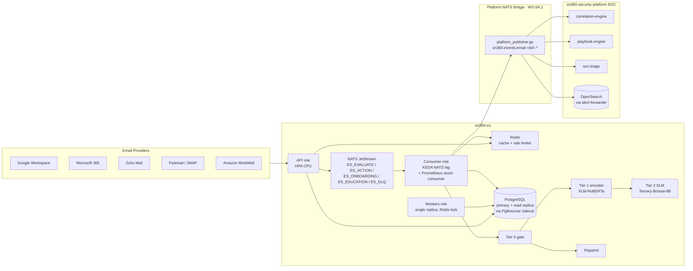

# SN360-ES Product Plan: Top-Level Roadmap to 5,000 Tenants

This is the top-level product plan for taking `sn360-es` from its
current state to a 5,000-tenant production-ready email security
product. Work is organised into **workstreams** (WS-1 through WS-7)
rather than calendar phases so that workstreams can run in parallel
across multiple Devin sessions without conflicting on the same files.

The companion documents are:

- [`PROPOSAL.md`](./PROPOSAL.md) — design document for the service.
- [`ARCHITECTURE.md`](./ARCHITECTURE.md) — current deployed topology
  and the canonical reference for what is wired in `cmd/sn360-es/`.
- [`PHASES.md`](./PHASES.md) — narrative history of work already
  landed (per-package code pointers).
- [`PROGRESS.md`](./PROGRESS.md) — release-style changelog.

Status legend used throughout this document:

- **DONE** — merged to `main`; the listed code pointer is the
  shipped artefact, not a target.
- **TODO** — work remains; the listed code pointer is the target
  file / package the work will land in.

The priority table at the end of this document is the source of
truth for execution order — workstream subsections are grouped by
topic, not by priority.

---

## WS-1 — Security Hardening

End-state: a single missed `WHERE tenant_id = $1` predicate cannot
leak cross-tenant data, every write endpoint requires the right
role, JWT signing keys are rotatable without redeploying the
binary, and signed banner tokens cannot be replayed for a month.

### 1a — Postgres Row-Level Security  *(DONE — PR #50)*

`migrations/0018_row_level_security.up.sql` enables `ROW LEVEL
SECURITY` and `FORCE ROW LEVEL SECURITY` on the 16 tenant-scoped
tables listed in `cmd/sn360-es-tenant-lint/main.go` and installs
the `tenant_isolation` policy that uses the `sn360.tenant_id`
session GUC. `pkg/storage/postgres/tenant_context.go` pins a pool
connection per request / consumer message, sets the GUC via
`set_config(...)`, and releases the connection with a clean slate
on response. HTTP handlers are wrapped by
`internal/middleware/tenant_conn.go`; NATS consumers by
`tenantBoundMessageHandler` in `cmd/sn360-es/consumers.go`; worker
fan-out paths declare cross-tenant scope explicitly via
`WithCrossTenant`. The build-time `cmd/sn360-es-tenant-lint`
static analyser remains as the first line of defence.

### 1b — RBAC roles in JWT claims  *(DONE — PR #51)*

`pkg/privacy/jwt.go` now mints tokens whose claims include a
`role` field, and `internal/middleware/rbac.go` exposes
`RequireRole(roles ...string)` which is applied per-route in
`cmd/sn360-es/routes.go`. The supported role set is
`admin`, `operator`, `viewer`, `end_user`. Write endpoints
(vendor approve / revoke, score-engine tuning, tenant CRUD) gate
on `admin` or `operator`; read endpoints gate on
`viewer` / `operator` / `admin`; banner-action and quarantine
self-release remain reachable by `end_user`.

### 1c — JWT ES256 + JWKS  *(DONE — PR #52)*

`pkg/privacy/jwt.go` supports ES256 alongside HS256, gated by
`JWT_SIGNING_ALG`. A `.well-known/jwks.json` handler serves the
public key for downstream verifiers (RFC 7638 thumbprint computed
via `json.Encoder` for canonical-form stability). During migration
the verifier accepts both HS256 and ES256 tokens; the dual-verify
path is wired so the rollover does not require a flag-day swap.

### 1d — Banner Token TTL  *(DONE — PR #49)*

`cmd/sn360-es/app.go::newApplication` previously fell back to
`30 * 24 * time.Hour` when `BANNER_TOKEN_TTL` was unset, which
contradicted the explicit 7d default in
`internal/config/scoring.go::loadBanner` and the same 7d fallback
inside `pkg/privacy/jwt.NewJWTIssuer`. All three call-sites now
agree on `7 * 24 * time.Hour`, capping the replay window for a
leaked banner / quarantine / interstitial action token at one
week.

---

## WS-2 — Scale Infrastructure for 5,000 Tenants

End-state: the deployed topology absorbs 5,000 tenants worth of
ingest without runaway connection counts, dashboard reads do not
contend with consumer writes, the largest table (`communication_histories`)
distributes evenly across partitions instead of bloating one row
group, and the cost model is calibrated for the new tenant density.

Already done (no work item — recorded here to keep WS-2 readable
against the priority table):

- **PgBouncer sidecar** is wired in
  [`deployments/helm/sn360-es/templates/deployment-role.yaml`](../../deployments/helm/sn360-es/templates/deployment-role.yaml)
  (template-level docstring lines 22–28 describe the sidecar
  injection, the `localhost:6432` env-override, and the network
  namespace sharing). The Helm values surface
  `pgbouncer.{enabled,poolSize,poolMode}` and tie the Go pool size
  to bouncer backend capacity per the round-6 review on PR #53.
- **KEDA on NATS JetStream consumer lag** ships at
  [`deployments/helm/sn360-es/templates/scaledobject.yaml`](../../deployments/helm/sn360-es/templates/scaledobject.yaml)
  with two triggers: `nats-jetstream` against the `evaluate-svc`
  consumer of stream `ES_EVALUATE`, and a Prometheus
  `event_lag_seconds` stuck-consumer safety net. Mutual
  exclusivity with the per-role HPA is wired in
  [`hpa-role.yaml`](../../deployments/helm/sn360-es/templates/hpa-role.yaml)
  via the `$skipForKeda := and $kedaOn (eq $role "consumers")`
  gate.
- **Provider `CHECK` constraint** for `('gws', 'o365', 'zoho',
  'fastmail', 'workmail')` is the shipped constraint in
  [`migrations/0015_expand_provider_check.up.sql`](../../migrations/0015_expand_provider_check.up.sql).
  The migration looks up the constraint by target column rather
  than by name to stay safe across dump-and-restore round-trips.

### 2a — Read-Replica Routing  *(DONE — PR #57)*

`pkg/storage/postgres/postgres.go` exposes `AttachReader` and a
routing matrix on `*postgres.DB`: a tenant-bound connection from
`WithTenant` always pins to the write pool (so the
`sn360.tenant_id` GUC stays attached to the same conn and RLS
remains enforced); an unbound `QueryContext` / `QueryRowContext`
routes to the read replica when one is attached; `ExecContext`
and `BeginTx` always route to the write pool so mutations cannot
land on a read-only standby. `internal/config/postgres.go` opts
in via `PG_READ_HOST` (with `PG_READ_PORT` / `_USER` /
`_PASSWORD` / `_DATABASE` / `_SSLMODE` / `_MAX_OPEN_CONNS` /
`_MAX_IDLE_CONNS` / `_CONN_MAX_LIFETIME` overrides that inherit
from the primary when unset); a missing `PG_READ_HOST` keeps the
old single-pool behaviour. `internal/config/validate.go` rejects
`PG_READ_SSLMODE=disable` in prod / uat when the read host is
set, mirroring the existing primary-side TLS guard.
`pkg/storage/postgres/read_replica_test.go` and
`internal/config/postgres_read_test.go` pin the routing matrix,
the `ExecAlwaysWritePool` invariant, idempotent `AttachReader`,
empty-host no-op, empty-database rejection, nil-receiver safety,
and the inheritance / override matrix.

### 2b — Communication Histories HASH Partitioning  *(DONE — PR #58)*

`migrations/0019_hash_partition_comm_histories.up.sql` converts
`communication_histories` to `PARTITION BY HASH (tenant_id)` with
32 partitions (`communication_histories_p00` through `_p31`,
`MODULUS 32`). The primary key is `(id, tenant_id)` because
Postgres requires the partition key in every unique constraint;
the natural unique key `(tenant_id, sender_hash, recipient_hash)`
is preserved. The up migration renames the legacy heap aside,
recreates the partitioned table, walks every row in via
`INSERT ... SELECT ... ON CONFLICT (tenant_id, sender_hash,
recipient_hash) DO NOTHING`, and only then drops the legacy
table — the whole conversion runs in a single `BEGIN ... COMMIT`
so failure rolls back cleanly. RLS, the `tenant_isolation`
policy, the `GRANT` to `sn360_app`, and the five indexes
(including the partial `idx_comm_hist_tenant_sender_domain ...
WHERE sender_domain IS NOT NULL`) are re-applied so they
propagate to every child partition; the down migration is
symmetric (`DROP TABLE ... CASCADE` walks the 32 partitions).
The application repository at
`internal/repository/communication_history.go` is unchanged —
every query already carries `tenant_id` in the WHERE clause so
Postgres prunes to a single partition at plan time.
`pkg/storage/postgres/rls_integration_test.go` was rewritten
to `applyAllMigrations` (discovers every numbered `.up.sql` at
runtime) so future migrations are picked up automatically, and
`migrations/migration_0019_test.go` pins HASH / MODULUS-32 / PK
/ RLS / grant / partial-index shape via 13 structural unit
tests.

### 2c — Cost Model Recalibration for 5,000 Tenants  *(TODO)*

PR #49 already added `--tenants` flag support, an
`enterprise` traffic profile (15 000 msg/tenant/day), and the
`test_5000_tenant_density` structural-invariant regression
(`scripts/cost_model/test_project.py`). This item recalibrates
the unit-economics constants once read-replica + HASH
partitioning are in place:

- Refresh `scripts/cost_model/project.py::PRICE_*` constants
  against current cloud-provider price sheets.
- Re-run `make bench-cost-model` and regenerate
  [`benchmarks/cost_model.json`](../../benchmarks/cost_model.json).
- Update the per-tenant figures in
  [`benchmarks/COST_MODEL.md`](../../benchmarks/COST_MODEL.md) §
  "Per-tenant cost at 5,000-tenant density" with the post-HASH
  numbers.

---

## WS-3 — Frontend, UX & Quarantine

End-state: end users can release their own quarantined messages
without an admin in the loop for the low-risk tiers, the
investigation surface answers "what happened with this message?"
and "what does this sender's pattern look like?" in a single API
call, and the customer-facing dashboard summary endpoint is
populated.

### 3a — Quarantine Self-Service  *(DONE — PR #64)*

`internal/handler/quarantine.go` dispatches
`POST /v1/quarantine/release` on the verified token's `scp`
claim: `ScopeQuarantineRelease` ("quarantine_release") routes
to the recipient self-release path; the existing operator
banner-action scope keeps the SOC flow. Token verification
runs *before* any resource lookup so a malformed / expired
token never produces a "this pmid exists" oracle. The recipient
state machine lives in `internal/service/selfrelease/service.go`
and walks `lookup → unconditional Tier-2 malicious gate →
per-recipient rate-limit lookup → reuse of the SOC
`action.ReleaseService` runner → audit row` — so operator and
recipient flows share exactly one release implementation.
Outcomes collapse onto a uniform HTTP surface
(`released → 202`, `already_released → 200`,
`rate_limited → 429`, `tier2_blocked → 403`; every miss /
cross-tenant / token-failure case → 404 or 401 with the same
body) so the endpoint cannot fingerprint another tenant's
message IDs. `migrations/0022_quarantine_release_audit.up.sql`
adds `quarantine_release_audit` (HASH-partitioned by tenant_id,
7-value closed-set outcome enum) and `tenant_release_policies`
(per-tenant `quarantine_self_release_per_hour`, default 5).
`pkg/privacy/jwt.go` adds `ScopeQuarantineRelease`, the
`RecipientUserHash` claim, and `VerifyDetail` so the handler
distinguishes `token_expired` from `invalid_token` in the audit
row while keeping the wire response uniform. The end-user banner
is rendered inline by `internal/service/selfrelease/banner.go`
with no JavaScript, HTML-escaped sender / subject, and a
`dir="rtl"` flip for known RTL locales so it survives mail-client
script stripping.

### 3b — Investigation API  *(DONE — PR #62)*

`internal/handler/investigation.go` exposes
`GET /v1/investigation/message/{pseudo_id}` and
`GET /v1/investigation/sender/{sender_hash}?limit=1..500&since_hours=1..720`,
wired in `cmd/sn360-es/routes.go` under the bounded path
templates `/v1/investigation/message/:pseudo_id` and
`/v1/investigation/sender/:sender_hash` (so per-message /
per-sender cardinality stays bounded on `http_requests_total` and
`http_rate_limited_total`). The handler runs
`TenantIDFromContext` before any resource-observable branch so
an unauthenticated caller cannot distinguish service-unconfigured
(503) from bad-path (400), and cross-tenant + genuine-miss
collapse onto an identical 404 body so the surface cannot
fingerprint another tenant's IDs.
`internal/service/investigation/service.go` loads the evaluation
result, best-effort joins `communication_histories` (transient
errors logged, not propagated), and computes the per-sender
aggregate (`TotalVerdicts`, `HighRiskVerdicts`, `MaxScore`,
`LastVerdictAt`, `DistinctRecipients` in the 30-day window,
`TotalSightingsWindow`) in-process so the dashboard headline
needs one repository round-trip rather than two. The per-sender
query is only SARGable because
`migrations/0020_evaluation_results_sender_recipient_hash.up.sql`
adds nullable `sender_hash` / `recipient_hash` BYTEA columns
plus a partial index on
`(tenant_id, sender_hash, evaluated_at DESC) WHERE sender_hash
IS NOT NULL`; `internal/service/evaluate/enricher.go` grows
`SightingFor` and the new `evaluate.StampResultParticipantHashes`
helper stamps the same hash bytes on the verdict before publish
so the join cannot diverge. `sender_hash` is accepted as
base64url (canonical) with base64-standard-with-padding as a
defense-in-depth fallback; `repository.EvalListBySenderMaxLimit
= 500` clamps the cursor on both memory and Postgres backends.
The spec lives in `api/openapi.yaml` and the embedded
`internal/handler/openapi.yaml`.

---

## WS-4 — Detection

End-state: a phishing campaign that pivots in real time gets a
fresh `CommunicationHistory` baseline within seconds of the first
message landing, the accuracy harness exercises real-world and
adversarial corpora rather than only the synthetic mix, and the
Tier 2 SLM is one of several pluggable providers so the platform
is not locked to one model vendor.

### 4a — Incremental Behavioral Baselines  *(DONE — PR #61)*

`pkg/events/nats/streams.go` declares `StreamManagement =
"ES_MANAGEMENT"` as the work-queue stream for the new
`es.management.comm_history.update` subject (24h `MaxAge`,
2-minute broker dedup window). The shared publisher
`evaluate.PublishCommHistoryUpdate` (in
`internal/service/evaluate/comm_history.go`) is wired from two
sites: per-message via
`cmd/sn360-es/consumers_evaluate.go::publishCommHistoryUpdate`
after `Evaluate` returns, and per-batch via
`internal/service/evaluate/batch.go::finalisePending` so the
batch orchestrator emits the same sighting after the batch
result lands. Both call sites publish the sighting *after* the
verdict result so an orphaned sighting can never appear for a
message whose verdict was never delivered.
`internal/service/evaluate/enricher.go` exposes `SightingFor`
on the `SignalEnricher` — it shares the `TrimSpace` + `ToLower`
+ PII-hasher cascade with `Enrich`, so the
`(sender_hash, recipient_hash)` pair the publisher emits is
bit-identical to the keys the read path looks up. The new
durable `comm-history-update` (registered in
`cmd/sn360-es/consumers.go`, `MaxDeliver=3`, registration
failure is a `critErrs` boot failure) calls
`CommunicationHistories.RecordSighting`: a single
`INSERT ... ON CONFLICT (tenant_id, sender_hash,
recipient_hash) DO UPDATE SET count_7d = c.count_7d + 1,
count_30d = c.count_30d + 1, last_seen_at =
GREATEST(c.last_seen_at, EXCLUDED.last_seen_at),
sender_domain = COALESCE(NULLIF(c.sender_domain, ''),
EXCLUDED.sender_domain)` on Postgres, with a mutex-guarded
compare-and-write on the memory backend. `RecordSighting`
touches only the incremental columns; `first_seen_at`,
`typical_hour`, and `relationship` stay exclusively owned by
the 4-hour `relationship_worker` cycle, so neither side
cross-writes the other's columns. `dto.CommHistoryUpdate.DedupID`
is a length-prefixed SHA-256 of
`(tenant, sender_hash, recipient_hash, message_id)` emitted as
the `Nats-Msg-Id` header so JetStream collapses redeliveries at
the broker rather than at the consumer.

### 4b — Real-World Corpus & Adversarial Testing  *(DONE — PR #63)*

`cmd/corpus-eval/main.go` is a JSONL-driven offline harness:
it loads a labelled corpus, runs every fixture through the
production `evaluate.NewEvaluator`, and emits a JSON report
with per-label precision / recall / F1, tier coverage,
confusion matrix, and a misclassification list. The corpus
runtime lives in
`internal/test/corpus/{types,eval,loader,synthetic,baseline}.go`;
the bundled 200-email synthetic fixture
`testdata/corpus-eval/synthetic.jsonl` is generated from
`corpus.DefaultSyntheticSeed = 4242` (50 per label across
phish / spam / benign / bec, every row annotated
`synthetic: true`). The committed baseline at
`testdata/corpus-eval/baseline.json` records the honest
Tier-0-only numbers (macro-F1 0.34, with `synthetic_only:
true` and `full_pipeline: false` surfaced in every report)
so reviewers cannot misread partial-pipeline metrics as
full-pipeline accuracy.
`internal/test/adversarial/perturbations.go` ships five
deterministic transforms — `HomoglyphSubstitute`,
`ZeroWidthInsert`, `Base64ObfuscateURL`, `MIMEMultipartSmuggle`,
`HeaderInjection` — and `properties_test.go` runs each through
100 iterations with `PropertySeed` pinned, asserting
`predictedLabel == baseLabel OR (degraded && reasonCode
matches)`; the reason-code vocabulary is enumerated in
`internal/test/adversarial/reasoncodes.go` and silent flips
without a matching reason code are logged with full diagnostics
rather than asserted, so the test surface stays honest while
Tier 1 / 2 remain unwired in CI. Makefile targets `corpus-eval`
/ `corpus-eval-gen` / `corpus-eval-baseline` and CI jobs
`corpus-eval` + `adversarial-fuzz` make the harness
non-blocking on PRs and blocking on `main`; an F1 drop > 5%
fails the gate (> 25% is treated as catastrophic).

### 4c — Tier 2 Model Abstraction  *(TODO)*

- `internal/service/evaluate/tier2.go`: extract a `Tier2Provider`
  interface `Analyze(ctx, Tier2Input) (Tier2Result, error)`.
- Implement three concrete providers: `BonsaiProvider` (the
  current Ternary-Bonsai-8B path), `OllamaProvider` (any Ollama
  model for local dev), `BedrockProvider` (AWS Bedrock Claude /
  Haiku).
- `internal/config/`: add `TIER2_PROVIDER=bonsai|ollama|bedrock`
  plus the provider-specific config blocks.
- Each provider gets its own row in
  [`benchmarks/accuracy_*.md`](../../benchmarks/) so the model
  swap doesn't drift detection accuracy invisibly.

---

## WS-5A — Primary SOC Integration via `sn360-security-platform`

End-state: every HighRisk / Blocked evaluation result and every
quarantine + escalation event flows into the platform's NATS,
correlation engine, playbook engine, and SOC triage views. The
platform — not sn360-es itself — is the SOC.

The platform repo (`kennguy3n/sn360-security-platform`) already
ships the correlation engine, playbook engine,
alert-forwarder (which indexes events to OpenSearch), and SOC
triage services. The work here is to feed those engines email
events from sn360-es and to author the email-specific correlation
rules + playbooks + dashboard panels that turn the raw events
into SOC-actionable signal.

### 5A.1 — NATS Event Bridge  *(DONE — PR #56)*

`internal/service/bridge/platform_publisher.go` is the
fire-and-forget bridge: it fans terminal email verdicts (Blocked
/ HighRisk phishing / BEC / malware-bearing attachment),
quarantine apply / release actions, and escalation create /
resolve transitions onto
`sn360.events.email.<tenant_id>.<kind>` on the platform's
`sn360-platform` JetStream. `kindForVerdict` routes by primary
category plus an `attachment_score >= 70` fallback that
promotes any verdict with an attachment-malware signal into the
`.malware` subject. The wire envelope reuses the platform's
existing alert-forwarder shape (`@timestamp` / `rule` / `agent`
/ `data`) so the platform indexes email events with no
platform-side code change, and the rule-ID range 7800–7899 is
reserved (`7800`/`7801` phishing Blocked/HighRisk,
`7810`/`7811` BEC, `7820`/`7821` malware, `7830`/`7831`
quarantine apply/release, `7840`/`7841` escalation
create/resolve). `hashIdentifier(tenantID, email) =
SHA-256(tenant || ":" || lower(trim(email)))` is the only path
recipient and sender addresses take across the wire — raw
addresses never cross the bridge.

Wiring lives in `cmd/sn360-es/app.go::newApplication` (bridge
constructed after the event bus; closer registered for graceful
shutdown; boot fails if `bridge.New` returns an error so a
misconfigured-but-enabled bridge cannot silently drop every
HighRisk verdict), `cmd/sn360-es/wire_infra.go::platformBridgeConfig`,
`cmd/sn360-es/consumers_action.go::handleIngestionAction` and
`handleActionQuarantine` (verdict + quarantine publish after
the local action commits), and
`cmd/sn360-es/consumers.go::handleEscalation` (create + resolve
publish after `Escalate` / `ResolveEscalation` succeed). The
bridge is gated on `PLATFORM_NATS_ENABLED` (default `false`)
and the new `PLATFORM_NATS_URLS` / `_CREDS_FILE` / `_TOKEN` /
`_STREAM` / `PLATFORM_CLUSTER_ID` / `_TLS_*` /
`_RECONNECT_WAIT` / `_MAX_RECONNECTS` / `_PUBLISH_TIMEOUT` /
`_RETRIES` env vars; `internal/config/validate.go` fail-closes
on `PLATFORM_NATS_TLS_INSECURE=true` or empty
`PLATFORM_NATS_URLS` in prod, mirroring the existing
`NATS_TLS_INSECURE` guard. Hybrid-envelope extensions and
dedup-budget env validation landed in follow-ups PR #59 and
PR #60; the consumer side of WS-5A.6 lives in PR #65.

### 5A.2 — Email-specific correlation rules  *(DONE — sn360-security-platform PR #257)*

Four bundled rules in
[`kennguy3n/sn360-security-platform/data/correlation/`](https://github.com/kennguy3n/sn360-security-platform/tree/main/data/correlation)
consume the WS-5A.1 envelope through the engine's existing
matcher hot path with no engine code changes:

- `21_email_phishing_then_escalation.yaml` — `message_id` join,
  600s window, severity `high`. Joins on `message_id` because
  escalations carry no `recipient_hash`.
- `22_email_bec_then_escalation.yaml` — `message_id` join,
  600s window, severity `critical`.
- `23_email_quarantine_release_then_high_risk.yaml` —
  `recipient_hash` join, 1800s window, severity `high`. Uses the
  engine's `Source.Fields{action:"released"}` matcher to gate on
  release events only, so apply→verdict (upstream policy
  re-firing) cannot look like a release-driven signal.
- `24_email_repeat_phishing_from_sender.yaml` — `sender_hash`
  join, 1800s window, severity `high`. Two-slot same-subject
  campaign idiom (cf. rule 08).

Fifteen new cases in `data/correlation/tests/` are auto-loaded
by
`services/correlation-engine/internal/dac/canonical_test.go::TestRuleTestHarness_CanonicalFixtures`
and replay through a real `engine.Engine` wired to
`DryRunStore` + `DryRunSink`. `data/mitre-mapping.yaml` gains
six dotted `event_class` entries the bridge actually publishes,
and `services/_mitre/killchain.go` adds `"T1656":
"installation"` so kill-chain phase tagging is correct.

### 5A.3 — Playbooks  *(DONE — sn360-security-platform PR #258)*

[`kennguy3n/sn360-security-platform/data/playbooks/11_phishing_response.yaml`](https://github.com/kennguy3n/sn360-security-platform/blob/main/data/playbooks/11_phishing_response.yaml)
is rewritten to match the actual bridge envelope: the prior
phantom `user_id` / `device_id` / `url` references (none of
which the bridge publishes) are replaced with the canonical
`message_id` / `sender_hash` / `recipient_hash` /
`correlation_id` / `tier` keys from `engineFieldsForVerdict`,
and the action surface is narrowed to enrichment + SOC
visibility + audit — destructive identity actions are deferred
to the soc-triage hash→identity resolution path. New
`data/playbooks/23_email_quarantine_escalation.yaml` triggers on
the WS-5A.2 correlation-match envelopes from rules 21 / 22 / 23
only (explicit `trigger_subjects`, not the bare
`sn360.events.correlation.matched.>` wildcard) and gates on a
CEL `event.event_class == "correlation_match"` so a legacy
raw-alert publish on the same subject hierarchy never trips the
playbook. Each WS-5A.2 rule grows
`incident_template.soar_trigger.enabled: false` so per-rule
opt-in is preserved across the 5,000-tenant fleet.
`TestBundledPlaybooks_EmailBridgeFieldsAreCanonical` pins every
email-bridge playbook (PB-09, PB-11, PB-23) to a closed allow-list
of `event.fields.<key>` derived from the bridge's published
shape, walking nested params so a phantom field reference cannot
sneak through a nested key.
`TestBundledPlaybooks_PB23_SubscribesToWS5A2Rules` pins PB-23's
`trigger_subjects` to the exact three WS-5A.2 SOAR subjects.

### 5A.4 — Dashboard panels  *(DONE — sn360-security-platform PR #266)*

Three operator investigation surfaces under
[`kennguy3n/sn360-security-platform/sn360-dashboard-plugin/`](https://github.com/kennguy3n/sn360-security-platform/tree/main/sn360-dashboard-plugin):
the verdict-mix histogram
(`public/pages/Investigation/VerdictMixPanel.tsx`, reading the
`sn360-events-*` OpenSearch index populated by WS-5A.1's
bridge), the sender-trail drilldown
(`public/pages/Investigation/SenderTrailDrilldown.tsx`), and
the `?pseudo_id=` pivot page
(`public/pages/MessageTrail/MessageTrailPanel.tsx`). The OSD
BFF proxies through `server/routes/investigation.ts` and
`server/clients/email_security.ts` — an HS256-signed JWT minter
that binds `tid` to the operator's tenant — into the WS-3b
investigation API. The proxy preserves sn360-es's invariants on
the dashboard side: auth-before-resource (401 before any path
parse or upstream call), missing-operator-role collapses to 401
(not 403) to defeat role fingerprinting,
unconfigured-upstream + unauth returns 401 (cannot probe
service health), and upstream 404 emits a generic
`{message:"not found"}` body so cross-tenant probes are
indistinguishable. `sender_hash` is canonicalised to
base64url-no-padding on both halves
(`server/clients/email_security_encoding.ts`,
`public/services/sender_hash.ts`) with
`canonical(canonical(x)) === canonical(x)` idempotence pinned
in tests. The plugin registers `APP_IDS.investigation` (order
120) and `APP_IDS.messageTrail` (order 121), both
`operatorOnly: true`.

### 5A.5 — SOC triage email enrichment  *(DONE — sn360-security-platform PR #265)*

[`kennguy3n/sn360-security-platform/services/soc-triage/internal/enrichment/email_trail.go`](https://github.com/kennguy3n/sn360-security-platform/blob/main/services/soc-triage/internal/enrichment/email_trail.go)
stamps `evidence.email_trail.{message_trail|sender_trail}` on
SOC incidents whose `evidence` JSONB carries a `correlation_id`
plus an email hint (`verdict_tier` / `source:"sn360-es"` /
`pseudo_message_id` / `sender_hash`). Two wires share the merge:
the handler-inline path in
`services/soc-triage/internal/handler/handler.go::enrichInline`
runs under a 3s budget before `Store.CreateIncident` (errors
logged + swallowed; never blocks the request), and the
60-second reconciler in
`services/soc-triage/internal/enrichment/reconciler.go` sweeps
incidents the inline path didn't enrich (batch 100, 24h
window). The HTTP client at
`services/soc-triage/internal/clients/sn360es/investigation.go`
mints an HS256 JWT per call with `tid=tenant_id`, returns the
sentinel `ErrNotFound` on 404, clamps `limit ≤ 500` and
`since_hours ≤ 720`, and rejects `/` in base64url hashes at the
typed boundary so a path-traversal cannot escape the URL.
Per-incident `TryEnrichmentLock` calls
`pg_try_advisory_lock(hashtextextended(incident_id,
0x534f433541350000))` so the reconciler safely scales across
replicas without double-fetch.
`migrations/093_soc_incidents_evidence_gin.up.sql` adds the GIN
index that keeps the `evidence ? 'correlation_id'` plan stable
as the table grows. The merge is additive (existing
`email_trail` keys preserved) and idempotent (last-write-wins
on `email_trail`).

### 5A.6 — Escalation ticket resolution sync  *(DONE — cross-repo: sn360-security-platform PR #264 + sn360-es PR #65)*

**Producer ([sn360-security-platform PR #264](https://github.com/kennguy3n/sn360-security-platform/pull/264)).**
`services/soc-triage/internal/handler/handler.go::transitionIncident`
emits the `IncidentResolved` envelope on
`soc.incident.resolved` *after*
`store.TransitionIncident` commits, gated on terminal status,
wired publisher, and
`extractEmailLink(inc.Evidence).HasIdentifier()` so non-email
incidents (network IOC, process tree) don't burn audit rows on
unactionable events. The envelope shape lives in
`services/soc-triage/internal/events/incident_resolved.go`;
`DedupIDFor` is `sha256(uvarint(len(id)) || id ||
big_endian(resolved_at.UnixNano()))` emitted in both the body's
`dedup_id` and the `Nats-Msg-Id` header so JetStream's
600-second `sn360-platform` dedup window collapses redeliveries.
Analyst outcomes map to a closed enum (`false_positive` →
`false_positive`; `resolved` + `confirmed_phishing|confirmed_threat`
→ `confirmed_threat`; `resolved` + `closed_no_action|benign` →
`benign`; `resolved` + `requires_hunting|empty|unknown` →
`inconclusive`; non-terminal → suppress publish).

**Consumer (PR #65).**
The durable `ws5a6-escalation-sync` consumer registered in
`cmd/sn360-es/consumers.go` calls
`internal/service/escalation/resolver.go::Resolve`, which walks
tenant check → wire-enum check → `dedup_id` idempotency → eval
row lookup (`pseudo_message_id` → `correlation_id` fallback) →
verdict-flip matrix. The matrix is asymmetric:
`confirmed_threat × {benign,suspicious} → malicious`;
`false_positive × {malicious,suspicious} → benign`;
`benign × malicious → benign` (downgrade);
`inconclusive | matching → noop`. On flip,
`EvaluationResults.SetFinalVerdict` updates the verdict,
`EmailVerdictAudits.Insert` writes exactly one audit row per
invocation (idempotent on `UNIQUE (tenant_id, dedup_id)`), and —
only if the new verdict is `malicious` and the banner was
already delivered — `cmd/sn360-es/banner_reopener.go::ReopenBanner`
re-injects an "Updated by SOC analyst" banner through the same
provider / `delivered_message_id` / `delivered_email` tuple
stamped by `handleActionBanner` on the original delivery.
`migrations/0021_email_verdict_audit.up.sql` ships the audit
table plus the
`banner_state.{provider,delivered_message_id,delivered_email}`
extensions; `pkg/events/nats/streams.go` registers `soc.>` as a
soc-triage-owned subject on the existing `sn360-platform`
stream so cross-stream ordering stays simple.

---

## WS-5B — Secondary SIEM Export

End-state: deployments that do not run sn360-security-platform
can still export events to an external SIEM (Splunk, generic
syslog, CEF) and can still consume threat-intel feeds. Items
here are P2 because WS-5A makes them redundant for the common
case (platform deployment).

### 5B.1 — alert-forwarder note  *(no work)*

The platform's `services/alert-forwarder` already indexes
every event it sees into OpenSearch. Once WS-5A.1 is live no
additional indexing work is required for OpenSearch-based SIEM
queries.

### 5B.2 — Optional webhook / SIEM export for standalone deployments  *(TODO — P2)*

For deployments that run sn360-es without the platform:

- `internal/service/integration/webhook.go` (new) — register
  webhook URL per tenant with event filter (HighRisk, Blocked,
  escalation, quarantine).
- `POST/GET/DELETE /v1/integrations/webhook[/{id}]` — manage
  registrations.
- Output formats: JSON (default), CEF.
- Adapters: generic webhook, Splunk HEC, RFC 5424 syslog.
- Gate on `RequireRole("admin")` for the management endpoints.

Skipped when the platform is running — `PLATFORM_NATS_ENABLED=true`
disables the standalone export path to avoid double-firing
into both the platform NATS and a separate SIEM.

### 5B.3 — Threat intel feed consumption  *(TODO — P2)*

- `internal/service/threatintel/feed.go` (new) — consume
  PhishTank (URL), URLhaus (URL), AbuseIPDB (IP).
- Cache IOCs in Redis: `threatintel:{type}:{hash}` with TTL
  matching feed refresh cadence (PhishTank 1h, URLhaus 5min).
- Wire into `internal/service/tier0/gate.go`: check sender
  domain and message URLs against cached IOCs; a match → instant
  `Blocked` without invoking Tier 1 / Tier 2.
- When the platform is running, optionally subscribe to the
  platform's IOCFS distribution (`workers/iocfs-compiler`) instead
  of pulling external feeds directly — IOCFS already deduplicates
  and signs the IOC set.

---

## WS-6 — Load Validation

End-state: the 5,000-tenant cost-model assumptions are validated
end-to-end under representative traffic, and the failure modes
documented in [`DEGRADATION_MODES.md`](./DEGRADATION_MODES.md) are
exercised in CI rather than discovered in production.

### 6a — End-to-End Load Test at 5,000 Tenants  *(TODO)*

- New directory: `tests/load/` with k6 scripts (the `make
  load-smoke` and `make load-soak` Makefile targets are already
  installed in the dev image — extend the targets to point at the
  new scripts).
- Scenarios: 5 000 tenants × {200, 1 200, 8 500} msgs/tenant/day
  (matches the cost-model traffic profiles).
- Capture per-scenario: end-to-end latency p50/p95/p99, NATS
  consumer lag (KEDA scaler input), Postgres connection count
  (PgBouncer client + server side), Redis memory, Tier 1 / Tier 2
  queue depth, Tier 2 SLM call concurrency.
- Grafana dashboard template under `tests/load/grafana/` so
  scenarios can be replayed and compared release-over-release.

### 6b — Chaos Engineering  *(TODO)*

Exercise the degradation paths the binary claims to handle:

- Tier 2 SLM failure → expect graceful fallback to Tier 0 + Tier 1
  + Rspamd; no Blocked decisions silently downgraded.
- NATS single-node failure → expect ack-pending replay and zero
  data loss on the JetStream-backed streams.
- Postgres primary failover → expect the WS-2a read replicas to
  absorb dashboard reads while writes wait for promotion.
- Redis eviction storm → expect `assertProductionDurableStores`
  to block the boot when downgraded to in-memory stores in a
  production-tagged config.

Each scenario lands as a regression under `tests/chaos/` plus a
runbook entry in `internal/docs/DEGRADATION_MODES.md`.

---

## WS-7 — Polish

End-state items that make the system better but do not gate the
production cutover. Each is small enough to ship independently
in a single PR.

### 7a — Multi-Region Routing  *(TODO)*

- `internal/config/postgres.go`: add `PG_REGION_MAP` for
  region-aware routing.
- Tenants already carry a `region` field (`migrations/0001_init.up.sql`
  line 25); route queries to the regional database using that
  field at request entry.
- NATS super-cluster config for cross-region event routing.

### 7b — Add-In Production Readiness  *(TODO)*

- `deployments/addins/outlook/src/presend.js` — full Office.js
  pre-send handler: recipient risk check via `/v1/predict/recipient`,
  lookalike domain detection, external-thread-going-external
  warning.
- `deployments/addins/gmail/` — equivalent Apps Script add-on.
- Automated tests for both add-ins (Office.js + Apps Script have
  documented testing harnesses — wire them into CI).
- Deployment docs for GWS Marketplace and M365 Admin Center.

### 7c — NATS Message Schema Versioning  *(TODO)*

- Add a `schema_version` field (string, e.g. `"v2"`) to every
  NATS message DTO in `internal/dto/`.
- New `pkg/events/SchemaValidator` validates payloads against
  registered schemas at publish time.
- Prevents a repeat of the `BatchMessage` vs flat
  `EvaluateRequest` migration documented in
  [`ARCHITECTURE.md`](./ARCHITECTURE.md) §3 ("NATS subject layout").

### 7d — CSP Headers on Interstitial  *(TODO)*

The `/l/{token}` handler (interstitial / safe-click landing page)
should add:

```
Content-Security-Policy: default-src 'none'; style-src 'unsafe-inline'; frame-ancestors 'none'
X-Frame-Options: DENY
X-Content-Type-Options: nosniff
```

---

## Priority table

| Priority | Workstream | Why | Status |
| --- | --- | --- | --- |
| P0 | WS-1 (Security: RLS, RBAC, JWT, TTL fix) | Cannot go to production without these | **Shipped** (PR #49, #50, #51, #52) |
| P0 | WS-2 (Read-replica + HASH partitioning + cost model 5k) | Remaining infrastructure for 5k tenants (PgBouncer + KEDA already done) | **2a / 2b shipped** (PR #57, #58); 2c P2 in flight (see *P2 — In flight* below) |
| P0 | WS-5A.1–3 (NATS bridge + correlation rules + playbooks) | Platform IS the SOC — email events must flow into it | **Shipped** (sn360-es PR #56; sn360-security-platform PR #257, #258) |
| P1 | WS-5A.4–6 (Dashboard panels + SOC enrichment + escalation sync) | Complete the bidirectional SOC loop | **Shipped** (sn360-security-platform PR #266, #265, #264 + sn360-es PR #65) |
| P1 | WS-3 (Dashboard + Quarantine self-service) | Biggest usability gap vs competitors | **Shipped** (PR #62, #64) |
| P1 | WS-4a (Incremental baselines) | Biggest detection gap vs Abnormal Security | **Shipped** (PR #61) |
| P2 | WS-5B (External SIEM export + threat intel feeds) | For standalone deployments / third-party SIEM | **In flight** — 5B.2 + 5B.3 parallel sub-Devins (see below); 5B.1 TODO |
| P2 | WS-4b–c (Real corpus + model abstraction) | Detection credibility | **4b shipped** (PR #63); **4c in flight** (see below) |
| P3 | WS-6 (Load testing at 5k tenants) | Validates everything above | TODO |
| P3 | WS-7 (Add-ins + schema versioning + CSP) | Polish | TODO |

### P2 — In flight (parallel sub-Devins)

The following P2 workstreams are currently being delivered by
parallel sub-Devin sessions spawned after the P0+P1 sweep
landed. Each section above (§2c, §4c, §5B.2, §5B.3) describes
the target shape; PR refs will be added here as each session
opens its PR.

- **WS-2c** — Cost Model Recalibration for 5,000 Tenants
  (sn360-es). _PR pending._
- **WS-4c** — Tier 2 Model Abstraction (sn360-es). _PR pending._
- **WS-5B.2** — Webhook / SIEM export sink for standalone
  deployments (sn360-es). _PR pending._
- **WS-5B.3** — Threat intel feed consumption (sn360-es). _PR
  pending._

---

## Architecture diagram

The diagram reflects the **current deployed topology** plus the
**WS-5A platform integration** target. PgBouncer and KEDA are
annotated as current state (not "planned") because both are
shipped — see WS-2's "Already done" section for citations.


