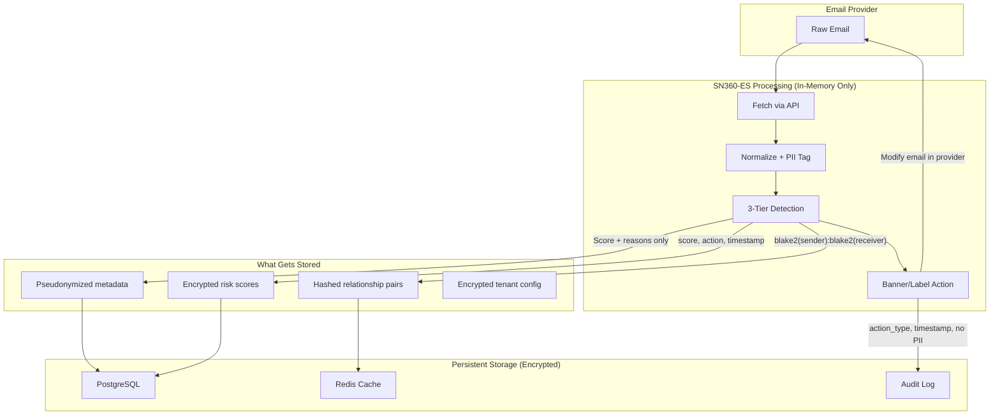
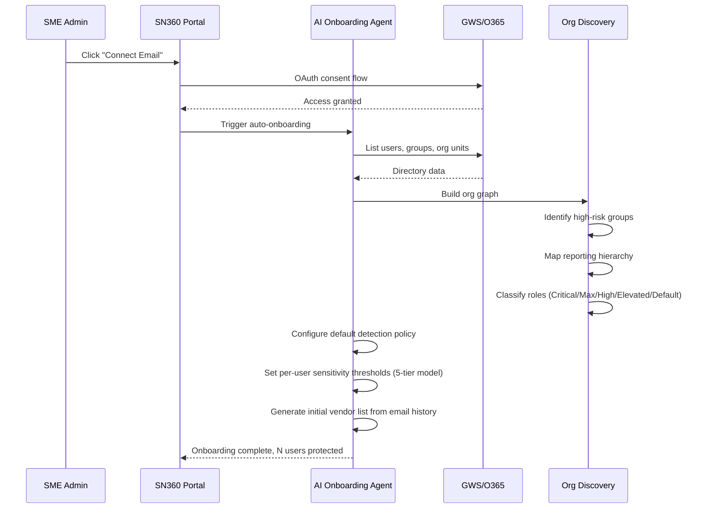
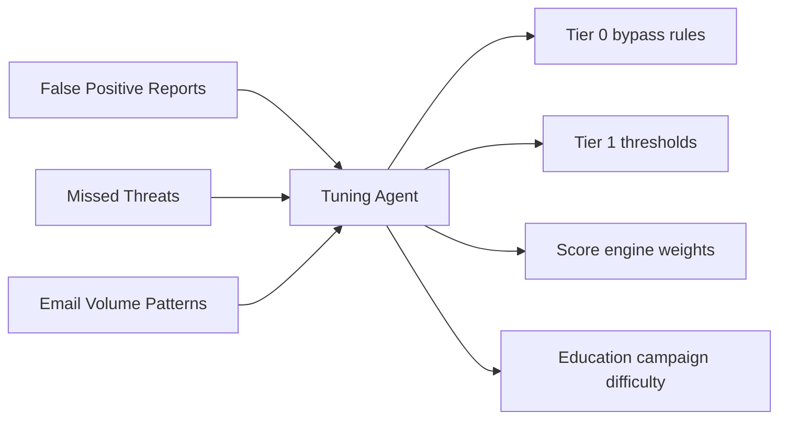
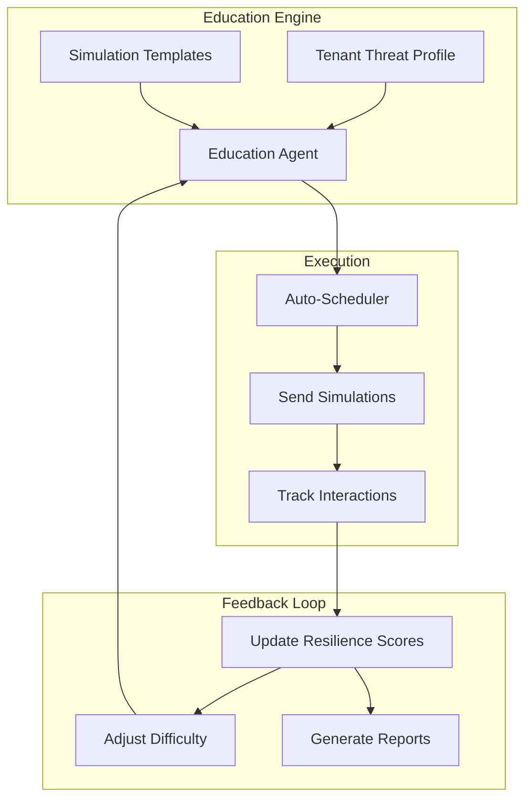
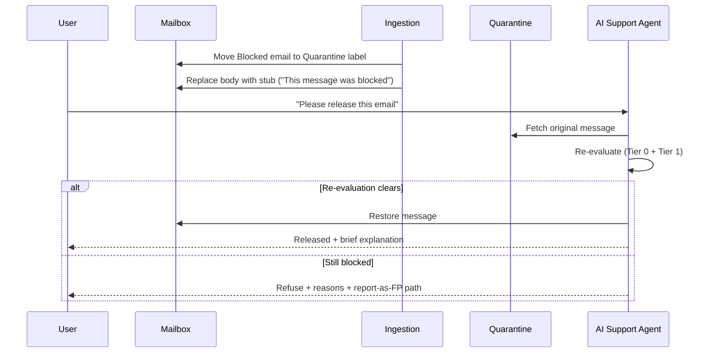

# SN360-ES — Design Document: Tiered ML Pipeline, Privacy Architecture & Zero-Admin Platform

## Executive Summary

SN360-ES is a **privacy-first, zero-admin, cost-effective email security
product** for SMEs. It is delivered as a single `sn360-es` Go binary
powered by a 3-tier ML pipeline, a NATS JetStream event bus, AI agent
operation, a severity-tiered banner and native-label end-user UX, and an
integrated email education service.

This document describes the design of the system and is updated to
reflect what is actually built. Anything labelled "Out of scope" or
called out in the project status matrix in
[`README.md`](../../README.md) is not yet wired into the running
binary.

---

## 1. NATS JetStream — The Event Bus

### Why NATS JetStream

| Concern | Redis Streams (fallback) | NATS JetStream (primary) |
|---|---|---|
| **Durability** | In-memory; data lost on Redis restart without AOF | Persistent file-based storage with configurable retention |
| **Dead-letter queue** | Manual implementation required | Built-in max delivery count → DLQ subject |
| **Message dedup** | None | Built-in dedup window (configurable, default 2min) |
| **Replay** | Only from consumer group position | Replay by time, sequence, or last per subject |
| **Backpressure** | None (unbounded stream) | Flow control + max pending per consumer |
| **Multi-tenancy** | Flat key namespace | Subject hierarchy (`es.{tenant}.evaluate.request`) |
| **Ops overhead** | Redis cluster for HA | NATS cluster with built-in Raft consensus |
| **Cost** | Redis memory = expensive at scale | NATS file storage = cheap, memory for hot path only |

Both buses share the same `events.EventService` interface
(`pkg/events/`). NATS JetStream is the production transport; Redis
Streams remains as a fallback for environments without NATS. Selection
is via `EVENT_BUS_TYPE=nats|redis`.

### JetStream Subject Design

```
es.>                                  # All SN360-ES events
es.onboarding.>                       # Onboarding events
es.onboarding.user.created            # User created
es.onboarding.user.deleted            # User deleted
es.evaluate.>                         # Evaluation pipeline
es.evaluate.request                   # Evaluate request (ingestion → evaluate)
es.evaluate.result                    # Evaluate result (evaluate → ingestion + management)
es.evaluate.result.attachment         # Attachment scan result
es.evaluate.dlq                       # Dead-letter queue for failed evaluations
es.education.>                        # Education platform
es.education.simulation.send          # Send phishing simulation
es.education.simulation.result        # User interaction result
es.education.lesson.trigger           # Trigger micro-lesson
es.action.>                           # Post-evaluation actions
es.action.banner                      # Banner injection
es.action.label                       # Label application
es.action.quarantine                  # Quarantine action
es.action.url_rewrite                 # Body URL rewriting
es.action.quarantine.release          # Quarantine release flow
es.action.escalation.>                # SecOps escalation
es.action.feedback.*                  # User feedback actions
```

### JetStream Stream Configuration

```yaml
streams:
  ES_EVALUATE:
    subjects: ["es.evaluate.>"]
    retention: WorkQueue           # Messages removed after ack
    storage: File                  # Persistent
    max_age: 24h                   # Auto-purge unprocessed after 24h
    max_msg_size: 10MB             # Max email payload
    discard: Old                   # Discard oldest when full
    num_replicas: 3                # Raft replication
    dedup_window: 2m               # Reject duplicate message IDs

  ES_ONBOARDING:
    subjects: ["es.onboarding.>"]
    retention: WorkQueue
    storage: File
    max_age: 72h
    num_replicas: 3

  ES_EDUCATION:
    subjects: ["es.education.>"]
    retention: Limits              # Keep history for analytics
    storage: File
    max_age: 90d
    num_replicas: 3

  ES_ACTION:
    subjects: ["es.action.>"]
    retention: WorkQueue
    storage: File
    max_age: 24h
    num_replicas: 3

  ES_DLQ:
    subjects: ["es.evaluate.dlq", "es.action.dlq"]
    retention: Limits
    storage: File
    max_age: 30d                   # Keep failed events for investigation
    num_replicas: 3
```

### Consumer Configuration

```yaml
consumers:
  evaluate_worker:
    stream: ES_EVALUATE
    filter: "es.evaluate.request"
    deliver_policy: All
    ack_policy: Explicit
    max_deliver: 5                 # Retry 5 times before DLQ
    ack_wait: 60s                  # 60s processing timeout
    max_ack_pending: 100           # Backpressure: max 100 in-flight
    deliver_group: "evaluate-svc"  # Queue group for horizontal scaling

  action_worker:
    stream: ES_EVALUATE
    filter: "es.evaluate.result"
    deliver_policy: All
    ack_policy: Explicit
    max_deliver: 3
    ack_wait: 30s
    max_ack_pending: 50
    deliver_group: "ingestion-action"
```

### Implementation Notes

- `pkg/events/` provides a `Factory` selecting between the NATS
  JetStream client (`pkg/events/nats/`) and the Redis Streams client
  (`pkg/events/redis/`) based on `EVENT_BUS_TYPE`.
- Both implementations satisfy the same `EventService` interface so
  consumers and publishers in `cmd/sn360-es/main.go` are bus-agnostic.
- Redis remains in the deployment for caching (score weights,
  classifications, vendor lists, relationships, poller locks) regardless
  of the event-bus selection.

### Micro-Batching with JetStream

JetStream consumers natively support batch fetch:

```go
// Fetch up to 50 messages, wait max 200ms
msgs, err := sub.Fetch(50, nats.MaxWait(200*time.Millisecond))
```

This enables:
- Batch Tier 0 classification (rule-based, CPU-only)
- Batch Tier 1 encoder inference (GPU batch = higher throughput)
- Batch Tier 2 SLM calls (batch API endpoints)
- Single Redis pipeline for loading all tenant configs per batch

---

## 2. Privacy-Centric Architecture

### Design Principles

1. **Zero-knowledge by default** — Platform cannot read stored email content
2. **Minimize, pseudonymize, encrypt** — Collect minimum, hash PII, encrypt remainder
3. **Tenant isolation** — Cryptographic boundary between tenants
4. **Right to erasure** — Cryptographic erasure via key deletion
5. **Audit everything** — Immutable log of all data access, no PII in logs

### Data Classification

| Data Type | Classification | Handling |
|---|---|---|
| Email body (raw) | **Critical PII** | In-memory only during evaluation; never persisted |
| Email headers (From, To, Subject) | **PII** | Pseudonymized (Blake2 hash) before storage |
| Sender/receiver addresses | **PII** | Stored as `blake2(address)` for relationship tracking |
| Risk scores | **Internal** | Stored encrypted at rest |
| Detection reasons | **Sensitive** | Stored without PII references (generic descriptions) |
| Banner HTML | **Transient** | Generated in-memory, injected, not stored |
| Tenant config | **Confidential** | Encrypted at rest, per-tenant key |
| Audit logs | **Compliance** | Append-only, no PII, retained per policy |

### Privacy Architecture



### Per-Tenant Encryption

```
┌─────────────────────────────────────┐
│  AWS KMS Master Key (per region)    │
│  └─ Tenant Data Key (per tenant)    │
│     └─ AES-256-GCM encryption       │
│        ├─ PostgreSQL column-level    │
│        ├─ Redis value-level          │
│        └─ S3 object-level            │
└─────────────────────────────────────┘
```

- **Tenant deletion** = delete tenant data key = **cryptographic erasure** of all tenant data
- Key rotation on configurable schedule (default quarterly)
- Keys never leave KMS; envelope encryption with data keys

### PII Pseudonymization (`pkg/privacy/`)

```go
// All email addresses stored as pseudonyms
type Pseudonymizer interface {
    // Hash returns blake2b-256 hash of input, keyed per tenant
    Hash(tenantKey []byte, input string) string
    // Pseudonymize replaces PII fields in a struct with hashes
    Pseudonymize(tenantKey []byte, data any) any
}

// Relationship tracking uses hashed pairs
// "alice@company.com" → "b2:a1b2c3d4e5f6..."
// Relationships: hash(sender) → hash(receiver) with counts
```

### Log Sanitization

All structured logging passes through a sanitizer that:
- Replaces email addresses with `***@domain` (domain kept for debugging)
- Strips email subjects entirely
- Masks tenant credentials
- Preserves correlation IDs, timestamps, and error codes

Rspamd has `subject_privacy` with Blake2 hashing; this pattern is
applied platform-wide via `internal/middleware/log_sanitizer.go`.

### Compliance Matrix

| Regulation | SN360-ES Coverage |
|---|---|
| **GDPR** | Right to erasure (crypto-shred), data minimization, pseudonymization, DPA-ready |
| **SOC 2 Type II** | Audit logs, access controls, encryption, availability monitoring |
| **ISO 27001** | Risk-based controls, incident management, asset classification |
| **PDPA (Thailand)** | Data residency controls, consent management, breach notification |
| **CCPA** | Data inventory, deletion on request, no sale of personal data |
| **HIPAA** | BAA-ready, encryption, access controls, audit trails (healthcare SMEs) |

---

## 3. Tiered ML Detection Pipeline

### Tier 0 — Classification Gate (cost: ~$0, latency: <1ms)

Uses `buildRiskSignals()` output as **gates** instead of just metadata:

| Signal | Action | Estimated Bypass |
|---|---|---|
| `IsInternal` | Skip all ML → Score 0 + "Internal" trusted chip | 30-40% of total |
| `IsFromVendor` | Skip all ML → Score 0 + "Vendor" trusted chip | 10-15% |
| `IsHighVolumeSender` | Skip ML → Rspamd-only score | 10-15% |
| `IsRecurringService` | Skip ML → Score 0 (noreply@, mailer-daemon) | 5-10% |
| `RelationshipCategory == Partner/Customer` | Lower Tier 1 threshold | N/A (threshold adjust) |
| `RelationshipCategory == FirstTimeExternal` | Always escalate to Tier 1 | N/A (force escalation) |

**Total Tier 0 bypass: 60-70% of emails never touch ML.**

Implementation: early return in `internal/service/evaluate/evaluator.go`
before launching ML goroutines. Config flags: `TIER0_SKIP_INTERNAL`,
`TIER0_SKIP_VENDOR`, `TIER0_SKIP_RECURRING`.

### Tier 1 — Encoder-Only Model (cost: ~$0.00005, latency: 50-200ms)

Self-hosted **XLM-RoBERTa-base** on Kubernetes:

- **Multilingual native**: 100+ languages, handles mixed-language (e.g., English subject + Thai body)
- **Fine-tuned** on multilingual phishing/BEC/scam datasets
- **Binary + confidence**: Outputs risk score 0-100 with calibrated confidence
- **Batch inference**: Processes up to 64 emails per GPU batch
- **CPU fallback**: ~200ms on CPU, ~20ms on GPU

The deployment manifests for the encoder service live in
[`deployments/encoder/`](../../deployments/encoder/). The Go client is
`internal/service/tier1/encoder.go`.

Thresholds (configurable per tenant via score engine):
- Score < 20 → **PASS** (clear safe)
- Score 20-60 → **ESCALATE** to Tier 2 (ambiguous)
- Score > 60 → **FLAG** (high-confidence threat, skip Tier 2)

**Tier 2 escalation rate: 10-20% of Tier 1 input.**

### Tier 2 — Ternary-Bonsai-8B (cost: ~$0.001-0.005, latency: 2-5s)

Tier 2 is served by a **self-hosted Ternary-Bonsai-8B** small language
model (SLM), deployed from
[`deployments/llm/`](../../deployments/llm/). It is invoked only for
emails Tier 1 marks as ambiguous, and:

- Performs full contextual analysis with aspect-level reasoning
- Receives relationship awareness (sender history, timing anomaly) as
  structured context
- Receives the language hint detected by Tier 1
- Returns actionable recommendations in the user's language

Alternative model providers are not supported; the corpus and accuracy
baselines are pinned to this specific deployment for reproducibility.
See [`scripts/CORPUS.md`](../../scripts/CORPUS.md) and
[`scripts/corpus_generator/README.md`](../../scripts/corpus_generator/README.md).

### Graceful Degradation

| Failure | Behavior |
|---|---|
| Tier 2 SLM down | Tier 0 + Tier 1 + Rspamd continue; Tier 2 results marked "pending" |
| Tier 1 encoder down | All external emails escalate to Tier 2 (cost spike, no outage) |
| Rspamd down | Log warning; ML tiers continue independently |
| NATS down | Messages buffered in NATS file store; auto-recovery on reconnect; Redis Streams fallback available via config |

### Combined Impact

| Metric | Conventional LLM-per-email | SN360-ES tiered pipeline |
|---|---|---|
| LLM calls/day (100 tenants × 5K emails) | ~500,000 | ~15,000-50,000 |
| Avg latency/email (p95) | 2-20s | 50-200ms |
| Monthly AI inference cost | ~$15,000 | ~$500-1,500 |
| Availability on AI outage | 0% | 95%+ |
| Languages supported | Depends on LLM | 100+ native (Tier 1) |

---

## 4. Zero-Admin AI-Agent Operation

### Design Philosophy

SMEs have no IT team. Every configuration decision, threshold tuning, and
incident response must be automated or trivially simple.

### Auto-Onboarding Flow



### AI Agent Capabilities

| Agent | Role | Replaces |
|---|---|---|
| **Onboarding Agent** | Auto-discover users, groups, roles; configure policies | Manual tenant setup |
| **Tuning Agent** | Analyze FP/FN rates; adjust per-tenant score weights and thresholds | Security engineer tuning |
| **Incident Agent** | Triage alerts, generate investigation summaries, suggest actions | SOC L1 analyst |
| **Education Agent** | Design phishing simulations tailored to tenant's threat profile | Security awareness program manager |
| **Compliance Agent** | Generate compliance reports, audit evidence, data retention enforcement | Compliance officer |
| **Support Agent** | Answer user questions about flagged emails, explain risk scores | IT helpdesk |

### Escalation to ShieldNet 360 SecOps

When AI agents cannot resolve:
1. **Auto-escalation triggers**: Confirmed breach indicators, account compromise, zero-day attachment
2. **Context package**: AI agent prepares investigation summary with anonymized evidence
3. **SN360 SecOps**: Human analysts take over, communicate via secure channel
4. **Resolution feedback**: Outcomes feed back into ML training pipeline

### Self-Tuning Thresholds



### Industry-Aware Sensitivity Classification

SN360-ES classifies every user into a 5-tier sensitivity model during
onboarding. Classification is fully automatic — no admin configuration
required — and works across six languages (English, Japanese, Korean,
Thai, Vietnamese, Chinese).

| Tier | Value | Typical roles |
|---|---|---|
| **Default** | 0 | Software Engineer, Marketing, Sales |
| **Elevated** | 1 | DevOps Engineer, Nurse, Paralegal, Sales Director |
| **High** | 2 | VP Finance, Security Engineer, Physician, Data Scientist, M&A Analyst |
| **Max** | 3 | CEO, CFO, CTO, Board Member, Founder |
| **Critical** | 4 | DBA, System Admin, Cloud Admin, SRE Lead, Network Admin |

The Critical tier represents users with infrastructure-level access to
production systems. A compromised DBA account can exfiltrate an entire
database; a compromised cloud admin can modify IAM policies. These users
receive the strictest monitoring:

- **Lower ATO thresholds**: Suspicious behaviour triggers alerts at a
  lower score (0.4 vs 0.5 default).
- **Outbound freemail flagging**: Any email from a Critical/Max user to
  a freemail or disposable domain is flagged as an insider-threat signal.
- **Higher vulnerability score**: Infrastructure access maps to the
  highest weight in per-user risk scoring.
- **Tighter volume anomaly**: 2σ threshold instead of 3σ.

Industry verticals are detected automatically from directory signals
(job titles, department names, group memberships). The classifier
recognises roles across Technology, Healthcare, M&A/Strategy, R&D,
Finance, Legal, HR, and IT verticals, mapping groups to risk classes
(`engineering`, `medical`, `strategy`, `research`, `finance`, `legal`,
`hr`, `it`) stored in the `groups.risk_class` column.

---

## 5. Email Education Platform

### Philosophy

Security awareness training fails when it is boring, infrequent, and
disconnected from real threats. SN360-ES embeds education **inside the
email experience** — teaching at the moment of relevance.

### Education Components

#### a) In-Context Micro-Lessons

When a suspicious email is detected, the banner (see Section 6 for full banner
specification) includes a contextual lesson:

```
┌──────────────────────────────────────────────────┐
│ ⚠ Warning: Likely Scam (Score: 72/100)           │
│                                                    │
│ > Sender domain "paypa1.com" mimics "paypal.com"  │
│ > Urgency language detected ("act now")            │
│                                                    │
│ 💡 Quick Lesson: Lookalike Domains                 │
│ Attackers register domains that look like trusted  │
│ brands by swapping letters (l→1, o→0). Always      │
│ check the sender's actual email address.           │
│                                                    │
│ [I understand ✓]  [Report as safe]  [Learn more]   │
└──────────────────────────────────────────────────┘
```

- Lessons are contextual to the specific threat type detected
- Available in all tenant languages (multilingual by default)
- Tracks whether user clicked "I understand" vs "Report as safe"

#### b) Automated Phishing Simulations

| Feature | Description |
|---|---|
| **Template library** | Real-world attack patterns: BEC, credential phishing, QR code, invoice fraud |
| **Auto-generation** | AI agent creates simulations based on tenant's actual threat profile |
| **Adaptive difficulty** | Easy → medium → hard based on employee performance |
| **Multilingual** | Simulations in employee's primary language |
| **Zero-setup** | Campaigns auto-scheduled; no admin configuration needed |
| **Safe landing page** | Clicked users see an instant teachable moment, not punishment |

#### c) Resilience Scoring

Per-employee and per-group resilience metrics:

```
Employee Resilience Score = f(
  simulation_performance,     # 40% — click rate on simulations
  report_rate,                # 25% — how often they report real threats
  lesson_engagement,          # 20% — interaction with micro-lessons
  incident_history,           # 15% — past involvement in real incidents
)
```

Scores feed back into:
- Detection sensitivity (lower thresholds for low-resilience users)
- Simulation frequency (more practice for those who need it)
- Aggregated tenant risk reports

#### d) Campaign Automation



---

## 6. End-User Label & Banner UX

### Design Goals

Every email is decorated with two end-user signals:
1. **Inline banner** — HTML, injected into the message body, severity-themed
2. **Native provider label** — Gmail Label / Outlook Category, color-coded

Each signal carries a **specific category** (not a generic "suspicious"
tag), supports **one-click actions** (report phishing, mark safe), and
is **multilingual** based on the recipient's locale.

### Design Influences

The design draws on patterns that have become industry-standard for
post-delivery email security: severity-tiered colored banners, native
provider labels per severity, specific category names instead of
generic "suspicious", one-click "Report Phishing" actions, sender-auth
chips, URL rewriting at high severity, pre-send / pre-open warnings via
add-ins, and quarantine + release flows. SN360-ES extends these
patterns with two design choices that are particular to this product:

- **In-banner micro-lessons** sourced from the Education service, so
  the same UI surface that warns about a threat also teaches the
  recipient about it.
- **Privacy-preserving banner copy** that maps reasons to a fixed
  `reason_code` enum so no email content ever appears in stored
  detection reasons, logs, or audit trails.

### Severity Tiers — Authoritative Spec

| Tier | Score | Banner Color | Banner Headline (en) | Native Label | Provider Action |
|---|---|---|---|---|---|
| **Blocked** | 85-100 | Red (filled, white text) | "This message was blocked as malicious." | `SN360 / Blocked` (red) | Auto-quarantine; user sees stub only |
| **High Risk** | 70-84 | Red (filled, white text) | "Likely phishing — do not click links or reply." | `SN360 / Warning` (red) | Banner + URLs rewritten/disabled |
| **Warning** | 50-69 | Orange (white text) | "Caution: This message has suspicious traits." | `SN360 / Caution` (orange) | Banner with reasons + actions |
| **Caution** | 30-49 | Yellow (dark text) | "Be cautious — verify the sender before acting." | `SN360 / Notice` (yellow) | Compact footer banner |
| **Informational** | 15-29 | Blue (dark text) | "External sender / First contact." | `SN360 / External` (blue) | Inline chip near sender name |
| **Trusted** | 0-14 | Green chip | "Verified internal / trusted vendor." | `SN360 / Trusted` (green) | Optional positive chip |

Score → tier mapping is configurable per tenant via the score engine.
The actual tier values live in
[`internal/constant/tiers.go`](../constant/tiers.go) and are typed as
`Tier string` (not `int iota`).

### Category Vocabulary

Every banner above Informational includes **one** primary category and may
include up to two secondary categories:

| Category | When Applied | User-Facing Copy (en) |
|---|---|---|
| `LIKELY_PHISHING` | High Tier 1/2 score with credential-harvest signals | "Likely phishing attempt" |
| `BEC_IMPERSONATION` | Display-name mismatch + financial intent | "Business Email Compromise suspected" |
| `LOOKALIKE_DOMAIN` | Sender domain near-matches trusted brand | "Sender domain mimics a known brand" |
| `SUSPICIOUS_URL` | URL flagged by VT/URLScan/SafeBrowsing | "Contains a suspicious link" |
| `SUSPICIOUS_ATTACHMENT` | ShieldNet sandbox flagged attachment | "Attachment flagged by sandbox" |
| `FIRST_CONTACT_EXTERNAL` | Relationship category = FirstTimeExternal | "First time this sender has emailed you" |
| `ACCOUNT_TAKEOVER_SUSPECTED` | Known sender + behavioral anomaly | "Account compromise suspected" |
| `VENDOR_COMPROMISE` | Trusted vendor + anomalous content | "Vendor account may be compromised" |
| `CREDENTIAL_HARVESTING` | Form fields / credential keywords | "Asks for password or credentials" |
| `INVOICE_FRAUD` | Invoice + payment redirect signals | "Possible invoice fraud" |
| `QR_PHISHING` | QR code resolves to suspicious URL | "QR code links to a suspicious site" |
| `SCAM_FRAUD` | Generic scam pattern | "Possible scam" |
| `AUTH_FAILED` | SPF/DKIM/DMARC fail on important sender | "Sender authentication failed" |
| `INTERNAL_TRUSTED` | Same tenant domain | "From your organization" |
| `VENDOR_TRUSTED` | Approved vendor list | "From a trusted vendor" |
| `NEWSLETTER` | Bulk sender / list-unsubscribe present | "Newsletter / mailing list" |

The canonical category constants are defined in
[`internal/constant/categories.go`](../constant/categories.go).

### Banner Anatomy

```
┌──────────────────────────────────────────────────┐
│ ▌ HIGH RISK  ·  Likely phishing                  │  <- severity stripe + headline
│                                                    │
│ • Sender domain "paypa1.com" mimics paypal.com    │  <- sanitized reasons (no PII)
│ • Authentication failed (SPF, DKIM)                │
│ • Asks for password or credentials                 │
│                                                    │
│ 🔐 Sender: ⚠ Unverified  ·  SPF: fail · DKIM: fail │  <- auth chip
│                                                    │
│ [ Report Phishing ]  [ Mark as Safe ]  [ Why? ]    │  <- one-click actions
│                                                    │
│ 💡 30-sec lesson: Lookalike Domains                │  <- micro-lesson (Warning+)
└──────────────────────────────────────────────────┘
```

- **Severity stripe** is rendered as a CSS gradient (no remote image) for
  privacy and dark-mode safety.
- **Reasons** are pulled from a fixed vocabulary of `reason_codes` — never raw
  email content — so they can be safely cached, logged, and shown across
  languages.
- **Sender auth chip** condenses SPF/DKIM/DMARC into a single Verified /
  Unverified / Failed verdict.
- **Action buttons** use HTTPS callbacks signed with a short-lived per-message
  token; clicking does not require the user to be logged into a SN360 portal.
- **"Why?" expander** reveals the full category, score, and confidence —
  helping power users without overwhelming average users.

### Native Provider Labels

| Provider | Mechanism | Color Mapping |
|---|---|---|
| **Google Workspace** | Gmail label per tier (created on tenant onboarding) | Gmail label colors mapped to tier colors |
| **Microsoft 365** | Outlook Master Categories | Outlook category color closest to tier color |

Label naming convention: `SN360 / {Tier}` (e.g., `SN360 / Blocked`). Categories
are surfaced as sub-labels when supported: `SN360 / Warning / Lookalike`.

### URL Rewriting (High Risk + Blocked Only)

- URLs in `High Risk` and `Blocked` messages are rewritten to an interstitial
  `https://l.sn360.io/{token}` page that:
  - Re-checks the URL against current threat intelligence before redirecting
  - Shows the user a final confirmation page with the destination
  - Logs (anonymously) the click decision for tuning
- Below High Risk, URLs are left untouched to minimize disruption and tracking.

### Quarantine + Release Flow



### Pre-Send & Pre-Open Warnings (Optional Add-In)

Outlook and Gmail add-ins (Manifest v3) provide real-time UX:

- **Pre-send**: Detects lookalike recipient domains, unusual recipients
  (e.g., personal address from a Finance user), and external recipients on
  threads previously kept internal. Prompts confirmation with one-click
  override + reason capture.
- **Pre-open**: At `Warning+` tier, shows a modal before the body renders —
  useful on mobile clients that auto-render HTML.

The add-in skeletons live in [`deployments/addins/`](../../deployments/addins/).

### Accessibility

- All banners pass WCAG 2.1 AA contrast at every tier (color is never the only
  signal — icons and headline text carry the meaning).
- Severity is announced to screen readers via `aria-label` (`role="alert"` for
  High Risk and Blocked).
- Dark-mode safe palette (banners render correctly in Gmail/Outlook dark themes).
- Banners are pure HTML/CSS — no JavaScript, no remote fonts, no remote images.

### Privacy in the Banner Itself

- No email content is quoted in stored detection reasons.
- All reasons map to a fixed `reason_code` enum; localized copy is generated
  client-side from the code, so the same email triggers the same reason
  regardless of locale.
- Banner HTML is generated in-memory at action time and is never persisted.
- The signed action-token in Report/Mark-Safe buttons contains only:
  `tenant_id`, `pseudonymized_message_id`, `tier`, `expires_at`. No PII.

---

## 7. Enriched Onboarding Intelligence

### Organizational Graph Discovery

| Data Point | Source | Use Case |
|---|---|---|
| **Employee directory** | GWS Directory API / MS Graph `/users` | Auto-discover all users, departments, titles, managers |
| **Group memberships** | GWS Groups / MS Graph `/groups` | Identify high-risk groups (Finance, C-suite, HR) |
| **Communication patterns** | Communication history | Build "who talks to whom" baseline |
| **Typical send times** | Message timestamps | Detect timing anomalies |
| **Vendor auto-discovery** | Analyze 30-day email history | Auto-populate vendor list from recurring external senders |

### Relationship Categories

| Category | Detection | Risk | Action |
|---|---|---|---|
| **Internal** | Domain match | Lowest | Tier 0 bypass |
| **Vendor** | Admin list + auto-discovered | Low | Tier 0 bypass |
| **Partner** | Bidirectional communication | Low-medium | Lower Tier 1 threshold |
| **Customer** | Inbound-heavy pattern | Medium | Normal Tier 1 |
| **Recurring Service** | noreply@, mailer-daemon | Lowest | Tier 0 bypass |
| **First-time External** | No communication history | Highest | Always Tier 1, lower escalation threshold |
| **Lapsed Contact** | Historical but no 30d activity | High | Account takeover vector — Tier 1 with low threshold |

### Vulnerability Scoring

```
Employee Vulnerability Score = f(
  role_risk,                  # C-suite, Finance, HR = high
  external_volume,            # More external email = more exposure
  first_contact_frequency,    # More new contacts = more risk
  incident_history,           # Past targeting
  resilience_score,           # Inverse of education performance
)
```

---

## 8. Optimisation Techniques

### Detection-Pipeline Optimisations

| Technique | SN360-ES Implementation |
|---|---|
| **Behavioral baselining** | Communication history + send-time patterns → anomaly score |
| **Supply-chain detection** | Detect vendor account compromise via relationship + content anomaly |
| **VIP impersonation** | Detect emails impersonating C-suite using org graph |
| **Message hold / clawback** | Quarantine action via transport rules (GWS routing / O365 transport) |
| **Crowdsourced intel** | Aggregate anonymized threat signals across tenants (privacy-safe) |
| **User-reported phishing** | One-click "Report Phish" button via Gmail add-on / Outlook add-in |
| **SOC-lite dashboard** | AI-generated threat summary dashboard (auto-produced, no manual setup) |
| **Inline pre-delivery** | O365 journaling rules / GWS content compliance rules |
| **Selective URL rewrite** | Rewrite only at High Risk + Blocked tiers |
| **Pre-send warnings** | Outlook/Gmail add-in detects risky recipients |
| **Severity-tiered banner** | 6-tier banner with category-specific copy |
| **Native provider labels** | Gmail labels + Outlook categories color-mapped to tier |

### Infrastructure Optimisations

| Area | Implementation |
|---|---|
| **Event bus** | NATS JetStream (DLQ, dedup, replay, file storage); Redis Streams fallback |
| **Graceful degradation** | Tier 0 + Tier 1 + Rspamd continue even on Tier 2 outage |
| **Micro-batching** | Batch fetch from NATS, batch Tier 1 inference, batch Tier 2 SLM |
| **AI result caching** | `sha256(normalized_body + sender_domain)` → TTL cache |
| **Rspamd result caching** | App-level `sha256(raw_mail)` → 30min cache |
| **Redis pipelining** | Pipeline batch reads per evaluation batch |
| **Connection pooling** | Persistent HTTP/2 pools to encoder and SLM |
| **URL pre-scanning** | Parallel scan against VirusTotal, URLScan.io, Google Safe Browsing |
| **Attachment pre-screen** | YARA + ClamAV lightweight scan → sandbox only if suspicious |
| **Distributed tracing** | OpenTelemetry W3C Trace Context end-to-end |

### Cost Impact Summary

| Technique | Estimated Savings |
|---|---|
| Tier 0 bypass (internal + vendor + newsletter) | 60-70% reduction in ML calls |
| Tier 1 encoder for clear cases | 80-90% reduction in Tier 2 calls |
| AI result caching (campaign dedup) | 10-20% additional |
| Micro-batching (batch inference) | 30-50% lower per-unit cost |
| Self-hosted encoder model | Fixed cost vs per-call |
| NATS JetStream (vs Redis memory) | 50-70% lower event bus cost |
| **Total estimated cost reduction** | **90-95%** |

---

## 9. Implementation Scope

| Area | Scope |
|---|---|
| **Event Bus + Detection** | Tier 0 gates + graceful degradation + NATS JetStream |
| **Privacy** | Privacy layer (`pkg/privacy/`), PII stripping, per-tenant encryption |
| **Tier 1 Encoder** | Tier 1 encoder client + micro-batching |
| **AI Agents** | Zero-admin AI agents (onboarding, tuning, support) |
| **Tiered UX** | Tiered banner + native label UX (Section 6) + URL rewriting |
| **Education** | Email education platform (simulations, micro-lessons, resilience scoring) |
| **Relationship Intelligence** | Org graph, vulnerability scoring, expanded relationships |
| **Add-Ins + Dashboard** | Pre-send / pre-open add-ins + admin dashboard + quarantine + user-reported phishing |

Code pointers for every package are documented in
[`PHASES.md`](./PHASES.md).
